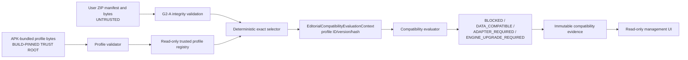

# Editorial Pack Platform — G2-C0 Trusted Engine Contract Profile

Status: `PROPOSED / REVIEW STOP / NO PROFILE BUNDLED`

Date: `2026-08-04`

This is a design and audit document only. It does not add a trusted profile,
change source code, change SQLite schema, enable execution, certify a pack or
produce a new APK.

## 1. Decision summary

G2-C0 should introduce a signed-by-build, immutable description of the
contract facts that the installed engine actually implements. The profile is
trusted APK metadata, not Editorial Pack data.

The first profile must be an honest fail-closed baseline:

- it may prove the implemented pack-integrity capability;
- it must explicitly list the missing execution capabilities;
- it must not claim SAFE4 L1/L2/L3 execution, release readiness or replay;
- it must not make the current SAFE4 pack `DATA_COMPATIBLE`;
- it must not change `EditorialSafe4Pack.executionEnabled()`;
- a matching profile can make a pack eligible for compatibility evaluation, but
  the pack remains at most `STORED_READY_FOR_CERTIFICATION` until later
  certification work.

The current production runtime deliberately supplies an empty profile. G2-C0
should replace that test-shaped seam only in a later approved wiring step, with
an exact bundled registry and no fallback selection.

## 2. Audit of the current implementation

### 2.1 Current trusted-facts seam

`editorial-engine/src/main/java/com/ml/tblandroidtxt/editorial/pack/EditorialEngineProfile.java`
currently contains only:

- `engineVersion`;
- a set of capability strings;
- contract/schema keys mapped to a machine-contract fingerprint and capability
  set;
- adapter records with source contract/schema/fingerprint, required
  capabilities and an `installed` flag.

This is an immutable value object, but it is not yet a trusted engine profile:
it has no profile ID, profile version, canonical profile bytes, profile hash,
source commit, deprecation policy, validator, bundled registry or build-pinned
identity. The production importer does not load it from a trusted resource.

`EditorialPackImportPageFactory.runtimeProfile()` currently constructs:

```text
engineVersion = AppBuildInfo.VERSION_NAME
capabilities = []
contracts = []
adapters = []
```

This is the correct fail-closed behavior for the current APK, but it is not a
contract profile. It guarantees that an imported pack cannot be guessed
compatible.

### 2.2 Existing pack and compatibility implementation

The existing G2-A/G2-B implementation provides useful, separately bounded
facts:

- `EditorialPackManifest` parses a strict v1 pack manifest and exposes
  declared contract, schema, roles, phase, context, evidence, gate and release
  declarations. These declarations remain untrusted because they come from the
  imported ZIP.
- `EditorialPackIntegrityValidator` validates exact raw bytes, lengths, hashes,
  strict UTF-8/no-BOM content, canonical JSON and exactly three declared data
  files. This is the only SAFE4 capability currently marked implemented.
- `EditorialCompatibilityEvaluator` computes compatibility from an injected
  `EditorialEngineProfile`; it does not trust filenames or the manifest's
  compatibility class without comparing it to trusted facts.
- `EditorialPackImportService.importZip(InputStream)` snapshots one selected
  stream, applies ZIP limits/security checks and persists immutable content
  through the v14 pipeline.
- `SqliteEditorialPackRegistry` is read-only and revalidates persisted manifest
  and immutable bytes before exposing records.
- `EditorialSafe4Pack.executionEnabled()` returns
  `IMPLEMENTED.containsAll(REQUIRED)`. `IMPLEMENTED` contains only
  `PACK_INTEGRITY`; the other nine required capabilities are missing.
- `EditorialSafe4Workflow` contains role/state/gate enums and context helper
  methods, but every execution transition and release predicate is still
  guarded by `executionEnabled() == false`.

The presence of an enum, manifest field, UI label, prompt declaration or parser
test is not execution evidence and must not be copied into
`implementedCapabilities`.

### 2.3 Current capability truth

| Capability | Current source fact | Trusted profile status |
|---|---|---|
| `pack.integrity.sha256.v1` | Build-time SAFE4 byte guard, pure-JVM pack integrity validator and G2-B2B device import integrity result exist | Implemented; only capability eligible for the first baseline profile |
| `lineage.exact-parent.v1` | v14 has import identity and immutable storage, but no run/parent/revision lineage chain | Missing |
| `ledger.exhaustive.safe4.v1` | No typed exhaustive SAFE4 ledger population/schema is executable | Missing |
| `gate.derived.safe4.v1` | Enums and helper predicates exist, but no persisted evidence-derived calculators | Missing |
| `context.pronoun-pair.safe4.v1` | Pronoun states and context checks exist as preparatory helpers; no trusted SAFE4 validator/scoped Pair implementation | Missing |
| `barrier.l1-raw-first.v1` | No SAFE4 provider runner or L1 barrier is connected | Missing |
| `diff.change-coverage.v1` | No execution-grade lineage-aware change coverage proof | Missing |
| `qa.l3-two-adversarial.v1` | No L3 adversarial coverage/regression runners or independent evidence checkpoints | Missing |
| `release.safe4.v1` | Old V5 release path was retired; SAFE4 FINAL/QA receipt contract is not implemented | Missing |
| `replay.safe4.g1-g10.v1` | No Golden Replay runner, certification store or retained G1–G10 evidence | Missing |

The first profile must contain exactly the corresponding truthful split:

```text
implementedCapabilities:
  - pack.integrity.sha256.v1

explicitlyMissingCapabilities:
  - lineage.exact-parent.v1
  - ledger.exhaustive.safe4.v1
  - gate.derived.safe4.v1
  - context.pronoun-pair.safe4.v1
  - barrier.l1-raw-first.v1
  - diff.change-coverage.v1
  - qa.l3-two-adversarial.v1
  - release.safe4.v1
  - replay.safe4.g1-g10.v1
```

This list describes the current engine boundary. It does not certify the
canonical SAFE4 pack and does not make any user-imported pack runnable.

### 2.4 Evidence from code91 device QA

The archived APK was installed without rebuilding:

- device: OnePlus CPH2691 / Android 15;
- package: `com.ml.tblandroidtxt`;
- version: `4.16-dev.29` / code91;
- APK SHA-256:
  `959A25630941550E3D59CB2FBE75C1E3C6D33DCA2A109553C248CDA653E4DE90`;
- installation result: `Success`.

A disposable four-entry ZIP fixture was selected through the real SAF picker.
It was not the canonical SAFE4 pack, was not read from `D:`, and was not either
candidate identity. The fixture had canonical pack hash
`d1e0e6f490f86a1a334a92708b7a8e9463bd1b0e925714e525177eed5c825f1c`.

Observed device result:

1. Editorial tab exposed `Import Editorial Pack ZIP` and read-only management.
2. SAF opened a single ZIP selection with the pushed fixture.
3. Import completed storage and displayed `Pack đã được lưu nhưng đang bị
   khóa`.
4. The concrete blocker was `UNSUPPORTED_CONTRACT_SCHEMA: No trusted contract
   descriptor is installed`.
5. The registry detail showed `STORED_BLOCKED`, `BLOCKED`, valid integrity and
   the exact canonical hash.
6. After process restart, the same pack remained in the read-only registry.
7. Private immutable storage contained the manifest plus the three exact files
   with sizes 2340, 8, 7 and 9 bytes.

This is G2-B2B-ZIP device evidence only. It is not profile evidence for SAFE4
execution, certification, activation, binding or release.

The requested import intentionally left one non-canonical, blocked QA record in
the device registry. No manual database mutation or cleanup bypass was used;
the pushed ZIP itself was removed from the device after the walkthrough.

## 3. What is missing today

The current app has no trusted source of truth for:

- which contract versions the installed engine supports;
- which evidence schemas and gate calculators are actually executable;
- which phase graph and context allow-list are enforced by trusted code;
- which adapters are bundled and for which exact source contract fingerprint;
- which release artifact contract is implemented;
- which engine/profile/capability identity produced a compatibility result.

The v14 compatibility table currently stores:

```text
engine_version_used
machine_contract_fingerprint
compatibility_class
required_class
blocked_reason
evaluated_at
```

It does not store profile ID, profile version, profile hash, adapter-set hash,
capability fingerprint or evaluation-context hash. `blocked_reason` must not be
used as a hidden serialization channel for these identities.

Therefore:

- G2-C0A and G2-C0B can be implemented without SQLite migration;
- G2-C0C can use an in-memory typed context first, but durable compatibility
  evidence needs an additive schema decision before wiring production writes;
- existing v14 compatibility rows must never be updated to pretend they were
  evaluated with a later trusted profile.

## 4. Trust model and threat model

### 4.1 Trust roots

The trusted profile must be supplied by one of these equivalent APK-bound
mechanisms, preferably both:

1. exact profile bytes under an APK asset/resource path such as
   `assets/editorial/engine-profile/v1/profile.json`;
2. a reviewed expected profile SHA-256 pinned in source/build verification.

The APK build must fail if the bundled profile bytes differ from the reviewed
hash. Runtime must validate the bytes again before the registry exposes the
profile. The profile may describe capabilities, but it cannot load code or name
a Java, Dex, native, SQL or reflection target.

The profile is not trusted because it says `trusted`; it is trusted because its
exact bytes are part of the reviewed APK source/build and its canonical hash is
verified.

### 4.2 Non-trusted inputs

The following are never trusted profile sources:

- `editorial-pack.json` or any file in a user ZIP/folder;
- a pack-declared `engineProfileId` or profile hash;
- SQLite/importer-generated profile facts;
- a file read from `D:`;
- a profile chosen by “latest” or closest-version heuristics;
- model output, prompt text or UI state;
- old compatibility rows without a profile identity.

The imported pack can request a contract/schema and declare required
capabilities, but only the APK registry can answer whether those requirements
are supported.

### 4.3 Threats and mitigations

| Threat | Required mitigation |
|---|---|
| User ZIP claims `DATA_COMPATIBLE` | Recompute from trusted profile and adapter facts; declaration mismatch is `INVALID` |
| User ZIP names a privileged profile | Ignore profile-selection fields from the pack; selector uses APK registry only |
| Profile bytes are modified | Build-pinned hash, strict runtime validation and canonical profile hash |
| Duplicate/unknown profile fields hide a semantic change | Reject duplicate keys, unknown fields, BOM, noncanonical JSON and noncanonical arrays |
| Profile declares an unimplemented capability | Require reviewed implementation evidence and keep the capability in `explicitlyMissingCapabilities` until proven |
| Two profiles are both compatible | Return `AMBIGUOUS_TRUSTED_PROFILE`; do not choose newest/first/closest |
| Old result is reused after profile change | Persist exact profile identity and create a new evaluation; never update history |
| Profile contains executable material | Allow only declarative strings, enums, hashes, lists and structured values; no class/method/script/SQL expressions |
| Candidate SAFE4 bytes are substituted | Keep code86 canonical hashes immutable; do not read/import/activate DBE214 or 3B2FCC candidates |
| Profile changes phase visibility or gate semantics silently | Include the full machine-contract projection in `machineContractFingerprint` |

## 5. Proposed profile model

The pure-JVM model should be immutable and contain no Android, `Context`, `Uri`,
SQLite or SAF types:

```text
EditorialEngineContractProfile
  profileFormat
  profileFormatVersion
  engineProfileId
  engineProfileVersion
  engineVersion
  minimumSupportedContractVersion
  maximumSupportedContractVersion
  supportedSchemaVersions[]
  supportedInputRoles[]
  supportedPhaseGraph
  contextAllowListByPhase
  evidenceSchemaFingerprints[]
  gateDefinitionFingerprints[]
  releaseArtifactFingerprints[]
  implementedCapabilities[]
  explicitlyMissingCapabilities[]
  capabilityEvidence[]
  bundledAdapterIds[]
  adapterDescriptors[]
  machineContractFingerprint
  createdAt
  buildSourceCommit
  deprecationPolicy
  canonicalProfileHash
```

Recommended supporting types:

- `EditorialEngineContractProfileValidator`;
- `EditorialEngineContractProfileRegistry`;
- `BundledEditorialEngineProfileRegistry`;
- `EditorialEngineProfileSelector`;
- `EditorialCompatibilityEvaluationContext`;
- immutable `CapabilityEvidence` records containing a capability ID, reviewed
  source commit, test/evidence fingerprint and evidence class;
- immutable adapter descriptors containing adapter ID/version, source
  contract/schema/fingerprint and required capabilities.

### 5.1 Current baseline profile sample

The following is a **design sample only**. It is not bundled, is not a valid
runtime profile until its placeholders are calculated and reviewed, and must
not be copied into the current APK. Empty contract/phase fields are deliberate:
the current app has no executable Editorial contract.

```json
{
  "profileFormat": "com.ml.tblandroidtxt.editorial-engine-profile",
  "profileFormatVersion": 1,
  "engineProfileId": "com.ml.tblandroidtxt.editorial.engine.bootstrap",
  "engineProfileVersion": "1.0.0",
  "engineVersion": "4.16-dev.29",
  "minimumSupportedContractVersion": null,
  "maximumSupportedContractVersion": null,
  "supportedSchemaVersions": [],
  "supportedInputRoles": [],
  "supportedPhaseGraph": {"phases": [], "edges": []},
  "contextAllowListByPhase": {},
  "evidenceSchemaFingerprints": [],
  "gateDefinitionFingerprints": [],
  "releaseArtifactFingerprints": [],
  "implementedCapabilities": ["pack.integrity.sha256.v1"],
  "explicitlyMissingCapabilities": [
    "lineage.exact-parent.v1",
    "ledger.exhaustive.safe4.v1",
    "gate.derived.safe4.v1",
    "context.pronoun-pair.safe4.v1",
    "barrier.l1-raw-first.v1",
    "diff.change-coverage.v1",
    "qa.l3-two-adversarial.v1",
    "release.safe4.v1",
    "replay.safe4.g1-g10.v1"
  ],
  "capabilityEvidence": [
    {
      "capabilityId": "pack.integrity.sha256.v1",
      "sourceCommit": "f62ea5b35a183071374498417b7ed4eef5637f33",
      "evidenceFingerprint": "<reviewed-test-and-build-evidence-hash>"
    }
  ],
  "bundledAdapterIds": [],
  "adapterDescriptors": [],
  "machineContractFingerprint": "<sha256-of-machine-contract-projection>",
  "createdAt": "2026-08-04T00:00:00+07:00",
  "buildSourceCommit": "f62ea5b35a183071374498417b7ed4eef5637f33",
  "deprecationPolicy": {
    "state": "ACTIVE",
    "replacementProfileId": null,
    "replacementVersion": null,
    "automaticReplacement": false,
    "automaticProjectRebind": false
  },
  "canonicalProfileHash": "<sha256-with-this-field-omitted>"
}
```

The first profile must not list SAFE4 contract/schema support merely because
`EditorialPackManifest` can parse those declarations. A future executable
profile can list a SAFE4 contract only after the corresponding adapter,
ledger, barriers, gates, release contract and replay evidence exist.

## 6. Canonicalization and hash rules

### 6.1 Profile JSON

Use the same strict canonical JSON boundary as G2-A, with the profile format
having its own domain separator:

```text
EDITORIAL_ENGINE_PROFILE_CANONICAL_HASH_V1\n
```

Rules:

1. UTF-8 without BOM, strict decoder, no replacement characters.
2. Reject duplicate keys, comments, trailing data, non-finite numbers and
   unknown fields for the declared profile format version.
3. Sort object keys lexicographically using the existing canonical JSON rules.
4. Represent set-like arrays in deterministic lexicographic order:
   capabilities, roles, schema IDs, gate IDs, adapter IDs and fingerprints.
5. Preserve semantic order for phase arrays and graph edges; reject duplicate
   phases/edges and edges that reference unknown phases.
6. Normalize integer values and reject values outside the model range.
7. Validate that `implementedCapabilities` and
   `explicitlyMissingCapabilities` do not overlap.
8. Require capability evidence for every implemented capability. Evidence is a
   review input; a parser cannot prove source behavior by itself.
9. Require both contract-version bounds or require both to be null. Null means
   “this profile supports no executable Editorial contract”, not “all versions”.
10. Require `buildSourceCommit` to be a full reviewed Git commit identity, not a
    branch name or mutable `HEAD` label.

### 6.2 Canonical profile hash

`canonicalProfileHash` is calculated as:

```text
SHA256(
  UTF8("EDITORIAL_ENGINE_PROFILE_CANONICAL_HASH_V1\n")
  || UTF8(canonicalProfileJsonWithCanonicalProfileHashOmitted)
)
```

The result is lowercase hexadecimal in canonical JSON and is never included in
the bytes being hashed. A one-byte change to any profile field creates a new
profile hash.

### 6.3 Machine-contract fingerprint

`machineContractFingerprint` is a separate hash over a canonical projection of
machine semantics only:

- supported contract version bounds;
- supported schema versions;
- supported input roles and cardinalities;
- phase graph and transitions;
- per-phase context allow-list;
- evidence schema IDs/fingerprints;
- gate IDs/calculator versions/fingerprints;
- release artifact roles/count/hash contract;
- implemented capabilities and explicitly missing capabilities;
- adapter IDs and exact adapter source fingerprints.

It must not depend on `createdAt`, source commit, profile ID or display text.
Changing implementation semantics changes this fingerprint. Changing only
build metadata still changes `canonicalProfileHash`, so historical evaluation
results are not silently reused.

## 7. Validator design

`EditorialEngineContractProfileValidator` should:

- accept only raw profile bytes and a build-pinned expected hash;
- parse through the strict canonical JSON parser;
- verify exact canonical bytes and `canonicalProfileHash`;
- recompute and verify `machineContractFingerprint`;
- reject unsupported profile format/version and unknown fields;
- reject duplicate IDs, duplicate set members, overlapping implemented/missing
  capabilities and duplicate adapter source identities;
- reject a capability listed as implemented without a corresponding structured
  evidence record;
- reject executable material such as class names, method names, scripts, SQL,
  native library names or reflective selectors;
- validate version bounds, graph closure, context-role closure and required
  fingerprint formats;
- return stable machine-readable validation codes and no mutable model views.

The validator is necessary but not sufficient for capability truth. A profile
can pass structural validation and still be rejected at review if the source,
tests or evidence do not prove the capability.

## 8. Registry and selector design

### 8.1 Read-only registry

```java
interface EditorialEngineContractProfileRegistry {
    List<EditorialEngineContractProfile> list();
    Optional<EditorialEngineContractProfile> findExact(
        String engineProfileId,
        String engineProfileVersion,
        String canonicalProfileHash);
}
```

The public registry has no import, update, delete, activate, “latest” or
replace method. `BundledEditorialEngineProfileRegistry` reads a fixed APK
resource, validates it, verifies the build-pinned hash and exposes one immutable
profile set. It must not read SQLite, SAF, a ZIP or `D:`.

If a future APK bundles multiple profiles, each is independently validated and
addressed by `(engineProfileId, engineProfileVersion, canonicalProfileHash)`.
The registry does not infer a default from version ordering.

### 8.2 Deterministic selector

`EditorialEngineProfileSelector` receives an imported manifest plus the trusted
registry. It never accepts a profile ID from the pack as an authority.

Selection algorithm:

1. Enumerate only profiles already validated by the APK-bound registry.
2. Discard deprecated profiles unless the exact evaluation policy explicitly
   permits historical read-only evaluation.
3. Compare contract/schema, version bounds, input roles, phase graph, context
   allow-list, evidence/gate/release fingerprints, required capabilities and
   adapter requirements.
4. Require exact machine-contract compatibility; do not use nearest or
   subset-compatible semantics.
5. If no trusted profile matches, return `BLOCKED` with a stable reason such as
   `NO_TRUSTED_PROFILE` or `ENGINE_UPGRADE_REQUIRED`.
6. If multiple profiles match and no explicit unambiguous rule identifies one,
   return `BLOCKED` with `AMBIGUOUS_TRUSTED_PROFILE`.
7. If exactly one profile matches but a required capability/adapter is missing,
   return `BLOCKED` or `ENGINE_UPGRADE_REQUIRED` with the exact IDs.
8. Return the selected profile's full identity and hash in the evaluation
   context.

The pack's declared `compatibilityClass` is checked against the computed class,
but it cannot select or create a trusted profile.

## 9. Evaluation context and compatibility evidence

`EditorialCompatibilityEvaluationContext` should be immutable and contain:

```text
evaluationId
packId
packVersion
canonicalPackHash
engineProfileId
engineProfileVersion
canonicalProfileHash
engineVersion
machineContractFingerprint
adapterSetHash
capabilityFingerprint
evaluatorVersion
evaluatedAt
```

The compatibility result must carry this context, not only a human-readable
reason. Any UI snapshot can display a reduced view, but durable evidence must
retain all identity fields.

The current v14 table has no profile identity fields. Do not overload
`blocked_reason`, change old rows or pretend `machine_contract_fingerprint`
alone identifies a profile.

The preferred future durable shape is an additive immutable table linked to the
v14 compatibility result/import identity, for example:

```text
editorial_pack_compatibility_evaluations
  evaluation_id                 PRIMARY KEY
  compatibility_result_id       FOREIGN KEY / RESTRICT
  canonical_pack_hash           FOREIGN KEY / RESTRICT
  engine_profile_id
  engine_profile_version
  canonical_profile_hash
  engine_version
  machine_contract_fingerprint
  adapter_set_hash
  capability_fingerprint
  evaluator_version
  classification
  required_class
  blocked_reason
  evaluated_at
```

This should be an additive forward migration only if G2-C0C is approved for
durable runtime wiring. G2-C0A and G2-C0B require no migration. Existing v14
rows remain historical and are never updated; a new evaluation creates a new
identity/result.

## 10. Profile lifecycle, staleness and re-evaluation

A compatibility result is valid only for the exact tuple:

```text
canonicalPackHash
+ canonicalProfileHash
+ machineContractFingerprint
+ adapterSetHash
+ capabilityFingerprint
+ evaluatorVersion
```

Create a new evaluation and preserve the old result when any of these changes:

- profile bytes, profile ID/version or profile hash;
- machine-contract projection;
- engine capability implementation/evidence fingerprint;
- bundled adapter set or adapter source contract fingerprint;
- evaluator semantics/version;
- imported pack bytes, canonical pack hash or pack contract/schema.

`buildSourceCommit` changes the profile identity and therefore requires a new
evaluation even when the machine-contract fingerprint is unchanged. No
historical result is rewritten. A deprecated profile may remain readable for
history, but it is not silently replaced and cannot rebind a project.

No “latest result for chapter/pack” query may decide execution. A consumer must
request an evaluation by exact profile/hash/context identity and verify that the
stored result matches the current trusted registry.

## 11. Architecture flow



The flow must never contain an arrow from ZIP data, SQLite or `D:` to the
trusted profile registry.

## 12. Migration decision

### G2-C0A and G2-C0B

No migration. The pure-JVM model/validator and APK-bundled read-only registry
do not write SQLite.

### G2-C0C

The v14 table is not sufficient for the requested durable profile identity. It
has engine version and machine-contract fingerprint, but not profile ID,
profile version, profile hash, adapter-set hash, capability fingerprint or
evaluation-context identity.

Therefore the implementation plan is:

1. Do not modify v14 during planning or in C0A/C0B.
2. Keep the current empty runtime profile and fail-closed behavior until C0C is
   approved.
3. If C0C must persist evaluation evidence, propose an additive v15 table (or
   an equally explicit additive identity table) with immutable rows, foreign
   key `RESTRICT`, append-only triggers and exact profile fields.
4. Do not backfill or rewrite existing v14 compatibility results. Re-evaluation
   creates new evidence.
5. Re-read the live database version before any future migration; never assume
   v14 if another approved migration has landed.

## 13. Test matrix

### Pure-JVM model and validator

- all required fields and null/no-contract baseline semantics;
- canonical profile hash excludes only `canonicalProfileHash`;
- one-byte change changes profile hash;
- machine-contract fingerprint changes when phase/context/evidence/gate/release
  semantics change;
- strict UTF-8, BOM rejection, duplicate key rejection, unknown field rejection
  and canonical byte equality;
- duplicate roles, phases, graph edges, capabilities, adapters and fingerprints
  rejected;
- implemented/missing capability overlap rejected;
- implemented capability without evidence record rejected;
- invalid version bounds, source commit and deprecation policy rejected;
- graph edges to unknown phases and context roles outside supported roles
  rejected;
- no class/method/script/SQL/native/reflection field can be represented.

### Registry

- exact bundled bytes pass the pinned build hash;
- wrong bundled hash blocks registry construction;
- registry is immutable and exposes defensive views;
- exact ID/version/hash lookup only;
- duplicate trusted profile identity is rejected;
- deprecated profiles remain historical but are not silently selected;
- no import/update/delete/activate/latest API exists.

### Selector/evaluator

- pack cannot select a profile by adding a manifest field;
- exact contract/schema/fingerprint match selects one profile;
- unknown contract/schema returns `BLOCKED`;
- missing capability returns `BLOCKED` with exact capability IDs;
- missing adapter returns `ADAPTER_REQUIRED`/`BLOCKED`;
- unsupported barrier/ledger/gate/release semantics return
  `ENGINE_UPGRADE_REQUIRED`;
- declared class mismatch returns `INVALID`;
- multiple equally matching profiles return
  `AMBIGUOUS_TRUSTED_PROFILE`;
- no closest/oldest/newest fallback occurs;
- every result contains profile ID/version/hash and context hash.

### Persistence and staleness

- old v14 rows are byte/count/hash identical after any future additive
  migration;
- old v14 results without profile identity cannot be used as current trusted
  evidence;
- new profile evaluation creates a new immutable result;
- changing profile, engine semantics, adapter set, capability fingerprint or
  pack hash creates a new evaluation;
- result lookup requires the exact context tuple;
- update/delete attempts are rejected by database constraints/triggers if a
  future v15 table is introduced.

### Device/regression boundary

- code91 install identity and APK hash match the archive;
- real SAF single-selection ZIP flow succeeds;
- valid ZIP is stored immutably but remains `STORED_BLOCKED` with the empty
  runtime profile;
- read-only list/detail survives process restart;
- cancellation/multiple-selection/traversal/extra/truncated cases remain
  fail-closed;
- no provider/model request, certification, activation, binding or release
  output occurs.

## 14. Small implementation plan and review stops

### G2-C0A — model and validator

Scope:

- add pure-JVM immutable profile model and nested descriptor types;
- add strict validator and canonical/profile/fingerprint calculation;
- add stable validation codes and capability-evidence records;
- add only fixtures/tests in `editorial-engine`;
- do not touch `MainActivity`, `EditorialPackImportService`, SQLite,
  `EditorialSafe4Pack`, assets or runtime wiring.

Evidence:

- focused pure-JVM validator/canonicalization matrix;
- source review proving no Android dependency and no executable profile field;
- exact fixture bytes and hash assertions.

Review stop A: approve model fields, canonical rules, capability evidence
standard and negative test matrix before any APK resource or app wiring.

### G2-C0B — bundled read-only registry

Scope:

- add one reviewed profile resource only after Stop A approval;
- add build-pinned expected hash and Android resource loader seam;
- validate profile bytes at resource load;
- expose read-only registry and exact lookup;
- keep the profile's executable contract empty and keep
  `executionEnabled()` false.

Evidence:

- wrong-resource/hash negative tests;
- APK/resource byte identity check in the archive-first build;
- registry immutability and no-ZIP/no-SQLite/no-`D:` source review.

Review stop B: approve exact bundled bytes, profile identity and capability
truth before runtime evaluator wiring.

### G2-C0C — runtime evaluator wiring

Scope:

- replace the production empty-profile construction with the approved bundled
  registry only after Stop B;
- add selector and `EditorialCompatibilityEvaluationContext` wiring;
- persist profile identity in a new immutable evidence shape only after the
  migration decision is approved;
- preserve blocked outcomes and read-only UI;
- do not add certification, activation, binding, execution, Golden Replay,
  folder import or release flow.

Evidence:

- exact SAFE4 and synthetic-pack compatibility negatives;
- profile identity/hash persisted and re-evaluation creates a new result;
- no historical row mutation;
- device import remains at most `STORED_READY_FOR_CERTIFICATION` and does not
  call a model.

Review stop C: approve selector/evidence semantics and stale behavior before
any later certification or engine-capability implementation.

## 15. Acceptance criteria for G2-C0

G2-C0 is complete only when the plan is approved and all of these remain true:

- no profile is bundled by this planning session;
- source audit identifies only `PACK_INTEGRITY` as currently implemented;
- all nine SAFE4 execution capabilities are explicitly missing;
- profile trust is rooted in reviewed APK bytes/build hash, never ZIP/SQLite/D:;
- canonical profile hash excludes itself and changes on every profile byte change;
- machine-contract fingerprint covers the complete semantic projection;
- registry is read-only and selector has no latest/closest fallback;
- no profile can claim a capability without source/test/evidence review;
- compatibility evidence carries exact profile identity in the future wiring
  design;
- v14 history is not rewritten and migration is deferred until C0C requires it;
- code91 device QA proves valid ZIP storage plus fail-closed blocking;
- `EditorialSafe4Pack.executionEnabled()` remains false;
- no `CERTIFIED`, `ACTIVE`, `PROJECT_BOUND`, `EXECUTING` or `RELEASE_READY`
  state is created by G2-C0.

## 16. Rollback plan

- Before C0A, delete/revert only the plan or reviewable documentation change;
  no application state or APK is affected.
- If C0A is rejected, leave the current empty runtime profile unchanged.
- If C0B is rejected, remove the bundled resource/registry in a reviewable
  revert; no imported pack row is modified because the registry is read-only.
- If C0C is rejected, disable the evaluator wiring and retain fail-closed
  `BLOCKED` outcomes; do not delete or rewrite compatibility history.
- Any future database change is forward-only and additive. Never downgrade,
  reset, delete the user's `.idea/gradle.xml`, move `v4.15`, overwrite an
  artifact or reuse an event directory.

## 17. Features that remain locked after G2-C0

The following remain deliberately unavailable even after this plan is approved
and even after a future profile is bundled:

- SAFE4 certification and `CERTIFIED` state;
- Golden Replay G1–G10;
- activation;
- project-to-pack binding;
- L1/L2/L3 model execution;
- exhaustive ledger implementation;
- evidence-derived gates;
- Pronoun `AVAILABLE/NONE/LEGACY_REJECTED` validation and scoped Pair Context;
- SAFE4 FINAL/QA receipt/release artifacts;
- folder/tree import;
- dynamic code loading;
- v4.16 release/tag/export claims;
- any change to the canonical SAFE4 three-file hashes;
- any use of DBE214 or 3B2FCC candidate bytes.

The next permitted action is user approval of this plan, followed by the
separate G2-C0A review stop. No G2-C0A implementation is started by this
document.
