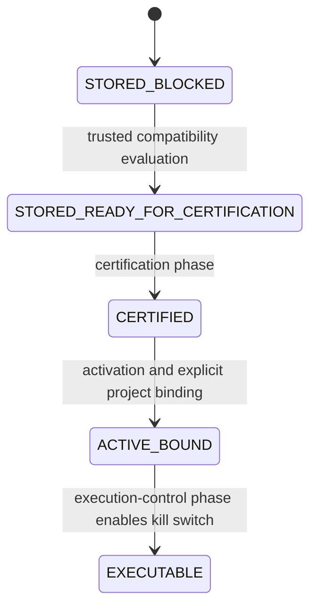
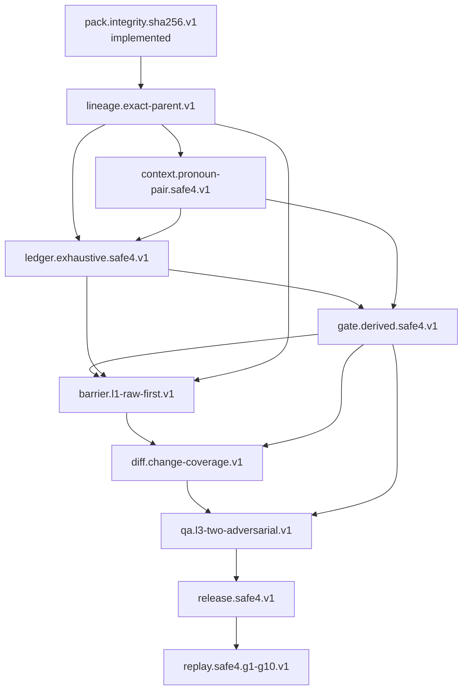

# Editorial Pack Platform — G2-C1A Executable Contract and Capability Implementation Plan

Status: `G2-C1A_PLAN: PASS / REVIEW STOP`

`SAFE4_EXECUTION_READINESS: BLOCKED`

Date: `2026-08-05`

This document is an audit, design and implementation plan only. It does not
implement a SAFE4 capability, edit the production profile, change SQLite,
certify or activate a pack, bind a project, run a model, enable execution, run
Golden Replay, build/install an APK, or reevaluate historical rows. G2-C1A
stops at this review stop; G2-C1B1 is not started.

## 1. Verified baseline

### Startup and repository state

The required startup order was followed:

1. `BUILD_STATE.md`;
2. `WORKSPACE_SNAPSHOT.md`;
3. `git status --short --branch` and `git rev-parse HEAD`;
4. `GIT_WORKFLOW.md`;
5. `EDITORIAL_PACK_PLATFORM_G2_C0_PLAN.md`;
6. G2-C0A evidence checklist and G2-C0B handoff;
7. `EDITORIAL_PACK_PLATFORM_G2_C0C.md`;
8. G2-C0C-B1 SQLite v15 and G2-C0C-B2 runtime-wiring handoffs;
9. canonical SAFE4 assets, the trusted profile, source catalog and related
   implementation/test inventory.

The verified implementation baseline was:

| Fact | Verified value |
|---|---|
| Baseline branch | `feature/v4.16` |
| Review branch | `feature/v4.16-g2-c1a` |
| Baseline/start HEAD | `1876439517057df0dc2cf4744de74dc0cd4d14fa` |
| Worktree at startup | Only `.idea/compiler.xml`, `.idea/gradle.xml`, `.idea/misc.xml` modified; all user-owned, unstaged and untouched |
| Database | SQLite v15 |
| Latest accepted development artifact | `4.16-dev.36`, versionCode `98`, event `build-20260805-095511` |
| APK SHA-256 | `9E147135DEA5D37EDFF5220D5EC8C44CE2686438DE3831BC5EC564E7BC752EC8` |
| Source ZIP SHA-256 | `B8B518270092D03ECC4D479DC93AB2C55EFF027A395600582EECAA5797799F22` |
| Production capability evidence | `pack.integrity.sha256.v1` only |
| Production profile | `com.ml.tblandroidtxt.editorial.engine.bootstrap` / `1.0.0`, non-executable |
| `EditorialSafe4Pack.executionEnabled()` | `false` |
| SAFE4 readiness | `BLOCKED` |

The current production profile remains at
`editorial-engine/src/main/resources/editorial/engine-profile/v1/profile.json`.
Its immutable trust anchors are:

- canonical profile hash:
  `2d4e2f76dc5defcfb98cfd36cec49b0e5454cb3462db93a6b1586f7784eb91b6`;
- machine-contract fingerprint:
  `6410f374ce175cbc6fc32484f5cd9635888b9297b01d882923af06ccd4ac1e4c`;
- raw resource SHA-256:
  `deb0e89a4084a88c137c71ba2aa7a7170f84d9979395ef58866c73529ce601eb`.

The profile has null contract bounds, no supported schema, role, phase,
context, evidence-schema, gate, release or adapter descriptors. This is a
truthful no-executable-contract profile, not wildcard support.

### Canonical SAFE4 source bytes

Only the committed canonical source files under
`app/src/main/assets/editorial/v5-safe4/` were used. Their current worktree
lengths and SHA-256 values match the source-owned anchors:

| Canonical asset | Bytes | SHA-256 |
|---|---:|---|
| `PROJECT_INSTRUCTION_BIEN_TAP_V5_SAFE_4.txt` | 9063 | `C57100C45F16FC5A27E56AE17ABE919BE89DA55082A66D060DB504746ED8B717` |
| `PROMPT_DAU_CHAT_3_LUOT_V5_SAFE_4.txt` | 5008 | `0B4C02573F46A91528A63262D3E52C655A5C7E31F2ABBBFB01759D38E94F8E81` |
| `WORKFLOW_BIEN_TAP_3_LUOT_V5_SAFE_4.txt` | 18337 | `7A434ADE77239DB33AF5A677456D0310AC11DC8391565FC4888236536FF96B5E` |

No external candidate bytes or data-directory files were used.

### Existing code and test boundary

The following are useful infrastructure, not capability evidence by
themselves:

- `EditorialSafe4Pack` declares the ten SAFE4 capability enum values but its
  implementation set contains only `PACK_INTEGRITY`; its global gate is still
  false.
- `EditorialSafe4Workflow` contains role, pronoun-status, gate, phase and
  state enums, input-role checks, release-number fields and fail-closed
  transition/release helpers. Enums and helpers do not prove executable
  evidence; transitions remain guarded by `executionEnabled()`.
- `EditorialPackManifest`, `EditorialPackIntegrityValidator`, immutable
  content-addressed import/storage, the SQLite v15 append-only compatibility
  evidence table, and the trusted-profile resolver provide identity,
  integrity, storage and profile-provenance infrastructure.
- C0A/C0B/C0C pure-JVM model, registry and resolver tests prove strict profile
  parsing, canonical hashes, registry trust anchors, fail-closed selection and
  immutable result shape. They do not prove any missing SAFE4 capability.
- Existing app tests cover SAFE4 blocked states, import/storage, v15 migration,
  read-only management, runtime provenance and rollback. They do not certify,
  activate, bind or execute a pack.

The related test inventory includes the profile/registry/resolver, canonical
JSON, compatibility evaluator/context, manifest/integrity, in-memory registry,
SAFE4 workflow, import/storage/migration, runtime-wiring and compatibility
instrumentation classes under `editorial-engine/src/test`, `app/src/test` and
`app/src/androidTest`. The existing test-only namespaces remain test seams and
cannot promote a production capability.

## 2. Exact capability inventory and requirement groups

The exact IDs below are taken from
`EditorialEngineContractCapabilityEvidenceCatalog` and the committed
production profile. They must not be renamed or inferred from enum labels.

| Group | Exact capability ID | SAFE4 machine responsibility | Current production state |
|---|---|---|---|
| Lineage | `lineage.exact-parent.v1` | Exact pack/manifest/input/run/parent identity and immutable chain | Missing |
| Exhaustive ledger | `ledger.exhaustive.safe4.v1` | Typed populations, anchors, ledgers and coverage equations | Missing |
| Evidence-derived gates | `gate.derived.safe4.v1` | Gate results calculated from stored evidence, not labels | Missing |
| Pronoun/Pair | `context.pronoun-pair.safe4.v1` | Conditional Pronoun status and scoped Pair Context/Pair proof | Missing |
| L1 | `barrier.l1-raw-first.v1` | Raw-first discovery/reconciliation barrier and REPORT_L1 contract | Missing |
| L2 | `diff.change-coverage.v1` | Change Map, exact population boundary and protected-span proof | Missing |
| L3 | `qa.l3-two-adversarial.v1` | Blind QA plus independent adversarial coverage/regression passes | Missing |
| SAFE4 release artifacts | `release.safe4.v1` | FINAL, QA_RECEIPT, optional PAIR_DELTA_QA and release contract | Missing |
| Golden Replay | `replay.safe4.g1-g10.v1` | Deterministic G1–G10 fixture harness and retained replay evidence | Missing |

The implemented production ID is `pack.integrity.sha256.v1`. It validates
canonical pack bytes and is necessary for every later capability, but it does
not imply lineage, compatibility, certification or execution.

## 3. Executable contract at machine level

An executable contract is the versioned, trusted machine projection that an
engine can actually enforce. It is not a profile field named `executable`, a
human label, a prompt, an enum, or a model response.

The contract projection consists of:

1. contract-version bounds and exact schema-version allow-list;
2. input roles with cardinality (`ONE`, `OPTIONAL`, `MANY`) and conditional
   requirements;
3. the complete phase graph, initial/terminal states and legal transitions;
4. phase context allow-lists, including Pronoun and Pair scope rules;
5. evidence-schema IDs and fingerprints;
6. gate IDs, calculator versions and fingerprints;
7. release-artifact roles, cardinalities, names/content contracts and hash
   rules;
8. implemented capability IDs and reviewed capability evidence;
9. adapter IDs, source contract/schema/fingerprint and required capabilities;
10. the machine-contract fingerprint over all semantic fields above.

For a pack `P`, profile `R`, engine build `E`, certification `C`, binding `B`
and execution switch `K`, machine eligibility is the following conjunction:

```text
ELIGIBLE(P,R,E,C,B,K) iff
  trustedProfileParseValidation(R) = PASS
  AND profileResourceHash(R) = trustedResourceAnchor(R)
  AND canonicalProfileHash(R) = trustedProfileAnchor(R)
  AND machineContractFingerprint(R) = trustedMachineAnchor(R)
  AND exactContractAndSchemaMatch(P,R)
  AND inputRolesAndCardinalities(P,R) are fully supported
  AND phaseGraphAndContext(P,R) are exactly supported
  AND every required capability has production implementation evidence
  AND every required evidence/gate/release fingerprint is executable by E
  AND every selected adapter is implemented, fingerprinted and certified
  AND no adapter is pending, ambiguous, untrusted or silently substituted
  AND GoldenReplayG1ToG10(P,R,E,fixtureSet) = PASS
  AND no blocker, invalid result or ambiguous profile exists
  AND certification is current for (packHash, profileHash, machineFingerprint, engineBuild)
  AND project binding is explicit for the same pack/profile version
  AND K is enabled by the separate execution-control phase
```

Every conjunct must have a machine-readable result and identity. A trusted
profile can describe the contract, but it cannot prove that the implementation
or certification exists. A boolean may be the final cached result of this
conjunction only after all evidence is independently verified; a manually
edited `executable=true` is never evidence.

The current profile fails at the contract, capability, replay, certification,
binding and switch predicates. G2-C1A changes none of those runtime facts and
does not call `executionEnabled()` differently.

### Eligibility evaluation sequence

1. Read only APK-bundled profiles from the validated registry.
2. Validate profile bytes, raw resource hash, canonical profile hash and
   machine fingerprint against independent trust anchors.
3. Reject deprecated/revoked profiles for new evaluation unless an explicit
   historical read policy is requested; never silently replace them.
4. Match contract, schema, role/cardinality, phase graph, context, evidence,
   gate and release fingerprints exactly.
5. Resolve required capabilities from the production evidence catalog and
   reject any capability without production evidence.
6. Resolve adapters only by exact source contract/schema/fingerprint and
   certified adapter identity.
7. Compute immutable compatibility evidence with pack/profile/engine context.
8. Require replay and certification evidence before an execution-eligible
   result is possible.
9. Require explicit project binding and a separate execution-control decision.
10. Return a stable blocked reason for every failed conjunct; never infer PASS
    from display text, model output or a pack declaration.

## 4. State machine and ownership boundary

The states are monotonic evidence states, not UI labels:



| Transition | Responsible phase | Machine entry conditions | G2-C1A action |
|---|---|---|---|
| import → `STORED_BLOCKED` | Existing C0C-B2 importer/provenance path | Immutable storage plus fail-closed compatibility result | Already exists; unchanged |
| `STORED_BLOCKED` → `STORED_READY_FOR_CERTIFICATION` | Future executable contract/compatibility phase | Exact executable profile, supported roles/schema/graph, all required implementation evidence, no blocker | Not performed |
| `STORED_READY_FOR_CERTIFICATION` → `CERTIFIED` | Separate certification + Golden Replay phase | Current pack/profile/engine identity, G1–G10 pass and certification receipt | Not performed |
| `CERTIFIED` → `ACTIVE/BOUND` | Separate activation/project-binding phase | User/project explicitly binds the exact certified pack/profile version | Not performed |
| `ACTIVE/BOUND` → `EXECUTABLE` | Separate execution-control phase | Global kill switch is enabled by reviewed phase output and all eligibility predicates still match | Not performed |

Profile selection is an engine trust decision. Pack activation is a project
state mutation. Certification is an evidence decision. Execution is a runtime
control decision. These are separate operations and APIs; none may be collapsed
into profile lookup or import.

## 5. Capability audit

The following tables are the implementation contract for each missing ID. A
test, enum, UI state or model phrase is explicitly not counted as production
evidence unless the row says it is a required part of a future implementation.

### 5.1 `lineage.exact-parent.v1`

| Field | G2-C1A audit/design |
|---|---|
| Machine-level meaning | An immutable, content-addressed chain linking pack identity, contract/profile identity, input manifest, run/evaluation identity and exact parent checkpoint. A child cannot silently change pack, source or parent. |
| SAFE4 requirement source | Project Instruction: source authority and same-manifest evidence; Workflow I: Source Manifest and identity; Workflow III: artifact/identity gate; migration requirement 1. |
| Input/output | Input: canonical pack hash, project/chapter/run identity, input-role hashes/counts, parent identity. Output: typed lineage record, chain fingerprint and stable failure code. |
| Invariant | Every child has exactly one declared parent or an explicit root; parent hash/context matches; all artifacts share the same manifest/series/version; no orphan, reparent, duplicate identity or cross-pack join. |
| Failure mode | `MISSING_PARENT`, `PARENT_MISMATCH`, `MANIFEST_MISMATCH`, `DUPLICATE_LINEAGE`, `ORPHAN_LINEAGE`, `AMBIGUOUS_PARENT` → blocked; historical rows remain unchanged. |
| Existing code | `EditorialPackManifest` canonical pack hash; immutable import/storage; SQLite v15 evaluation identity/context fingerprint; project/chapter input snapshots. |
| Missing | Typed lineage graph, parent checkpoint records, exact run/evaluation links, append-only persistence and stale-chain detection. |
| Dependency capability | `pack.integrity.sha256.v1`; foundational dependency for every ledger, gate, release and replay receipt. |
| Adapter required? | No for the same contract; an adapter may not repair a broken parent chain. |
| Schema/database change? | Yes, future additive lineage/evidence records (expected new schema version); never rewrite v15 history. |
| Pure-JVM test | Canonical chain fingerprint, root/child construction, deterministic identity, duplicate/reparent rejection, one-byte parent/manifest invalidation. |
| App/integration test | Import two revisions, restart, verify exact parent readback, reject cross-pack/cross-profile child and preserve old row. |
| Negative/adversarial test | Missing parent, fork, changed source hash, same identity/different bytes, stale profile, replayed child and ambiguous parent. |
| Golden fixture | `lineage/root-child-v1` plus one-byte parent, cross-pack and stale-context variants, each with fixed hashes. |
| Device QA | New-pack import/revision/restart on a disposable fixture; no existing pack reevaluation or manual DB edits. |
| Production evidence | Implementation commit, source/test blob hashes, schema migration hash, archive `BUILD_INFO`, lineage fixture manifest and retained positive/negative report. |
| Rollback | Disable the capability/profile path and keep packs `STORED_BLOCKED`; retain immutable history; no delete/reparent/backfill. |
| Profile/fingerprint effect | Add capability evidence and lineage semantic projection; new machine fingerprint and profile hash/version. Current v1 anchors never change. |

### 5.2 `context.pronoun-pair.safe4.v1`

| Field | G2-C1A audit/design |
|---|---|
| Machine-level meaning | Validates `AVAILABLE`, `NONE` and `LEGACY_REJECTED` status and a scoped Pair Context keyed by speaker, listener/audience, phase, scope, boundary and evidence. `NONE` is valid and never triggers fallback lookup. |
| SAFE4 requirement source | Project Instruction: PRONOUN/RAW-FIRST, PAIR_CONTEXT authority, observed vs approved Pair Record; Workflow I, II-F and IV; Prompt L1/L2/L3 status and Pair rules; Golden cases G1–G3 and G6. |
| Input/output | Input: raw-derived context, optional Pronoun file/status, Pair Context, relation candidates and lineage scope. Output: typed status, Pair records, field evidence and validation result. |
| Invariant | Pronoun is reference only; Pair authority is scope-bound; every trigger maps or is validly dismissed; `ROLE_LOCKED` reciprocity holds; asymmetry has reason/anchor/boundary; no generic fallback. |
| Failure mode | `PRONOUN_STATUS_INVALID`, `PAIR_SCOPE_MISMATCH`, `PAIR_PROOF_REQUIRED`, `RELATION_CONFLICT`, `UNSUPPORTED_FALLBACK` → blocked or unresolved; no neutralization to hide conflict. |
| Existing code | `EditorialSafe4Workflow.PronounStatus`, `requiredInputs`, `validateContext`, project-owned profiles and import planner; static Pair-related enums/fixtures only. |
| Missing | Trusted validator, typed Pair Context/Pair Record schema, scope/boundary proof, full candidate inventory integration and persisted evidence. |
| Dependency capability | `lineage.exact-parent.v1`; ledger population must carry the scoped relation/evidence identity. |
| Adapter required? | No for SAFE4 v1 semantics; a different Pair schema requires a deterministic certified adapter. |
| Schema/database change? | Yes, additive context/Pair evidence schema; no reinterpretation of legacy pronoun rows. |
| Pure-JVM test | Status matrix, no-fallback semantics, scoped Pair equality, ROLE_LOCKED invariant, valid asymmetry, ambiguous/unlocked preservation. |
| App/integration test | Import and persist `AVAILABLE`, `NONE` and `LEGACY_REJECTED`; restart; verify scope and no fallback/row mutation. |
| Negative/adversarial test | Half-pair, listener switch, reciprocal mismatch, generic pronoun, missing boundary, Pair from another chapter/pack, neutralization attempt. |
| Golden fixture | SAFE4 G1, G2, G3 and G6 with exact raw/context/expected reason hashes. |
| Device QA | Scoped fixture import/restart and blocked-pair display; no model request or certification. |
| Production evidence | Validator implementation/test/build hashes, schema fingerprint, fixed Pair fixtures, negative report and reviewed source manifest. |
| Rollback | Quarantine Pair/Pronoun evaluation and keep the pack blocked; preserve raw/input history and never substitute a default. |
| Profile/fingerprint effect | Add capability, context schema and phase allow-list to semantic projection; new profile version/hash/fingerprint. |

### 5.3 `ledger.exhaustive.safe4.v1`

| Field | G2-C1A audit/design |
|---|---|
| Machine-level meaning | Typed, countable and anchor-addressed Scene, RAW–VI Unit, Title/Glossary, Semantic Risk, Relation Candidate, Pair, Speaker, Error, Change and Protected Span ledgers. |
| SAFE4 requirement source | Project Instruction: required ledgers and coverage; Workflow II-A–J; Workflow III coverage equations; Prompt L1/L2/L3 exhaustive-candidate instructions. |
| Input/output | Input: exact lineage-bound RAW/DRAFT/GLOSSARY/status/context and phase artifact. Output: immutable ledger snapshot with populations, anchors, verdicts and equations. |
| Invariant | `TG detected = PASS + CONFLICT`; `SR detected = PASS + CONFLICT`; `RC total = mapped + validly dismissed`; unprocessed/uncovered/conflict counts are explicit; counts derive from inventory, not hand-entered totals. |
| Failure mode | Missing population, duplicate anchor, uncovered occurrence, hand-entered count, non-closed row or cross-manifest ledger → `LEDGER_INCOMPLETE`/blocked. |
| Existing code | `EditorialSafe4Workflow.ReleaseNumbers`, gate enums, raw/draft snapshot and import infrastructure; no typed exhaustive ledger engine or persistence. |
| Missing | All ledger row types, population scanners, anchor identity, equation calculators, immutable snapshots and evidence links. |
| Dependency capability | `lineage.exact-parent.v1`; scoped Pronoun/Pair semantics must be available before Pair/RC closure. |
| Adapter required? | No for SAFE4 v1; schema changes require an explicit lossless adapter only. |
| Schema/database change? | Yes, additive ledger/evidence storage; legacy V5 rows remain read-only/history. |
| Pure-JVM test | Row schema, anchor uniqueness, equation derivation, deterministic ordering, snapshot immutability and hash invalidation. |
| App/integration test | Persist/reopen a complete fixture, verify counts and exact anchors; append a new revision without modifying the prior snapshot. |
| Negative/adversarial test | Omitted title, hidden semantic occurrence, dismissed RC with a trigger, duplicate anchor, altered count and mixed-manifest ledger. |
| Golden fixture | SAFE4 G4 and G5 plus exhaustive ledger fixture with fixed population/count/hash manifest. |
| Device QA | Import/restart/read-only ledger provenance and blocked state; no execution path. |
| Production evidence | Typed schema/validator commit, full fixture hash set, positive/negative regression, immutable evidence row and archive provenance. |
| Rollback | Stop ledger evaluation and leave the pack blocked; do not delete or rewrite prior evidence. |
| Profile/fingerprint effect | Add every ledger schema fingerprint and capability evidence; new profile version, canonical hash and machine fingerprint. |

### 5.4 `gate.derived.safe4.v1`

| Field | G2-C1A audit/design |
|---|---|
| Machine-level meaning | Calculates each SAFE4 gate from typed ledger/evidence rows, exact equations, calculator version and input fingerprints. A label such as PASS/CLOSED/SAFE is not an input proof. |
| SAFE4 requirement source | Project Instruction gate authority; Workflow III gate list 1–9 and receipt rule; Prompt common contract and L3 release numbers; Golden G10 receipt-evidence failure. |
| Input/output | Input: lineage-bound ledger snapshots, phase outputs, calculator definitions and required fingerprints. Output: immutable gate result with inputs, counts, calculator/fingerprint and reason. |
| Invariant | Every PASS cites its ledger/section/count/anchors; absent or ambiguous evidence is OPEN/BLOCKED; gate outputs are deterministic and cannot be set by model text. |
| Failure mode | Missing evidence, stale input, calculator mismatch, nonzero release number, unknown gate or model-only PASS → blocked. |
| Existing code | `EditorialSafe4Workflow.Gate`, `GateStatus`, `ReleaseNumbers`, `mayRelease`; current method is still globally guarded and does not calculate stored evidence. |
| Missing | Typed calculators, gate dependency graph, immutable receipts, stale-input checks and production gate evidence catalog entries. |
| Dependency capability | Lineage, exhaustive ledger and Pronoun/Pair context; L1/L2/L3 runners later provide their phase evidence. |
| Adapter required? | No for unchanged SAFE4 gates; changed gate semantics require a new profile or certified adapter. |
| Schema/database change? | Yes, additive gate-result/evidence receipt storage; no legacy result reinterpretation. |
| Pure-JVM test | Equation-to-gate mapping, stale fingerprint rejection, model-label injection rejection, every gate dependency and deterministic receipt hash. |
| App/integration test | Persist/read gate receipts, reject updates/deletes, block ready/release when one evidence row is absent or stale. |
| Negative/adversarial test | Manual PASS, wrong count, missing anchor, reused prior pack receipt, unknown calculator and nonzero release number. |
| Golden fixture | G8 and G10, plus one-fixture-per-gate receipt evidence with expected blocked reason. |
| Device QA | Read-only gate receipt display and blocked state after restart; no activation or execution. |
| Production evidence | Calculator/source/test/build hashes, gate-definition fingerprints, fixture receipts, full regression and review stop. |
| Rollback | Revoke gate calculator/profile support and return all dependent states to blocked; preserve receipts as historical. |
| Profile/fingerprint effect | Gate IDs/calculator versions/fingerprints enter the machine projection; new profile/hash/fingerprint. |

### 5.5 `barrier.l1-raw-first.v1`

| Field | G2-C1A audit/design |
|---|---|
| Machine-level meaning | Enforces L1 order: verify manifest/status, read all RAW, build raw-side models/candidates, then reconcile optional sources and original DRAFT, and produce REPORT_L1 without editing. |
| SAFE4 requirement source | Prompt L1; Workflow IV L1 order/exit/output; Project Instruction RAW-FIRST and authority rules. |
| Input/output | Input: exact RAW, original DRAFT, GLOSSARY, Pronoun status and optional Pair Context. Output: REPORT_L1 plus lineage-bound ledgers, source manifest and open/closed errors. |
| Invariant | No DRAFT edit before raw audit; no later phase without REPORT_L1; every scene/unit/candidate has status and anchor; identity mismatch is blocked. |
| Failure mode | Missing/wrong artifact, order violation, raw coverage gap, source identity mismatch or premature edit → blocked L1; no VI_L2/FINAL. |
| Existing code | `EditorialSafe4Workflow.ContextPhase`, input-role validation, immutable input snapshots and retired-run safety boundary. No production L1 runner remains. |
| Missing | Raw-first runner, source manifest reader, exhaustive L1 report writer, phase transition persistence and model/provider barrier. |
| Dependency capability | Lineage, exhaustive ledger and Pronoun/Pair context. |
| Adapter required? | No for SAFE4 v1; a changed report schema needs a versioned adapter. |
| Schema/database change? | Yes, additive phase/report evidence records; no old run resurrection. |
| Pure-JVM test | Phase order, required/forbidden roles, report identity, raw-first no-edit invariant and missing-artifact blocking. |
| App/integration test | Start/import L1, persist REPORT_L1, restart, prevent L2 until exact report is present. |
| Negative/adversarial test | Draft-first access, wrong report hash, missing glossary, Pronoun fallback, forged CLOSED and mixed series/manifest. |
| Golden fixture | G1/G2/G3/G6/G7 phase-barrier variants with fixed REPORT_L1 expected outcomes. |
| Device QA | Phase entry/blocked messaging/restart with no model call; no certification. |
| Production evidence | Runner implementation/test/build hashes, report fixtures, source manifest hashes, blocked-path logs and review approval. |
| Rollback | Disable phase transition and keep inputs/history intact; no partial report promoted. |
| Profile/fingerprint effect | Add L1 phase/barrier and report schema fingerprints; new profile version/hash/fingerprint. |

### 5.6 `diff.change-coverage.v1`

| Field | G2-C1A audit/design |
|---|---|
| Machine-level meaning | Reconstructs DRAFT→VI_L2 changes and proves every changed anchor is within a declared Change Map population, with protected-span and speaker-proof regression checks. |
| SAFE4 requirement source | Project Instruction Scope Fence/Change Trace; Workflow II-I/J and L2 order; Workflow III change/no-regression gates; Prompt L2 change map and boundary regression. |
| Input/output | Input: original DRAFT, REPORT_L1, edited VI_L2, Change Map, protected spans, speaker proofs and lineage. Output: exact diff map, coverage equation and regression result. |
| Invariant | `Actual Changed Anchors ⊆ Union(Declared Population)`; each change has Error/Change ID; out-of-scope/protected changes are zero or explicitly independently authorized. |
| Failure mode | Unaccounted diff, outside population, protected-span regression, missing speaker proof, changed input identity → blocked/revert. |
| Existing code | Input snapshots, chapter override/import planner, older editorial history; no SAFE4 change-map/diff evidence executor. |
| Missing | Diff engine, anchor normalizer, protected-span ledger, speaker proof contract, immutable Change Map evidence. |
| Dependency capability | Lineage, ledger, derived gates and completed L1 report. |
| Adapter required? | No for same DRAFT/VI_L2 semantics; new diff semantics require a deterministic adapter/certification. |
| Schema/database change? | Yes, additive change-map/protected-span evidence; history remains immutable. |
| Pure-JVM test | Exact diff population, anchor normalization, subset equation, protected span and zero-regression checks. |
| App/integration test | Persist VI_L2/change map, reopen, reject release when one changed anchor lacks ID or population. |
| Negative/adversarial test | Unnecessary rewrite, neutralization, removed subject/listener, changed title/table/symbol, extra line and wrong speaker proof. |
| Golden fixture | G7 and G9, with fixed DRAFT/VI_L2/change-map hashes and expected failure codes. |
| Device QA | Read-only change evidence and blocked release; no model execution or project binding. |
| Production evidence | Diff/protected-span implementation/test/build hashes, fixture set, regression report and exact receipt identity. |
| Rollback | Revert the full change set to the prior immutable input; never silently edit the map or prior output. |
| Profile/fingerprint effect | Add change-map/protected-span schema and calculator fingerprints; new profile version/hash/fingerprint. |

### 5.7 `qa.l3-two-adversarial.v1`

| Field | G2-C1A audit/design |
|---|---|
| Machine-level meaning | Runs independent blind QA, adversarial coverage and adversarial regression from raw/original inputs; it does not reuse a first-pass PASS as evidence. |
| SAFE4 requirement source | Prompt L3 and both adversarial passes; Workflow VI and Release Numbers; Project Instruction release/no-regression rules. |
| Input/output | Input: exact L1/L2 artifacts plus raw/original DRAFT/VI_L2/change map. Output: FINAL candidate, QA evidence, two adversarial result sets and QA_RECEIPT changes. |
| Invariant | Raw-first blind read precedes reconciliation; each pass is independent; all five release numbers are zero; unresolved conflict/protected regression blocks. |
| Failure mode | Reused evidence, missing adversarial probe, nonzero release number, weak speaker proof or hidden regression → blocked/no FINAL. |
| Existing code | `ChapterState`/`ContextPhase` enum vocabulary and release-number value object; no live L3 runner or adversarial evidence engine. |
| Missing | Blind QA runner, probe registry, independent evidence stores, two-pass comparator, QA change integration and phase persistence. |
| Dependency capability | Lineage, ledgers, gates, Pronoun/Pair, L1 and L2. |
| Adapter required? | No for SAFE4 v1; changed QA schema requires versioned adapter and replay recertification. |
| Schema/database change? | Yes, additive QA/adversarial evidence records. |
| Pure-JVM test | Independent input graph, no evidence reuse, probe coverage, five release numbers and final-read hash checks. |
| App/integration test | Reopen/resume blocked L3, verify two evidence sets and prevent release when one is absent. |
| Negative/adversarial test | Omitted candidate, wrong relation, half-pair, listener switch, speaker guess, receipt-only PASS and protected-span regression. |
| Golden fixture | G1–G10 execution matrix, especially G7/G8/G9/G10, with each result identity fixed. |
| Device QA | Read-only QA state/restart and blocked release; no activation or model request until later phase. |
| Production evidence | Independent pass manifests, probe/output hashes, implementation/test/build hashes, full regression and review stop. |
| Rollback | Quarantine the L3 result and return to blocked/previous immutable checkpoint; never delete adversarial findings. |
| Profile/fingerprint effect | Add L3/adversarial schema and phase fingerprints; new profile version/hash/fingerprint. |

### 5.8 `release.safe4.v1`

| Field | G2-C1A audit/design |
|---|---|
| Machine-level meaning | Produces only the SAFE4 release artifact contract: FINAL translation, QA_RECEIPT with evidence table/coverage equations/adversarial results, and optional QA-confirmed PAIR_DELTA_QA. |
| SAFE4 requirement source | Prompt common chain and L3 output; Workflow I, III and VI release output; Project Instruction release conditions and receipt evidence rule. |
| Input/output | Input: certified phase artifacts, gate receipts, exact manifest/lineage and final hashes. Output: bounded artifact set and immutable release receipt; no model label creates release. |
| Invariant | Same manifest/pack/profile context throughout; maximum/required files match profile; each PASS cites evidence; five release numbers are zero; final file contains translation only. |
| Failure mode | Missing artifact, wrong hash/order, unsupported extra file, receipt without evidence, unresolved gate or profile mismatch → blocked/no release. |
| Existing code | `EditorialSafe4Pack` identity/hash guard, retired release paths, archive tooling for development artifacts; no SAFE4 FINAL/QA receipt builder. |
| Missing | Release schema, artifact writer/validator, receipt calculator, optional Pair delta handling and certification linkage. |
| Dependency capability | All prior eight capabilities; certification remains a separate consumer/phase. |
| Adapter required? | Only when release artifact semantics are losslessly transformed and separately certified; otherwise engine/profile upgrade. |
| Schema/database change? | Yes, additive release receipt/evidence identity; archive payload is separate from app history. |
| Pure-JVM test | Artifact cardinality/content contract, receipt equations, final-only translation, hash/order and missing-evidence blocking. |
| App/integration test | Persist/read release receipt without activation; reject archive when receipt/profile/pack identity differs. |
| Negative/adversarial test | Receipt-only PASS, extra report file, wrong pair delta, nonzero release number, changed final after receipt, stale profile. |
| Golden fixture | G8 and G10, plus exact two-file and three-file output fixtures with fixed hashes. |
| Device QA | Read-only release preview/receipt identity; no activation, project binding or execution. |
| Production evidence | Artifact validator/source/test/build hashes, receipt fixtures, archive parity and review approval. |
| Rollback | Revoke release readiness; keep immutable draft/QA evidence and return to blocked, never delete receipt history. |
| Profile/fingerprint effect | Add release artifact contract fingerprint; new profile version/hash/fingerprint. |

### 5.9 `replay.safe4.g1-g10.v1`

| Field | G2-C1A audit/design |
|---|---|
| Machine-level meaning | Deterministic harness runs fixed G1–G10 fixtures against exact pack/profile/engine context and compares machine results, evidence and failure codes. It is evidence, not a certification authority. |
| SAFE4 requirement source | Canonical Workflow VII G1–G10, Prompt adversarial/release rules, Project Instruction receipt and no-gate-bypass rules. |
| Input/output | Input: fixed fixture bytes/manifest, engine build, profile identity, capability/evidence fingerprints and expected outcome. Output: replay result set and fixture-set fingerprint. |
| Invariant | Every result is bound to pack hash, profile hash, machine fingerprint, engine build and fixture-set hash; any identity change invalidates prior replay. |
| Failure mode | Fixture drift, identity mismatch, nondeterminism, wrong expected code, missing evidence or harness self-certification attempt → replay FAIL/blocked. |
| Existing code | No production Golden Replay harness or certification store; current profile only lists the capability as missing and no replay cases are trusted. |
| Missing | Fixed fixture package, deterministic harness, result schema, invalidation rules and retained replay evidence. |
| Dependency capability | All previous capabilities and the SAFE4 release artifact contract. |
| Adapter required? | No for exact SAFE4; adapters need their own fixture set and certification. |
| Schema/database change? | Yes, additive replay evidence/certification records in a later phase; no current rows changed. |
| Pure-JVM test | Harness determinism, fixture hash lock, expected G1–G10 codes, identity binding and one-byte invalidation. |
| App/integration test | Read-only replay evidence lookup by exact context; no harness-triggered activation or model execution. |
| Negative/adversarial test | Alter fixture, engine build, profile hash, machine fingerprint, expected code or receipt identity; attempt harness self-certification. |
| Golden fixture | Canonical G1, G2, G3, G4, G5, G6, G7, G8, G9 and G10 fixture IDs from Workflow VII. |
| Device QA | Only after pure-JVM evidence and certification design; device result must be separately tagged and cannot be self-certified by the harness. |
| Production evidence | Fixture-set manifest/hash, harness commit/test/build hash, all ten results, exact context identity and independent review/certification receipt. |
| Rollback | Mark replay evidence stale/revoked and block certification; do not delete the fixture set or rewrite prior results. |
| Profile/fingerprint effect | Add replay fixture-set fingerprint and capability evidence; new profile version/hash/fingerprint. |

## 6. Dependency graph and implementation order

The dependency order is deliberately identity/evidence-first. The existing
integrity capability is the root; lineage and ledger precede gates, release and
replay.



The order is:

1. `lineage.exact-parent.v1`;
2. `context.pronoun-pair.safe4.v1`;
3. `ledger.exhaustive.safe4.v1`;
4. `gate.derived.safe4.v1`;
5. `barrier.l1-raw-first.v1`;
6. `diff.change-coverage.v1`;
7. `qa.l3-two-adversarial.v1`;
8. `release.safe4.v1`;
9. `replay.safe4.g1-g10.v1`.

The single smallest foundational capability proposed for `G2-C1B1` is
`lineage.exact-parent.v1`. It creates the identity on which every later ledger,
gate, release and replay claim depends. No other capability is grouped into
G2-C1B1.

## 7. Phased implementation plan

Every phase below is a separate reviewable group and must have separate
implementation, regression and evidence-promotion commits where practical.
The phase plan does not authorize starting any phase.

### G2-C1B1 — exact lineage

| Field | Plan |
|---|---|
| Capability | `lineage.exact-parent.v1` only |
| Dependency | Existing pack integrity and C0C-B2 immutable identity; no other missing capability |
| Expected modules | Pure-JVM `EditorialLineage*` model/fingerprint/validator; app append-only lineage DAO and additive migration; importer/evaluation context integration only after review |
| Tests/evidence | Lineage identity/parent unit matrix; import/restart integration; cross-pack, fork, reparent and stale negative fixtures; production source/test/build hashes |
| Migration | Additive lineage table/columns only after schema review; v15 rows unchanged, no backfill or reevaluation |
| Build/device QA | Pure-JVM plus required app/instrumentation regression; archive-first APK only if Android source changes; no certification/execution |
| Review stop | Approve identity tuple, root/child semantics and migration before G2-C1B2 |
| Rollback | Disable lineage capability/profile claim; retain immutable records and keep packs blocked |
| Acceptance | Exact parent/manifest/input identity is machine-verifiable; all negative tests pass; catalog promotion is reviewed separately |
| Still locked | All other eight capabilities, certification, activation, binding, execution and `executionEnabled()` |

### G2-C1B2 — conditional Pronoun/Pair context

| Field | Plan |
|---|---|
| Capability | `context.pronoun-pair.safe4.v1` |
| Dependency | G2-C1B1 lineage; existing raw/input snapshot infrastructure |
| Expected modules | Typed Pronoun status validator, Pair Context/Pair Record model, scope/boundary validator and lineage-bound persistence adapter |
| Tests/evidence | Pure-JVM status/invariant matrix; app persistence/restart; half-pair/listener-switch/generic-fallback negatives; fixed G1/G2/G3/G6 fixtures |
| Migration | Additive context/Pair evidence only; old Pronoun/profile rows remain historical and are not reevaluated |
| Build/device QA | Full required regression; focused device readback only if APK changes; no model/certification |
| Review stop | Approve `NONE` semantics, Pair scope and ROLE_LOCKED/ASYMMETRIC rules |
| Rollback | Quarantine context result and leave pack blocked; never synthesize a default Pair |
| Acceptance | Every Pair candidate maps/dismisses with evidence; status and scope are deterministic; evidence catalog review passes |
| Still locked | Ledger closure, gates, L1/L2/L3, release, replay, certification, activation, binding and execution |

### G2-C1B3 — exhaustive ledgers

| Field | Plan |
|---|---|
| Capability | `ledger.exhaustive.safe4.v1` |
| Dependency | Lineage and Pronoun/Pair context |
| Expected modules | Typed Scene, RAW–VI, TG, SR, RC, Pair, Speaker, Error, Change and Protected Span ledgers; scanners, anchor/count calculators and immutable snapshots |
| Tests/evidence | Equation/anchor unit tests; persisted complete fixture; omitted/duplicate/hand-count/mixed-manifest negatives; fixed G4/G5 ledger fixtures |
| Migration | Additive ledger schema/history; no legacy V5 row conversion to SAFE4 evidence |
| Build/device QA | Full JVM/app regression; device read-only evidence only; no execution |
| Review stop | Approve ledger population definitions, equations and anchor model |
| Rollback | Stop ledger promotion and keep all affected packs blocked |
| Acceptance | All populations are machine-derived, equations balance, uncovered/unprocessed/conflict behavior is fail-closed, catalog promotion reviewed |
| Still locked | Gates and all L1/L2/L3/release/replay/certification/activation/binding/execution work |

### G2-C1B4 — evidence-derived gates

| Field | Plan |
|---|---|
| Capability | `gate.derived.safe4.v1` |
| Dependency | Lineage, Pronoun/Pair and exhaustive ledgers |
| Expected modules | Gate calculator registry, typed gate result/receipt, dependency fingerprint verifier and release-number calculator |
| Tests/evidence | Every gate positive/negative, model-label injection, stale input and calculator mismatch; G8/G10 receipt fixtures |
| Migration | Additive gate evidence history; v14/v15 rows remain unattested/current only by exact context |
| Build/device QA | Full regression and read-only receipt inspection; no release or execution |
| Review stop | Approve gate definitions, calculator fingerprints and evidence citation requirements |
| Rollback | Revoke calculators/profile claim and return all dependent results to blocked |
| Acceptance | No gate PASS without stored evidence, counts and anchors; all calculator fingerprints match profile |
| Still locked | L1/L2/L3, release, replay, certification, activation, binding and execution |

### G2-C1B5 — L1 raw-first barrier

| Field | Plan |
|---|---|
| Capability | `barrier.l1-raw-first.v1` |
| Dependency | Lineage, context, ledgers and gates |
| Expected modules | L1 phase runner, source-manifest builder, raw-first context gate and REPORT_L1 artifact validator |
| Tests/evidence | Order/role tests, report identity, no-edit-before-audit, missing/wrong artifact negatives and fixed L1 fixtures |
| Migration | Additive phase/report evidence; no old run promotion |
| Build/device QA | Full regression; controlled device phase-entry/readback if Android wiring changes; no model execution beyond approved later runner boundary |
| Review stop | Approve phase order and REPORT_L1 contract |
| Rollback | Prevent L2 transition; preserve inputs and partial evidence as blocked |
| Acceptance | Raw is audited first, all L1 equations/identities are closed, REPORT_L1 is exact and immutable |
| Still locked | L2/L3, release, replay, certification, activation, binding and execution |

### G2-C1B6 — L2 change coverage

| Field | Plan |
|---|---|
| Capability | `diff.change-coverage.v1` |
| Dependency | G2-C1B1–B5, especially exact REPORT_L1 and ledgers |
| Expected modules | L2 runner, diff/anchor engine, Change Map validator, protected-span and Speaker Proof evidence |
| Tests/evidence | Subset equation, zero-regression, speaker proof and changed-output fixtures; G7/G9 negative replay fixtures |
| Migration | Additive change-map/protected-span evidence; no historical mutation |
| Build/device QA | Full regression; no release/device execution claim |
| Review stop | Approve exact population/anchor semantics and rollback of whole change sets |
| Rollback | Revert complete output/change set to immutable prior checkpoint |
| Acceptance | Every actual change has ID and declared population; protected-span and speaker checks pass |
| Still locked | L3, release, replay, certification, activation, binding and execution |

### G2-C1B7 — L3 two adversarial passes

| Field | Plan |
|---|---|
| Capability | `qa.l3-two-adversarial.v1` |
| Dependency | All prior phases through L2 and derived gates |
| Expected modules | Blind QA runner, independent adversarial coverage/regression pass stores, probe manifest and QA receipt integration |
| Tests/evidence | No-evidence-reuse tests, all adversarial probes, five release numbers, G1–G10 phase fixtures and two independent result hashes |
| Migration | Additive QA/adversarial evidence; no legacy receipt promotion |
| Build/device QA | Full regression; scoped device read-only QA only; no certification/activation |
| Review stop | Approve independence, probe coverage and no-reuse semantics |
| Rollback | Quarantine L3 evidence and return to blocked/prior immutable checkpoint |
| Acceptance | Both adversarial passes are independently reproduced, all release numbers zero and no unresolved conflict remains |
| Still locked | SAFE4 release, replay certification, activation, binding and execution |

### G2-C1B8 — SAFE4 release artifacts

| Field | Plan |
|---|---|
| Capability | `release.safe4.v1` |
| Dependency | All prior capabilities through L3 |
| Expected modules | FINAL/QA_RECEIPT/PAIR_DELTA_QA schemas, artifact validator, receipt calculator and archive/certification handoff seam |
| Tests/evidence | Exact two/three-file output fixtures, receipt equations, wrong identity/extra file/nonzero-number negatives and archive parity |
| Migration | Additive release evidence; archive payload is immutable and not a substitute for app certification |
| Build/device QA | Full regression; archive-first build only in its approved implementation phase; no activation/execution |
| Review stop | Approve release artifact contract and receipt evidence table |
| Rollback | Revoke release readiness; preserve all inputs and receipts as history |
| Acceptance | Artifact set, hashes, identity, equations and evidence references all match; no release on labels alone |
| Still locked | Golden Replay, certification, activation, binding and execution |

### G2-C1B9 — Golden Replay G1–G10

| Field | Plan |
|---|---|
| Capability | `replay.safe4.g1-g10.v1` |
| Dependency | All prior capabilities and SAFE4 release artifact contract |
| Expected modules | Fixed fixture manifest, deterministic replay harness, context-bound result schema, invalidation and independent certification handoff |
| Tests/evidence | All G1–G10 positive/negative expected codes, one-byte/identity invalidation, deterministic repeated runs and complete fixture-set hash |
| Migration | Additive replay/certification evidence only; no current profile or historical row rewrite |
| Build/device QA | Pure-JVM first; device evidence later and separately identified; no harness self-certification |
| Review stop | Approve fixture set, expected machine codes and certification boundary |
| Rollback | Mark replay/certification stale and block; preserve fixtures/results |
| Acceptance | All ten cases pass with exact pack/profile/machine/engine/fixture identity and independent review |
| Still locked | Activation, project binding, execution switch and production execution until later phases |

## 8. Evidence promotion rule

A capability may be added to the production evidence catalog only when all of
the following are true:

1. production implementation exists in a non-test namespace;
2. the implementation is bound to the intended contract/schema semantics;
3. pure-JVM unit tests pass, including negative/adversarial tests;
4. app/integration tests pass where persistence, importer, phase or Android
   composition is involved;
5. a fixed golden fixture set exists and every fixture has a stable hash;
6. no permissive fallback, bypass, test-only namespace or model-label shortcut
   exists;
7. full regression passes in the pinned toolchain;
8. production source, test, build and evidence hashes are retained;
9. the review stop is explicitly approved.

Implementation commit and evidence-catalog promotion are separate review gates
where practical. A profile may not declare the capability until the promotion
gate has passed. A profile created before promotion remains non-executable for
that capability.

## 9. Profile immutability, versioning and resolver policy

The current profile is immutable. Its resource bytes, canonical hash
`2d4e2f76...4eb91b6`, machine fingerprint
`6410f374...4ac1e4c` and raw resource hash are never overwritten or reused for
new semantics.

When new capability semantics are implemented:

- create a new profile resource/version and new canonical profile hash;
- include the new capability evidence, schema/phase/gate/release/replay
  fingerprints and, where needed, adapter descriptors;
- keep the v1 profile readable for compatibility history;
- retain the old profile identity/hash in all SQLite v15 rows;
- never reevaluate or rewrite old pack/evaluation rows automatically;
- never silently replace the trusted profile or rebind an existing project.

The resolver must select by a full identity and semantic match, not by version
string alone:

```text
(engineProfileId, engineProfileVersion, canonicalProfileHash,
 machineContractFingerprint, contract/schema, roles/cardinality,
 phase/context, evidence/gate/release fingerprints, capabilities, adapters)
```

For a new pack, the APK registry first validates all bundled profiles, removes
deprecated/revoked entries under the current policy, and exact-matches the
pack's untrusted declarations against trusted descriptors. The pack cannot
choose its profile. Zero matches are blocked; multiple matches are
`AMBIGUOUS_TRUSTED_PROFILE`; one match is only a selected engine profile, not
an activated pack.

If compiled current-profile selector logic or catalog eligibility metadata is
needed, it is a separately reviewed future phase. It must not be introduced by
changing the current profile in place, and it must not use `latest`, closest,
first or display-version ordering as authority.

## 10. New-pack compatibility matrix

The installed APK boundary is a contract boundary, not a promise that every
future pack will run without an engine upgrade.

| New pack change | APK rebuild needed? | Adapter needed? | Conditions |
|---|---|---|---|
| Data/prompt/workflow wording only | No, if current supported contract/schema and machine semantics remain identical | No | Manifest contract, schema, roles/cardinality, phase graph, context, gate/release fingerprints and required capabilities remain within the trusted executable profile; integrity, certification and binding still pass |
| New data-only pack under an already supported version | No | No | Exact pack manifest/identity is valid; no new capability, phase, gate, release or machine semantics; it must still be certified for its own pack hash/context |
| Schema changes but lossless deterministic mapping exists | Not if the current engine bundles and supports the adapter | Yes | Adapter has implementation, source/schema/fingerprint, deterministic lossless tests, production evidence, profile descriptor and separate certification; no semantic change is hidden by conversion |
| New capability requirement | Yes | Usually no | New production implementation/evidence and profile version are required; current APK must return engine-upgrade/block |
| New phase graph, context barrier, gate or release semantics | Yes | Only if a certified adapter truly preserves semantics | Machine contract is outside current bounds; new profile/engine semantics and replay/certification are required |
| Schema cannot be safely converted | Yes | No safe adapter exists | Reject rather than lossy conversion; historical packs remain bound to their original profile |
| External code/plugin/native execution required | Yes | No permissive plugin adapter | Current declarative profile cannot authorize code loading; new engine/APK security review is required |
| Contract outside engine bounds | Yes | Only with a separately certified deterministic adapter if semantics remain supported | Resolver returns `ENGINE_UPGRADE_REQUIRED` or `ADAPTER_REQUIRED`; no nearest-profile fallback |

Therefore, a pack can be imported and stored by the current C0C-B2 boundary,
but it cannot execute merely because it is data-only. The current production
profile remains non-executable and SAFE4 remains blocked.

## 11. Golden Replay and certification boundary

Capability implementation is not certification. The Golden Replay harness is a
deterministic evidence producer and must not certify a pack by itself.

Every replay result must include:

```text
canonicalPackHash
canonicalProfileHash
machineContractFingerprint
engineBuildIdentity
fixtureSetFingerprint
capability/evidence fingerprints
expected and actual machine result codes
```

Changing any identity invalidates the prior replay/certification context or
requires a new evaluation. Certification is a separate phase that reviews
the retained replay and release receipts for the exact pack/profile/engine
tuple. Activation, project binding and execution-control are still separate
phases after certification. G2-C1A neither implements the harness nor runs or
promotes any replay/certification result.

## 12. Blockers and decisions requiring user approval

The plan itself is complete, but execution readiness remains blocked by:

- nine missing production capabilities and no production evidence for them;
- the current profile's intentionally empty executable contract;
- no certified profile/pack/engine context;
- no Golden Replay G1–G10 evidence;
- no activation, project binding or execution-control approval.

User review is requested for:

1. approval of this G2-C1A plan and the dependency order;
2. approval of `lineage.exact-parent.v1` as the single capability for G2-C1B1;
3. approval of additive schema/versioning work before any future runtime
   implementation;
4. later approval of each phase's review stop and evidence-catalog promotion;
5. explicit confirmation that certification, activation, binding and execution
   remain separate phases after capability implementation.

## 13. Required verification evidence

The mandatory read-only regression was run with Android Studio JBR 21 and the
repository Wrapper:

```text
.\gradlew.bat :editorial-engine:test :app:testDebugUnitTest --no-daemon
PASS: editorial-engine 60/60; app JVM 162/162
Failures: 0; errors: 0; skipped: 0

git diff --check
PASS (exit code 0; existing Git LF/CRLF warning only)
```

No `connected*`, `assemble*`, `build-and-save.ps1`, APK installation, device
QA, certification, Golden Replay, activation, binding or execution command was
run for G2-C1A. The accepted code98 artifact remains the latest build.

## 14. Final boundary and status

No capability was added to the production catalog. No profile, SAFE4 byte,
database schema, runtime execution gate, historical evaluation or APK was
changed by G2-C1A. The protected `.idea/*` files remain untouched, unstaged
and uncommitted.

```text
G2-C1A_PLAN: PASS / REVIEW STOP
SAFE4_EXECUTION_READINESS: BLOCKED
NEXT ACTION: User review; do not start G2-C1B1 automatically
```
