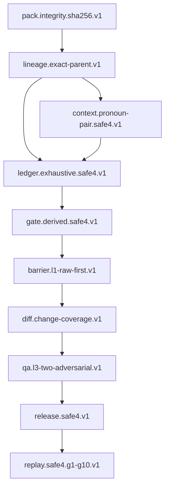

# G2-C1B1-A Pure-JVM Exact-Parent Lineage Contract

## Review-stop status

| State | Result |
|---|---|
| `G2-C1B1A_IMPLEMENTATION` | `PASS` |
| `LINEAGE_CAPABILITY_PROMOTION` | `NOT_STARTED` |
| `SAFE4_EXECUTION_READINESS` | `BLOCKED` |

This phase implements only the pure-JVM model, canonical identity, SHA-256
fingerprint derivation and fail-closed validator for the exact capability
`lineage.exact-parent.v1`. It does not add the capability to the production
evidence catalog, change the bundled profile, migrate SQLite, wire an
importer/runtime call site, create certification evidence, run Golden Replay,
activate a pack, bind a project or enable execution. The phase stops here for
review; G2-C1B1-B is not started.

## Branch, commits and baseline

| Checkpoint | Evidence |
|---|---|
| C1A pre-correction | `feature/v4.16-g2-c1a`, `HEAD=7d085066d67f196cdcae9b1350243b1dff4a3dad` |
| C1A checklist correction | Commit `9091d9167fa2f791cb822a2c6522af8bdab3021e`; step 09 records the real C1A documentation commit `7d085066d67f196cdcae9b1350243b1dff4a3dad` |
| C1B1A branch start | `feature/v4.16-g2-c1b1a`, `HEAD=9091d9167fa2f791cb822a2c6522af8bdab3021e` |
| Implementation end | Commit `b4a9a52d37697b8f81eb7857a969103ef970daa3`, `feat(editorial): add pure-jvm exact-parent lineage contract` |
| Final handoff state | Commit `f097087` (`docs(editorial): record C1B1A lineage review stop`) contains the handoff/checklist/snapshot state; the snapshot records `b4a9a52...` as the implementation baseline immediately before that state commit. |

The C1A correction was made before opening this branch, and only checklist
step 09 was changed. The three user-owned files
`.idea/compiler.xml`, `.idea/gradle.xml` and `.idea/misc.xml` were never
modified by this phase's staging or commits.

The verified baseline remains:

- SQLite v15.
- Latest accepted APK `4.16-dev.36`, code98; no APK was built or installed.
- Canonical profile hash
  `2d4e2f76dc5defcfb98cfd36cec49b0e5454cb3462db93a6b1586f7784eb91b6`.
- Machine contract fingerprint
  `6410f374ce175cbc6fc32484f5cd9635888b9297b01d882923af06ccd4ac1e4c`.
- Production evidence remains only `pack.integrity.sha256.v1`.
- `EditorialSafe4Pack.executionEnabled()` remains `false`.

## Exact SAFE4 capability inventory

These IDs are copied from the committed source catalog and are not renamed or
inferred from labels:

1. `lineage.exact-parent.v1` - implemented in this phase, but not promoted.
2. `ledger.exhaustive.safe4.v1` - missing.
3. `gate.derived.safe4.v1` - missing.
4. `context.pronoun-pair.safe4.v1` - missing.
5. `barrier.l1-raw-first.v1` - missing.
6. `diff.change-coverage.v1` - missing.
7. `qa.l3-two-adversarial.v1` - missing.
8. `release.safe4.v1` - missing.
9. `replay.safe4.g1-g10.v1` - missing.

The existing `pack.integrity.sha256.v1` remains the only production evidence.
The following SAFE4 groups remain distinct: Lineage; Exhaustive ledger;
Evidence-derived gates; Pronoun/Pair; L1; L2; L3; SAFE4 release artifacts;
and Golden Replay G1-G10. No ledger, Pronoun/Pair, gate, L1/L2/L3, release or
replay implementation was added here.

## Dependency graph and order



The smallest foundational capability selected for G2-C1B1-A is exactly
`lineage.exact-parent.v1`, because all later ledger rows, gates, release
artifacts and replay receipts need an immutable pack/profile/source/run
scope. No other capability is grouped into this phase.

## Exact lineage identity tuple

The immutable semantic tuple is represented by
`EditorialLineageIdentity` plus the record's explicit parent reference and
derived fingerprint:

1. canonical pack hash;
2. trusted profile ID;
3. trusted profile version;
4. canonical profile hash;
5. machine contract fingerprint;
6. contract identity/version;
7. schema identity/version;
8. project identity;
9. chapter/input-scope identity;
10. run/evaluation identity;
11. input-manifest version;
12. every input-role entry: role, ordinal, input hash, byte count and item
    count;
13. explicit `ROOT` or `CHILD` kind;
14. for a child only, exactly one parent record identity and exact parent
    record fingerprint.

`recordIdentity` is the stable node identity projection and intentionally
excludes the parent. `recordFingerprint` is the immutable lineage-record
projection and includes the full identity, explicit node kind and exact
parent reference. This separation means a reparent attempt cannot silently
become a new node identity: the validator sees the same node identity with a
different parent-bound fingerprint and returns duplicate/reparent/mismatch
codes. No random UUID is generated. If a future tuple cannot distinguish two
semantic records, the required outcome is
`LINEAGE_IDENTITY_REVIEW_REQUIRED`.

### Root semantics

A root declares `ROOT`, has no parent reference, and still carries the full
pack/profile/contract/schema/project/scope/run/input-manifest context. A
missing parent is never interpreted as an implicit root.

### Child semantics

A child declares `CHILD` and has exactly one parent reference. The read-only
validation context must resolve one parent record. Its identity and
fingerprint must match exactly, and pack, profile, machine, contract/schema,
project, input scope and source/input manifest must be the same lineage
context. Cross-pack, cross-profile, cross-project, cross-chapter/scope,
reparent, silent source changes, orphan chains, cycles, ambiguous parents and
forbidden forks fail closed.

## Canonicalization and fingerprints

`EditorialLineageCanonicalizer` uses the existing
`EditorialCanonicalJson` canonical JSON implementation. Object keys are
sorted independently of source field order and whitespace. Input-manifest
entries are a set-like collection sorted by role, ordinal, hash and counts;
ordered semantic phase data is not introduced or reordered by this phase.
Canonical text is strict UTF-8, malformed text is rejected, and a BOM is
forbidden. No locale, timestamp, UI text or machine-local path participates in
the semantic chain fingerprint.

The SHA-256 domains are distinct and fixed:

```text
EDITORIAL_LINEAGE_INPUT_MANIFEST_V1\n
EDITORIAL_LINEAGE_IDENTITY_V1\n
EDITORIAL_LINEAGE_RECORD_FINGERPRINT_V1\n
```

The manifest fingerprint covers the canonical role/hash/count manifest. The
node record identity covers the semantic identity tuple. The record
fingerprint covers the identity, explicit node kind and parent identity plus
parent fingerprint. The record's own fingerprint is never included in its
input. A one-byte change in pack hash, profile hash, machine fingerprint,
manifest entry, input hash or parent reference changes the applicable
fingerprint.

## Validator contract and stable failure codes

`EditorialLineageValidator` accepts only a record and a read-only
`EditorialLineageValidationContext`; it has no Android, filesystem, network,
SQLite, Java/Dex loading or script-loading dependency. Model/value objects are
immutable and lists are defensively copied/unmodifiable. The validator never
creates a parent, repairs an adapter chain or falls back permissively.

The result is deterministically sorted by enum ordinal, path and detail, with
deduplicated failure codes in that order. The stable code set is:

| Code | Machine condition |
|---|---|
| `VALID` | All identity, fingerprint, context and parent invariants pass |
| `INPUT_NULL`, `CONTEXT_NULL` | Required validator input is absent |
| `INVALID_IDENTITY_ENCODING`, `INVALID_HASH`, `INVALID_MANIFEST` | Encoding, SHA-256 or manifest invariant fails |
| `ROOT_HAS_PARENT`, `MISSING_PARENT` | Root/child parent cardinality is wrong or parent is absent |
| `PARENT_MISMATCH`, `IDENTITY_FINGERPRINT_MISMATCH` | Exact parent or declared derived bytes do not match |
| `MANIFEST_MISMATCH` | Contract/schema/source/input manifest differs |
| `DUPLICATE_LINEAGE`, `REPARENT_ATTEMPT` | Existing identity or same run is reused/rewired |
| `ORPHAN_LINEAGE`, `AMBIGUOUS_PARENT` | Parent chain is invalid or resolves to zero/multiple records |
| `CROSS_PACK`, `CROSS_PROFILE`, `STALE_PROFILE` | Pack/profile/machine trust context differs |
| `CROSS_PROJECT`, `CROSS_INPUT_SCOPE` | Project or chapter/input scope differs |
| `FORK_NOT_ALLOWED` | More than one child is present when context forbids forks |
| `CYCLE_DETECTED`, `SELF_PARENT` | Parent graph cycles or points to itself |
| `LINEAGE_IDENTITY_REVIEW_REQUIRED` | The tuple cannot safely distinguish records |

The validator covers changed source/input hashes, same identity with different
bytes/fingerprint, cross-pack/profile/project/chapter, stale machine
fingerprints, root/child cardinality, duplicate, orphan, ambiguous,
reparent, fork, cycle/self-parent and invalid encoding cases. Model text or UI
labels such as PASS, CLOSED or SAFE are never consulted.

## Fixed fixture set

The pure-JVM fixture manifest is
`editorial-engine/src/test/resources/editorial/lineage/root-child-v1/manifest.json`.
Its raw SHA-256, including the fixed file ending, is:

```text
6D5429B5F75DCE7CCBC97C62413421E43E1413E929B5D3351F93D93BDF769508
```

The manifest declares these machine outcomes:

| Fixture case | Expected code |
|---|---|
| `valid-root` | `VALID` |
| `valid-child` | `VALID` |
| `one-byte-parent-mutation` | `PARENT_MISMATCH` |
| `cross-pack-child` | `CROSS_PACK` |
| `cross-profile-child` | `CROSS_PROFILE` |
| `changed-input-manifest` | `MANIFEST_MISMATCH` |
| `missing-parent` | `MISSING_PARENT` |
| `reparent-attempt` | `REPARENT_ATTEMPT` |
| `duplicate-identity-different-fingerprint` | `DUPLICATE_LINEAGE` |
| `orphan` | `ORPHAN_LINEAGE` |
| `ambiguous-parent` | `AMBIGUOUS_PARENT` |
| `cycle` | `CYCLE_DETECTED` |
| `self-parent` | `SELF_PARENT` |
| `fork` | `FORK_NOT_ALLOWED` |
| `stale-profile` | `STALE_PROFILE` |
| `invalid-hash` | `INVALID_HASH` |
| `root-has-parent` | `ROOT_HAS_PARENT` |
| `child-without-parent` | `MISSING_PARENT` |
| `cross-project-child` | `CROSS_PROJECT` |
| `cross-input-scope-child` | `CROSS_INPUT_SCOPE` |
| `same-run-different-input` | `MANIFEST_MISMATCH` |

This fixture set is test evidence only. It is not a production evidence
catalog entry and cannot promote the capability or certify a pack.

## Production classes added

All implementation is in `editorial-engine` package
`com.ml.tblandroidtxt.editorial.pack`:

- `EditorialLineageIdentity`, `EditorialLineageNodeKind`;
- `EditorialLineageInputEntry`, `EditorialLineageInputManifest`;
- `EditorialLineageParentReference`, `EditorialLineageRecord`;
- `EditorialLineageFingerprint`, `EditorialLineageCanonicalizer`;
- `EditorialLineageValidator`, `EditorialLineageValidationContext`;
- `EditorialLineageTrustContext`;
- `EditorialLineageValidationCode`, `EditorialLineageValidationIssue`,
  `EditorialLineageValidationResult`.

No production importer call site, runtime composition, resolver eligibility
metadata, database DAO/table, migration, profile, catalog or SQLite code was
changed. The production catalog still confirms implementation evidence only
for `pack.integrity.sha256.v1`; it does not confirm lineage.

## Test matrix and actual result

`EditorialLineageValidatorTest` contains 14 focused tests covering valid root
and child, deterministic canonicalization, locale/whitespace/field-order
independence, set ordering, exact parent matching, one-byte invalidation,
all fixed negative cases, strict UTF-8/BOM rejection, immutable defensive
copies, stable failure-code ordering and repeated validation determinism.

The required final verification passed:

```text
./gradlew.bat :editorial-engine:clean :editorial-engine:test :app:testDebugUnitTest :app:compileDebugAndroidTestJavaWithJavac --no-daemon  PASS
./gradlew.bat :app:lintDebug --no-daemon                                                PASS
git diff --check                                                                         PASS
```

| Scope | Pass | Fail | Error | Skip |
|---|---:|---:|---:|---:|
| `:editorial-engine:test` | 74 | 0 | 0 | 0 |
| `:app:testDebugUnitTest` | 162 | 0 | 0 | 0 |
| Android-test Java compilation | PASS | - | - | - |
| `:app:lintDebug` | 0 errors, 53 existing warnings | - | - | - |

No APK build or installation was run. The latest accepted artifact remains
code98. No device QA, certification, Golden Replay or activation result is
claimed.

## C1B1-B persistence boundary proposal (not implemented)

After a separate review, G2-C1B1-B may propose schema v16 as an additive,
append-only lineage store. The boundary should be:

- a lineage-record table keyed by unique `record_identity`, storing the
  canonical pack/profile/contract/schema/project/scope/run tuple, node kind,
  manifest fingerprint, record fingerprint and nullable parent identity plus
  parent fingerprint (nullable only for an explicit root);
- an input-entry table keyed by record identity, role and ordinal, storing each
  input hash, byte count and item count, with a unique role/ordinal invariant;
- immutable update/delete rejection triggers and exact-parent references
  checked by the pure-JVM validator before transaction commit;
- no rewrite, backfill, reparent, deletion, reevaluation or mutation of
  SQLite v15 history; v15 remains readable as historical data;
- one transaction for the validated lineage record and its manifest entries,
  followed only in B by reviewed importer/runtime wiring.

This is a proposal only. No schema v16, table, DAO, migration, importer or
persistence call site exists in G2-C1B1-A.

## Promotion, profile and certification boundary

The implementation commit is deliberately separate from any future evidence
catalog promotion. Promotion requires production implementation, passing unit
and negative tests, required integration tests, fixed-hash golden fixtures,
no test-only namespace, no bypass/fallback, full regression and an approved
review stop. Persistence/runtime evidence must exist before lineage promotion.

Only after all capabilities declared by a future profile version have valid
production evidence may a new profile be created. The current profile bytes,
canonical hash and machine fingerprint remain immutable. Old SQLite evaluation
rows continue to reference the old profile and are never silently reevaluated.

Golden Replay is a later harness/certification consumer, not an implementation
side effect. A replay result must bind pack hash, profile hash, machine
fingerprint, engine build and fixture-set hash; any identity change invalidates
old certification. This phase creates no replay or certification result and
cannot move a pack through stored, certified, active or executable states.

## Final protected state and review stop

- `G2-C1B1A_IMPLEMENTATION: PASS`.
- `LINEAGE_CAPABILITY_PROMOTION: NOT_STARTED`.
- `SAFE4_EXECUTION_READINESS: BLOCKED`.
- `executionEnabled()` is still `false`.
- Profile/catalog/SQLite v15/compatibility history are unchanged.
- `.idea/compiler.xml`, `.idea/gradle.xml` and `.idea/misc.xml` remain
  user-owned and unstaged.
- The next action requires explicit review approval for G2-C1B1-B. Codex does
  not start it automatically.
