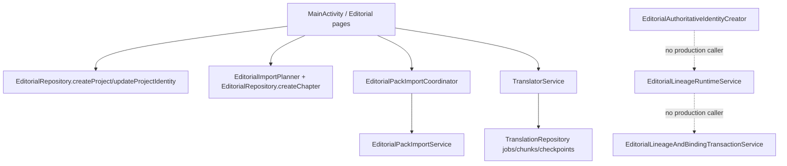

# G2-C1B1-C2-B0 — Production Caller Boundary & Atomicity Plan

Status: `G2-C1B1C2B0_BOUNDARY_PLAN: PASS` / review stop. This is a source audit and implementation plan only. No production code, SQLite schema, profile/catalog, importer, runtime caller, database row, APK, installation, migration, capability promotion, certification, activation, project binding, or execution was added or changed in this phase.

## 1. Baseline and protected scope

The required handoffs and workflow documents were read before source modification. The verified starting point was:

- Branch: `feature/v4.16-g2-c1b1c2a`.
- Starting HEAD: `ddec1acebec448f7f206142cd011dfa633a91816`.
- SQLite source version: v17.
- Latest accepted artifact: `4.16-dev.42`, Android version code `104`.
- APK SHA-256: `961D4DDF531EF3703EDFDFB3DF55BCBF26CFC8BF512076B25D63DB55AAC01A7B`.
- The requested branch is `feature/v4.16-g2-c1b1c2b0`, created from that HEAD.
- Pre-existing user-owned changes in `.idea/compiler.xml`, `.idea/gradle.xml`, and `.idea/misc.xml` were not read for content, edited, staged, stashed, or committed.

The accepted code104 artifact and its artifact/backup payloads remain the baseline. No build or device QA was run for B0.

## 2. Source lifecycle audit

### 2.1 Observed production call graph



The dotted edges are deliberately absent in source. A search for constructors/call sites found declarations only for the C2-A creator, SQLite resolver, retention preflight, and the C1 transaction service; no `MainActivity`, importer, startup, page rebuild, or translation workflow constructs them.

### 2.2 Project, chapter, and input preparation

Evidence:

- `app/src/main/java/com/ml/tblandroidtxt/MainActivity.java:848-852` creates an editorial project through `EditorialRepository.createProject`; `:856-861` updates its display identity.
- `app/src/main/java/com/ml/tblandroidtxt/EditorialRepository.java:50-61` writes the mutable `editorial_projects` row using a SQLite autoincrement row ID and current timestamps. This is not a canonical project semantic identity.
- `MainActivity.java:981-988` consumes `EditorialImportPlanner` output and calls `EditorialRepository.createChapter`.
- `EditorialRepository.java:63-84` inserts a chapter and its mutable assets in one local transaction after UI/import validation. It does not create a v17 scope snapshot or declare a frozen authoritative manifest event.
- The repository's required asset check is the current UI/editorial contract (`RAW`, `DRAFT`, `GLOSSARY`, with optional roles), not the future run-phase contract owned by a production run lifecycle.

Conclusion: project creation, chapter creation, asset selection, and persistence exist, but they are preparation operations. None is `RUN_CONTEXT_CLOSED` and none has authority to create lineage.

### 2.3 `editorial_runs` and the absence of a closure event

The source search for `editorial_runs` returned only:

- `app/src/main/java/com/ml/tblandroidtxt/EditorialMigrationSpec.java:16-21` — v11-era DDL, indexes, and child evidence tables.
- `EditorialRepository.java:152-154` — lookup and deletion of old run rows while deleting a project.
- `EditorialClosedRunContextDao.java:119-120` — a provenance existence check for an optional `source_run_row_id`.
- v17 closed-context DDL/reference lines in `EditorialMigrationSpec.java:85-86`.

There is no production `INSERT INTO editorial_runs`, no `createRun`, no state transition API for `editorial_runs`, and no production append of a closed-run context. Therefore:

`PRODUCTION_RUN_CONTEXT_CLOSED_EVENT: ABSENT`

The word `CLOSED` in chapter state is not evidence of a run closure. `EditorialSafe4Workflow.ChapterState` at `EditorialSafe4Workflow.java:30-45` contains `L1_CLOSED` and `L2_CLOSED`; transitions at `:133-145` are chapter workflow transitions and are globally gated by `EditorialSafe4Pack.executionEnabled()`. They carry no run identity, compatibility evaluation, trusted profile, immutable input-manifest fingerprint, attempt ordinal, or lineage binding. They are not `RUN_CONTEXT_CLOSED`.

Ownership is consequently absent in the current production lifecycle:

| Fact | Current source owner | B0 finding |
|---|---|---|
| `sourceRunRowId` | Only an optional provenance field in C2-A request/DAO and retention lookup | No production run lifecycle owns or supplies it |
| `runKind` | Present in v17 closed-run model/closure request and old DDL | No production authoritative run state supplies it |
| `phaseIdentity` | Present in v17 closed-run model/closure request | No production phase-closure event supplies it |
| Frozen input manifest | Chapter asset rows and planner output are mutable preparation data | No production component is authorized to attest the immutable snapshot |

No run retry/resume path exists. There is a different translation-job recovery path: `TranslatorService.java:166-200` exposes resume/retry actions, `:212` calls `TranslationRepository.recoverInterruptedState`, and `:417-570` resumes/retries jobs and chunks. `JobStore.java:20` also recovers interrupted translation chunks. That path is about `jobs`/`chunks` and provider delivery safety, not editorial closed-run identity or lineage. It must not be relabeled as authoritative run recovery.

### 2.4 ZIP import, startup, and page rebuild boundaries

- `EditorialPackImportCoordinator.java:44-105` prevents duplicate picker work and delegates the ZIP operation.
- `EditorialPackImportService.java:117-180` snapshots, validates, evaluates, and stores pack/import compatibility evidence only. Its recovery at `:296-310` is importer-owned staging/storage recovery.
- `MainActivity.java:203-260` performs startup, UI rebuild, tab restoration, and translation-job cache refresh; there is no identity creator/resolver call.
- The explicit source search found no production construction of `EditorialAuthoritativeIdentityCreator`, `SqliteEditorialLineageContextResolver`, `EditorialLineageRuntimeService`, `EditorialLineageAndBindingTransactionService`, or `EditorialIdentityRetentionPreflight`.

ZIP import completion, project/chapter preparation, tab changes, page rebuild, model request completion, and translation-job completion are therefore not closure events. C2-B must not add a synthetic call site merely to make the event appear present.

### 2.5 Current deletion behavior

`EditorialRepository.deleteProject` at `EditorialRepository.java:145-166` manually deletes old evidence, `editorial_runs`, assets, chapters, project assets, reference profiles, and the project in one transaction. That flow predates the v17 retention boundary and is not safe to treat as an authoritative-identity delete policy.

C2-A added only a read-only guard: `EditorialIdentityRetentionPreflight.java:15-32` checks `source_project_row_id` and `source_run_row_id`, returning `CLEAR_TO_DELETE`, `AUTHORITATIVE_REFERENCE_PRESENT`, or `INVALID_SELECTION`. It is not called by current delete UI and exposes no cascade or detach operation.

## 3. Locked future production caller contract

Because the real production event is absent, the following is a target contract, not an identified existing caller. There is exactly one proposed app-facing owner:

`EditorialRunContextCoordinator` handling the explicit `RUN_CONTEXT_CLOSED` event emitted by the future authoritative run-lifecycle coordinator after the run's immutable input manifest has been persisted.

No MainActivity method, ZIP importer, startup hook, page rebuild, or generic chapter-state listener may call the creator or C1 service.

### 3.1 Minimal command

The future coordinator receives an immutable command containing only:

- a stable closure-event/idempotency selector owned by the run lifecycle;
- project-revision selector;
- input-scope selector;
- closed-run/source-run selector, if a real source run row exists;
- explicit user/workflow intent: `ROOT` or `CHILD`;
- for `CHILD`, one exact `parentRecordIdentity` selector.

The caller does not declare or assert pack hash, profile ID/version/hash/fingerprint, compatibility outcome, evaluation provenance, input-manifest fingerprint, lineage identity/fingerprint, or attempt ordinal. `runKind`, `phaseIdentity`, the source run row, manifest facts, and all trust/evaluation facts are owned by the authoritative run lifecycle/storage and are re-read by the creator/resolver. No caller-provided precomputed identity is accepted.

### 3.2 Preconditions and result boundary

Before closure is attempted:

1. A real production run lifecycle must exist, with an explicit finalization event and an authoritative frozen manifest.
2. The project revision and scope snapshot must exist, be immutable, and match exactly.
3. The evaluation, pack, trusted profile, contract facts, and schema facts must be read from storage and cross-checked.
4. The evaluation must be attested `TRUSTED_PROFILE` and `DATA_COMPATIBLE`; the current production profile does not satisfy this.
5. The requested node kind must be explicit. `ROOT` has no parent; `CHILD` has one exact parent selector.
6. The service/DAO clock owns the persisted timestamp. Retry never replaces the timestamp of an existing row.

Stable result mapping must preserve the existing C1/C2-A vocabulary: `READY_TO_APPEND`, `ALREADY_EXISTS`, `CLOSED_UNBOUND`, `RUN_CONTEXT_NOT_CLOSED`, `INPUT_SCOPE_REQUIRED`, `COMPATIBILITY_CONTEXT_MISMATCH`, `TRUSTED_PROFILE_CONTEXT_MISMATCH`, `INPUT_MANIFEST_INCOMPLETE`, `PARENT_NOT_FOUND`, `PARENT_AMBIGUOUS`, `ROOT_HAS_PARENT`, `MISSING_PARENT`, `ORPHAN_LINEAGE`, `BINDING_MISMATCH`, and immutable collision/persistence failures. Raw `SQLiteConstraintException` must never be the UI contract.

`CLOSED_UNBOUND` is a read/projection result meaning “the immutable closed-run row exists but its unique binding does not.” It is not a new SQLite state and does not require v18.

The deterministic retry key is derived from the authoritative closed-run identity, requested node kind, and exact parent identity (empty only for explicit ROOT). A user double-click or process-death retry must resolve the same facts and parent. It must not allocate a new attempt, choose a latest row, or silently reparent.

Timestamps are recorded once by the closure application service/DAO using its injected clock and persisted in the closed context/binding append. Logging records event selector, authoritative identities, result code, and mismatch category; it does not log raw input content, output URI, local paths, or untrusted caller facts.

## 4. State machine and ownership

The current production state machine has no authoritative run branch. The future state machine is:

```text
RUN_NOT_STARTED -> RUN_ACTIVE -> RUN_CONTEXT_CLOSED
                                      |
                                      +-> CLOSED_UNBOUND
                                      |       |
                                      |       +-> LINEAGE_VALIDATED -> LINEAGE_BOUND
                                      |       +-> LINEAGE_REJECTED (no write)
                                      |       +-> RETRYABLE_BINDING_FAILURE (same facts only)
                                      |
                                      +-> CLOSE_REJECTED (no closed row)
```

`RUN_CANCELLED` and `RUN_FAILED` may terminate the real run lifecycle before closure, but neither can be treated as a closed context. Once a closed context exists it is immutable: no reopen, update, delete, detach, or parent replacement. The authoritative lifecycle coordinator owns closure and frozen-manifest confirmation; the future `EditorialRunContextCoordinator` owns orchestration; the C1 service owns validation/preparation; the shared transaction service owns lineage+binding atomicity.

## 5. ROOT/CHILD parent-selection contract

The selection is explicit and is owned by a reviewed workflow command, not inferred from storage:

- `ROOT`: explicit node kind, no parent selector. Any parent candidates or supplied parent is rejected.
- `CHILD`: explicit node kind and one exact `parentRecordIdentity`. Missing parent is rejected.
- The resolver must return zero or one exact parent. Zero is `PARENT_NOT_FOUND`; multiple is `PARENT_AMBIGUOUS`.
- There is no “latest lineage” query, no fallback parent, and no inference of ROOT because a parent was not found.
- Existing C1 validation must confirm project, scope, contract, schema, and parent relationship compatibility before a record is ready.

Evidence already in source: `SqliteEditorialLineageContextResolver.java:76-91` resolves the exact parent selector and rejects zero/multiple results; `EditorialLineageRuntimeService.java:71-98` enforces explicit ROOT/CHILD semantics; `EditorialLineageRuntimeService.java:120-132` applies the validator before returning `READY`.

No UI is implemented in B0. Until a user-reviewed workflow command exists, `PRODUCTION_CALLER_OWNER` remains unresolved even though the target ownership contract is decided.

## 6. Atomicity decision: Option B

**Decision: choose Option B — closed run independently, then C1 validation, then atomic lineage append + binding.**

This matches the source boundaries already implemented:

1. `EditorialAuthoritativeIdentityCreator.closeRunContext` reads evaluation/pack/trusted facts and appends the immutable v17 closed context through its DAO transaction (`EditorialAuthoritativeIdentityCreator.java:69-98`).
2. `EditorialLineageRuntimeService.validateAndPrepare` is pure JVM and explicitly “never appends or persists” (`EditorialLineageRuntimeService.java:10-16,35-37`).
3. `EditorialLineageAndBindingTransactionService.appendAndBind` uses one SQLite transaction for v16 lineage append/readback and v17 binding (`EditorialLineageAndBindingTransactionService.java:24-73`). New lineage rolls back with a failed binding; pre-existing lineage is preserved when the binding fails.

Option A would require a new cross-service transaction seam that holds closed-run creation, resolver reads, C1 validation, lineage append, and binding on one connection. That coupling is not present and would create a larger unreviewed transaction boundary. Option B is acceptable only with the deterministic recovery and no-reparent rules below.

### 6.1 Failure and recovery matrix

| Failure point | Required result and durable state |
|---|---|
| Before close attempt | No v17 closed-run row, lineage row, or binding. Return the stable precondition code. |
| Pack/profile/evaluation mismatch before close | Fail closed; no closed-run row. Current production profile returns the trusted/executable-profile blocker. |
| Close succeeds, process dies before validation | Readback finds the same immutable closed context as `CLOSED_UNBOUND`; no startup auto-append. An explicit retry uses the same selectors and intent. |
| C1 validation rejects | Keep the closed context, create no lineage/binding, return the preserved validation code. Retry cannot change parent or facts under the same event key. |
| Lineage append is new and binding fails | Shared transaction rolls back both new lineage and binding. Retry repeats the same derived record and parent. |
| Lineage existed before transaction and binding fails | Existing lineage remains; no binding is created. Return incomplete/retryable result, never claim completion. |
| Binding already exists | Exact same closed-run/lineage/fingerprint is idempotent `ALREADY_EXISTS`; any different tuple is `BINDING_MISMATCH` and cannot rebind. |
| Process dies during append/bind transaction | SQLite rollback/readback determines whether neither, both, or only pre-existing lineage survived; no independent partial binding is accepted. |
| User double-clicks | Deterministic closed-run/node-kind/parent key resolves to the existing result; no second ordinal, record, or binding. |
| Retry after restart | Explicit workflow retry only; read authoritative rows, validate exact facts, use the same parent selector, and append/bind idempotently. No startup or page-rebuild retry. |
| Production profile is non-executable | `closeRunContext` is rejected before insert; no production `DATA_COMPATIBLE`, closed-run, lineage, or binding row. |

No schema v18 is required by this contract. A future need for an explicit persisted orchestration state must be a separately approved additive migration proposal, not a C2-B0 change.

## 7. Retention and delete contract

The current delete flow is not changed in B0. The locked future contract is:

1. Before deleting a project, chapter, or source run, call a read-only retention preflight for every relevant source row.
2. If any authoritative revision, scope, closed-run, lineage, or binding reference exists, return a stable domain result such as `DELETE_BLOCKED_BY_AUTHORITATIVE_REFERENCE` mapped from `AUTHORITATIVE_REFERENCE_PRESENT`.
3. Do not cascade-delete authoritative identity/evidence tables, detach a binding, or silently remove provenance.
4. Translate the preflight/domain result at repository/service boundary; raw SQLite constraint exceptions never reach UI.
5. Wiring this guard into deletion UX belongs to C2-B2 or a separately approved retention phase. B0 changes no UI deletion flow.

## 8. Compatibility and safety blocker

The current production profile declares only `pack.integrity.sha256.v1`. It does not provide a trusted executable profile/evidence set. `EditorialSafe4Pack.executionEnabled()` remains `false`. Therefore:

- `PRODUCTION_CLOSED_RUN_CREATION: BLOCKED`.
- No production `DATA_COMPATIBLE` closed-run context may be created.
- No production lineage record or run-lineage binding may be appended.
- Test-only trusted fixtures cannot become production capability evidence.
- `lineage.exact-parent.v1`, certification, activation, project binding, SAFE4 model execution, and all caller wiring remain unstarted.

## 9. Smallest approved C2-B implementation split

### G2-C1B1-C2-B1 — coordinator/orchestrator

Implement only the future `EditorialRunContextCoordinator` boundary:

- accept the minimal authoritative closed-run command;
- invoke creator closure, resolver, C1 `validateAndPrepare`, and the existing shared append+binding seam in the Option-B order;
- map immutable/idempotent/collision/compatibility/parent/retention failures to stable results;
- provide explicit retry/readback after process death and double-click dedupe;
- use isolated test-only trusted fixtures;
- do not connect MainActivity, importer, startup, page rebuild, or any production workflow while `PRODUCTION_RUN_CONTEXT_CLOSED_EVENT` is absent;
- do not add migration, schema state, capability promotion, certification, activation, binding-for-execution, or execution.

If B1 discovers that a real production run lifecycle still does not exist, B1 must stop and insert a separately reviewed lifecycle phase. It must not call the C1 service seam “production caller wiring” without an actual closure event.

### G2-C1B1-C2-B2 — proven event wiring and retention

Only after B1 and a real event are reviewed:

- wire exactly one proven caller at the authoritative `RUN_CONTEXT_CLOSED` event;
- do not call from startup, ZIP importer, page rebuild, chapter `L1_CLOSED`/`L2_CLOSED`, or model-request completion;
- run isolated device QA for duplicate click, process death/restart, exact readback, mismatch, retry, parent stability, and binding atomicity;
- connect retention preflight to the delete repository boundary only if that scope is explicitly approved;
- keep profile/catalog/importer unchanged unless a separate approved phase says otherwise.

## 10. Acceptance and rollback boundary

C2-B may be accepted only when the real closure event, single caller owner, stable state/result vocabulary, exact ROOT/CHILD selection, Option-B recovery, retention preflight boundary, isolated QA, and production-profile blocker are all evidenced. A failed precondition or absent event stops dependent wiring.

Rollback for B0 is documentation-only: revert the B0 documentation/checklist/state commits while preserving the protected `.idea/*` working-tree changes. B0 created no database state and no runtime behavior to roll back. Any future implementation rollback must use its own approved code/database boundary; it must not use destructive migration downgrade or detach authoritative records.

## 11. Verification evidence for B0

Read-only verification used the Gradle Wrapper with JBR 21 and the pinned Gradle 9.3.0 distribution:

```text
:editorial-engine:test       105/105, failures=0, errors=0, skipped=0
:app:testDebugUnitTest       164/164, failures=0, errors=0, skipped=0
git diff --check              PASS
```

Wrapper toolchain preflight also passed: Gradle `9.3.0`, Launcher/Daemon JVM `21.0.10` from Android Studio JetBrains Runtime, Windows amd64.

The first sandboxed Wrapper attempt could not download the pinned distribution because network access was denied; the same command then passed with approved network access. No APK build, instrumentation, lint, installation, migration, raw SQLite inspection, or database-row creation was performed for B0. Artifact code104 remains unchanged. No candidate was read from `D:`.

## 12. Final review-stop status

```text
G2-C1B1C2B0_BOUNDARY_PLAN: PASS
PRODUCTION_RUN_CONTEXT_CLOSED_EVENT: ABSENT
PRODUCTION_CALLER_OWNER: UNRESOLVED
ATOMICITY_CONTRACT: DECIDED
RECOVERY_CONTRACT: DECIDED
ROOT_CHILD_SELECTION_CONTRACT: DECIDED
C2B1_IMPLEMENTATION: NOT_STARTED
LINEAGE_RUNTIME_CALLER_WIRING: NOT_STARTED
LINEAGE_CAPABILITY_PROMOTION: NOT_STARTED
SAFE4_EXECUTION_READINESS: BLOCKED
```

The exact next step is one review decision: approve or reject the C2-B1 coordinator plan. Do not begin C2-B1, C2-B2, capability promotion, certification, activation, or execution automatically.
