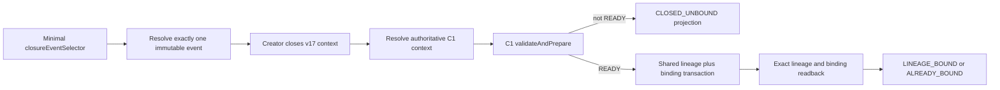

# G2-C1B1-C2-B1 — Lineage Coordinator and Recovery Orchestrator

## Review-stop status

- `G2-C1B1C2B1_COORDINATOR: BLOCKED`
- `OPTION_B_ORCHESTRATION: IMPLEMENTED`
- `CLOSED_UNBOUND_RECOVERY: IMPLEMENTED`
- `ROOT_CHILD_PARENT_STABILITY: PROVEN` for the injected immutable event fixture
- `PRODUCTION_CLOSURE_EVENT_RESOLVER: ABSENT_FAIL_CLOSED`
- `PRODUCTION_RUN_CONTEXT_CLOSED_EVENT: ABSENT`
- `PRODUCTION_CALLER_OWNER: UNRESOLVED`
- `LINEAGE_RUNTIME_CALLER_WIRING: NOT_STARTED`
- `LINEAGE_CAPABILITY_PROMOTION: NOT_STARTED`
- `SAFE4_EXECUTION_READINESS: BLOCKED`

The implementation is complete for the approved B1 service boundary. Global PASS is blocked by three unrelated connected-suite failures observed on the exact archive build; the focused B1 class passed 7/7.

## Baseline and end

- Start branch: `feature/v4.16-g2-c1b1c2b0`
- Start HEAD: `616a0184a2df2462c3adca316f59cbd70e7d88b9`
- End branch: `feature/v4.16-g2-c1b1c2b1`
- Implementation/state commit: `ac55c78` (`feat(editorial): add B1 lineage coordinator`)
- SQLite source: v17; no migration was added.
- User-owned `.idea/compiler.xml`, `.idea/gradle.xml`, and `.idea/misc.xml` remained untouched, unstaged and uncommitted.

## Authoritative source boundary

The B0 source audit remains decisive: production has no `RUN_CONTEXT_CLOSED` event owner, no production `editorial_runs` INSERT/creator/state transition, and no authoritative source for the frozen manifest, run kind, phase identity or parent selection. `L1_CLOSED` and `L2_CLOSED` are chapter states, not run closure. No synthetic event is created from startup, importer, page rebuild, project preparation or model completion.

The production resolver is `EditorialProductionRunClosureEventResolver`; it always returns `CLOSURE_EVENT_UNAVAILABLE`. The only positive path is the package-private injected resolver used by isolated instrumentation fixtures. No `EditorialRunContextCoordinator` instance is composed into `MainActivity`, startup, importer, project preparation or UI code.

## Implemented boundary

The app-side boundary consists of:

- `EditorialRunContextCommand`: contains only `closureEventSelector`.
- `EditorialRunClosureEvent`: immutable event with stable identity, canonical fingerprint, project/scope/evaluation selectors, run kind, phase, optional source-run selector, explicit ROOT/CHILD, exact parent for CHILD, frozen-manifest fingerprint/reference and eligibility.
- `EditorialRunClosureEventResolver` and stable resolution result vocabulary.
- `EditorialCoordinatorClock`: injected trusted clock; callers provide no timestamps.
- `EditorialRunContextCoordinator`: Option-B orchestration, exact replay, recovery and readback.
- `EditorialRunContextCoordinatorResult`: stage, stable code, retryability, identities and lossless C1/persistence codes without raw SQLite exceptions.
- `EditorialRunContextStatus`: read-only projection; inspection never appends, retries or selects a latest row.

## Canonical event contract

Event identity and fingerprint use separate domains:

- `EDITORIAL_CLOSURE_EVENT_IDENTITY_V1`
- `EDITORIAL_CLOSURE_EVENT_FINGERPRINT_V1`

The canonical projection is deterministic JSON encoded with strict UTF-8. It includes all selectors, run/phase facts, manifest attestation/reference, eligibility, and explicit `nodeKind` plus `parentRecordIdentity`. It excludes timestamps. A declared event whose identity/fingerprint does not recompute exactly returns `CLOSURE_EVENT_COLLISION`; changing ROOT to CHILD or changing the exact parent cannot be replayed as the same event.

The creator/resolver still recomputes authoritative pack, trusted profile, compatibility, manifest and lineage facts from SQLite v17/v15 storage. Caller assertions are not accepted as authority.

## Option-B flow

The coordinator accepts only `APPENDED` or exact identical `ALREADY_EXISTS` for the closed context. The DAO remains the authority for attempt allocation. If C1 is rejected, the closed context remains and no lineage/binding is created. `CLOSED_UNBOUND` is derived from readback; no status column/table and no v18 migration are used.

## Idempotency and recovery

- Same event replay first checks exact closed-run binding/lineage readback, so duplicate C1 validation cannot turn an exact replay into a false failure.
- An existing unbound lineage is accepted only after exact event/closed-context checks and authoritative context resolution, then is bound through the shared transaction.
- Exact binding returns `ALREADY_BOUND`; timestamps are not rewritten.
- A binding for the same closed run with a different lineage, node kind, parent or fingerprint returns `BINDING_CONFLICT`; it is never replaced or detached.
- Same-process serialization is only an optimization. SQLite identity/unique constraints, append-only DAO behavior and exact readback remain the cross-instance safety boundary.
- Process-death recovery is represented by re-resolving the same persisted/authoritative event selector after a new coordinator instance. A production persisted event source is still absent, so production process-death continuity is not claimed.

## Stable result vocabulary

Coordinator codes include `COMMAND_INVALID`, `CLOSURE_EVENT_UNAVAILABLE`, `CLOSURE_EVENT_INVALID`, `CLOSURE_EVENT_COLLISION`, `CLOSE_REJECTED`, `CLOSED_UNBOUND`, `LINEAGE_VALIDATION_REJECTED`, `LINEAGE_PERSISTENCE_FAILED`, `BINDING_CONFLICT`, `LINEAGE_BOUND`, `ALREADY_BOUND`, and read-only status codes. Results preserve `EditorialLineageCreationCode`, validation-code lists and `EditorialIdentityPersistenceCode` where available. No raw `SQLiteException` is exposed.

## ROOT/CHILD contract

ROOT is explicit and has no parent. CHILD is explicit and carries one exact `parentRecordIdentity`. The coordinator never infers ROOT from a missing parent, chooses latest, falls back to a different parent, or reparents on retry. The C1 resolver/validator checks exact parent existence, fingerprint and project/scope/contract context. The production owner of this selection remains unresolved because the production closure event is absent; no UI was added in B1.

## Retention boundary

`EditorialIdentityRetentionPreflight` remains read-only. Authoritative identity rows are not deleted, cascaded or detached by B1. Existing mutable project/run delete flows were not changed, and raw FK exceptions are not part of the coordinator result contract. Connecting the preflight to deletion UX remains C2-B2 or a separately approved phase.

## Verification evidence

- Focused coordinator instrumentation on OnePlus CPH2691 / Android 15, exact archived code107: `7/7 PASS`, `0` failures/errors/skips. Covered production resolver zero-write fail-closed, ROOT success/replay, CHILD exact parent, missing parent/CLOSED_UNBOUND, event collision, status read-only and invalid command/root-parent contracts.
- `:editorial-engine:test`: `105/105`.
- `:app:testDebugUnitTest`: `164/164`.
- Combined JVM: `269/269`, `0` failures, `0` errors, `0` skips.
- `:app:compileDebugAndroidTestJavaWithJavac`: PASS.
- `:app:lintDebug`: PASS, 0 errors / 53 warnings.
- `git diff --check`: PASS.
- Wrapper/JDK: Gradle `9.3.0`, JBR/JDK `21.0.10`, Java source/target `17`.
- Archive-first build: `4.16-dev.45`, code107, event `build-20260806-090226`; APK SHA-256 `F0A8971AA9E8A4D08CF08A63857BC37F17BD6DEFE264CE4F2813DAAF8A1211A9`. Artifact/backup parity and manifest hashes passed.
- Device install: exact archive installed with `adb install -r` over the prior device build; no `pm clear`; production database was empty, therefore `REAL_DATA_CONTINUITY: NOT_CLAIMED`.

The global connected suite was attempted on the exact archive build but is not clean: two unrelated ZIP expectation failures and one `EditorialPackManagementPageInstrumentedTest` failure occurred; one explicitly approved real-API test was skipped. These failures were not modified by B1 and block a global PASS claim.

## Rollback and review boundary

The implementation rollback boundary is the source/state commit `ac55c78`; there is no schema rollback or production-data rollback because B1 created no production rows and no migration. Do not revert the user-owned `.idea/*` changes. No production caller, capability promotion, certification, activation or execution may begin from this handoff.

## Handoff

Checklist: `release_checklists/v4.16-g2-c1b1c2b1.md`.

Exactly one next step: review this B1 handoff and resolve/approve the unrelated connected-suite blocker. Do not start C2-B2 or production run-lifecycle work automatically.
