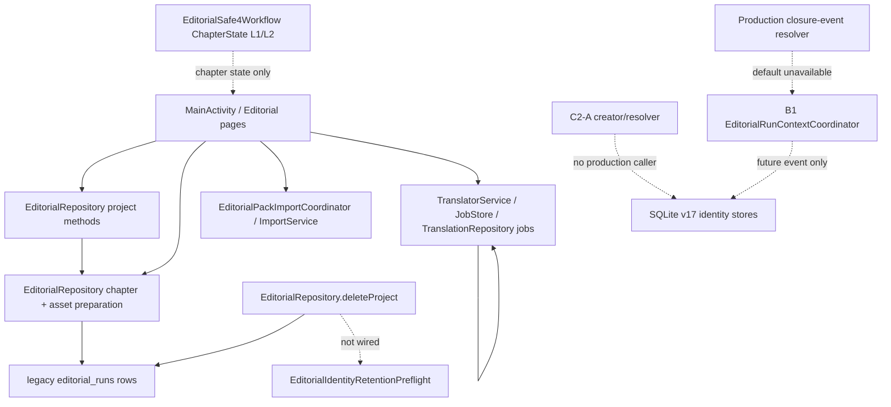

# G2-C1B1-C2B2A-1 — Run Lifecycle Owner and Closure Event Contract

Status: `G2-C1B1C2B2A1_CONTRACT: PASS / REVIEW STOP`

This is a source-audit and schema-review plan. It does not modify production
code, SQLite schema/data, profile/catalog, caller composition, or execution.

## Baseline and protected boundary

- Baseline branch: `feature/v4.16-g2-c1b1d0-d1-c1b2a`.
- Baseline HEAD: `8d2a7c01dc1cf02eeaefff1690a92e5912a153c6`.
- New branch: `feature/v4.16-g2-c1b1c2b2a1`.
- SQLite source version: v17.
- Retained artifact: `4.16-dev.48`, code110, event `build-20260806-093920`.
- APK SHA-256: `B7E07C945602CF65572702DDF19579961CBA0070024DB9C5FFF89585C825F2C3`.
- Source ZIP SHA-256: `E5E927A5C7A32501F11555BB3A74A633A76DE4218A58DF8F2C2E9B5551759B23`.
- Baseline JVM: `269/269 PASS`; retained connected baseline: `82/82`, 0
  failures/errors, 1 approved skip.
- `.idea/compiler.xml`, `.idea/gradle.xml`, and `.idea/misc.xml` are
  pre-existing user-owned changes. They were not edited, staged, stashed, or
  committed.

## Final A1 decision

```text
G2-C1B1C2B2A1_CONTRACT: PASS
RUN_LIFECYCLE_OWNER: IDENTIFIED
LEGACY_EDITORIAL_RUNS_REUSABLE: NO
CLOSURE_EVENT_CONTRACT: DECIDED
ROOT_CHILD_OWNER: IDENTIFIED
PRODUCTION_EQUIVALENT_EVIDENCE_CONTRACT: DECIDED
V17_EVENT_STORAGE_SUFFICIENT: NO
SQLITE_V18_REQUIRED: YES
C2B2A2_SCHEMA_IMPLEMENTATION: NOT_STARTED
C2B2A3_LIFECYCLE_IMPLEMENTATION: NOT_STARTED
LINEAGE_PROMOTION: BLOCKED
SAFE4_EXECUTION_READINESS: BLOCKED
```

`RUN_LIFECYCLE_OWNER: IDENTIFIED` and `ROOT_CHILD_OWNER: IDENTIFIED` mean the
future production owner is selected by this contract. The current source does
not yet contain that owner or a positive event source; production composition
therefore remains fail-closed.

## 1. Current production lifecycle source audit

### 1.1 Source call graph



The dotted edges are absent or intentionally fail-closed in the current
production composition.

### 1.2 Project, chapter and input preparation

| Area | Line-level source evidence | Finding |
|---|---|---|
| Project schema | `EditorialMigrationSpec.java:10-11` | `editorial_projects` uses AUTOINCREMENT `id`, mutable series/volume/workflow fields, URI and timestamps. It is not a canonical project revision. |
| Project creation | `EditorialRepository.java:50-60`; `MainActivity.java:848-861` | UI creates a mutable project row and can update display identity. No v17 revision is created and no closure event is emitted. |
| Chapter/asset preparation | `EditorialRepository.java:63-84`; `MainActivity.java:981-988` | Chapter and current asset rows are inserted in a local preparation transaction. The rows do not attest a frozen reviewed role/ordinal/hash/count manifest. |
| Input manifest | `EditorialMigrationSpec.java:14,16`; `EditorialAssetManifest` contract cited by C1.5-A | Legacy assets and `editorial_runs.input_manifest_json` do not provide the reviewed immutable v17 snapshot semantics. |
| Importer | `EditorialPackImportCoordinator.java:44-105`; `EditorialPackImportService.java:117-180,296-310` | ZIP import owns pack/import integrity and staging recovery only. It is not an editorial run closure owner. |

### 1.3 Legacy `editorial_runs`

The legacy table is defined at `EditorialMigrationSpec.java:16-20` with an
AUTOINCREMENT row ID, mutable `state`, provider/model fields, prompt/workflow
hashes, legacy `input_manifest_json`, and timestamps. Current production
source references are only:

- delete-time lookup and deletion at `EditorialRepository.java:145-160`;
- optional provenance lookup at `EditorialClosedRunContextDao.java:120`;
- old DDL/evidence child-table definitions at
  `EditorialMigrationSpec.java:16-20`.

There is no production `INSERT INTO editorial_runs`, `createRun`, authoritative
state transition, closed-run creator, frozen-manifest attestation, trusted
evaluation/profile link, exact parent selection, or editorial run retry/resume
owner. Therefore:

```text
PRODUCTION_EDITORIAL_RUN_INSERT: ABSENT
PRODUCTION_EDITORIAL_RUN_STATE_OWNER: ABSENT
PRODUCTION_RUN_CONTEXT_CLOSED_EVENT: ABSENT
```

The legacy row is **not reusable**. It fails all five required proof areas:

1. identity: local AUTOINCREMENT ID and mutable fields are not the reviewed
   project/scope/run identity tuple;
2. immutability: the row has mutable state/timestamps and no authoritative
   append-only closure trigger contract;
3. recovery: no exact closure-event selector, ROOT/CHILD intent, parent
   selector, or deterministic post-process-death closure replay;
4. provenance: no complete trusted profile/evaluation/context projection and
   no reviewed role/ordinal/hash/byte-count/item-count snapshot;
5. retention: `deleteProject` explicitly deletes legacy run rows; it is not a
   retention-safe authoritative identity boundary.

Legacy `editorial_runs` remains historical data. No reinterpretation,
backfill, update, or delete-policy change is authorized by A1.

### 1.4 Translation jobs and recovery are a separate state machine

`TranslatorService.java:167-212` handles explicit resume/retry actions and
initializes `TranslationRepository.recoverInterruptedState()` after process
restart. Job creation and mutable progress are at
`TranslatorService.java:350-410`; resume is at `:417-474`; failed-chunk retry
is at `:504-548`; chunk processing and output completion are at `:614-678`.
`JobStore.java:20-40` exposes job/chunk recovery and delete operations.

This is provider-delivery/job recovery, not authoritative editorial run
closure. It has no v17 project revision, scope snapshot, compatibility
evaluation, exact parent, or lineage binding and must not be relabeled as the
RUN_CONTEXT_CLOSED owner.

### 1.5 L1/L2/L3 vocabulary is not a run closure event

`EditorialSafe4Workflow.java:30-55` defines `ChapterState` and
`ContextPhase`; `L1_CLOSED` and `L2_CLOSED` are chapter workflow states.
Transitions at `EditorialSafe4Workflow.java:133-145` are chapter transitions
and are globally guarded by `EditorialSafe4Pack.executionEnabled()` at
`:129,136`. `EditorialSafe4Pack.java:59-64` keeps the execution switch false.

Those states do not carry a run identity, trusted evaluation/profile facts,
frozen manifest attestation, attempt ordinal, ROOT/CHILD intent, or exact
parent. They cannot emit or imply `RUN_CONTEXT_CLOSED`.

### 1.6 C2-A, event resolver, B1 and retention

| Boundary | Line-level source evidence | Current role |
|---|---|---|
| C2-A creator | `EditorialAuthoritativeIdentityCreator.java:18,41-69` | Prepares project/scope and closes a context only after re-reading authoritative facts; no production caller constructs it. |
| C2-A resolver | `SqliteEditorialLineageContextResolver.java:27-72,88-105` | Reads exact project/scope/closed context, cross-checks manifest and trusted facts, and resolves only the exact parent selector; zero/multiple parent is rejected at `:88-93`. |
| Closure-event model | `EditorialRunClosureEvent.java:13-23,41-78,147-165` | Canonical immutable event model exists as a seam, but not a durable production event store. It includes explicit node kind and parent. |
| Production event resolver | `EditorialProductionRunClosureEventResolver.java:7-13` | Always returns `CLOSURE_EVENT_UNAVAILABLE`; it deliberately does not synthesize an event. |
| B1 coordinator | `EditorialRunContextCoordinator.java:27-43,75-105,262+` | Consumes a resolved event, orchestrates Option B, and has read-only status. It does not create events. |
| Retention preflight | `EditorialIdentityRetentionPreflight.java:8-32` | Read-only source-project/source-run reference check. It is not wired to delete UI. |
| Delete flow | `EditorialRepository.java:145-166` | Deletes legacy runs/assets/chapters/project in a local transaction; no authoritative event preflight is connected. |

No current component owns a frozen manifest, authoritative `runKind`,
`phaseIdentity`, or ROOT/CHILD parent selection. The current default production
composition remains fail-closed.

## 2. Single production owner

The sole future production owner is:

```text
EditorialAuthoritativeRunLifecycleService
```

This name is a contract name; implementation may follow package naming
convention without changing responsibility. It belongs in the production app
namespace and owns only the editorial run lifecycle/closure boundary.

### 2.1 Responsibilities

The owner must:

1. accept a minimal reviewed lifecycle command and explicit user/workflow
   intent;
2. re-read the exact project revision, input scope, compatibility evaluation,
   pack/profile facts and current manifest from authoritative storage;
3. verify that the scope is frozen and complete under the reviewed role
   contract;
4. verify trusted `DATA_COMPATIBLE` eligibility without creating or
   reevaluating compatibility/provenance;
5. validate explicit ROOT/CHILD and exact parent selection;
6. construct canonical event bytes and compute event identity/fingerprint;
7. append/read back one immutable closure event through the event DAO;
8. expose an exact selector for B1 consumption and deterministic recovery.

It must not create compatibility evidence, choose the latest pack/profile or
parent, call the model, select a provider, activate/bind a project, certify,
or execute SAFE4.

### 2.2 Ownership split

| Actor | Allowed authority | Forbidden authority |
|---|---|---|
| UI/user or reviewed workflow | Minimal intent: explicit ROOT or CHILD; for CHILD, exact reviewed parent selector | Hashes, profile/evaluation facts, manifest fingerprint, lineage identity, parent fingerprint, ordinal or timestamp |
| `EditorialAuthoritativeRunLifecycleService` | Re-read facts, validate/freeze intent, enforce eligibility, compute and append event | Creating compatibility/provenance, model calls, latest/fallback selection, activation/execution |
| Closure-event DAO/store | Persist/read immutable event bytes and exact selector; map collisions | Update/delete/replace/latest selection |
| B1 coordinator | Consume one exact event selector; close v17 context, call C1, append/bind atomically, read back | Creating an event, changing ROOT/CHILD, changing parent, startup retry |
| Future L1/L2/L3 runner | Consume a lineage-bound context and produce later phase evidence | Owning closure or retroactively changing event/lineage |
| MainActivity/importer/startup/page rebuild | None in this boundary | Constructing or inferring closure events |

Until a reviewed workflow owns the intent, the lifecycle service may exist
dormant, but its production/default composition must return a stable
fail-closed result and perform zero writes.

## 3. Lifecycle state machine

```text
RUN_DECLARED
    |
    +--> INPUT_SCOPE_FROZEN
            |
            +--> CLOSURE_ELIGIBILITY_VERIFIED
                    |
                    +--> RUN_CONTEXT_CLOSED_EVENT_APPENDED
                    |       |
                    |       +--> [B1 Option B closes v17 context]
                    |               |
                    |               +--> CLOSED_UNBOUND   (derived projection)
                    |                       |
                    |                       +--> LINEAGE_BOUND (exact binding)
                    |
                    +--> INPUT_SCOPE_INVALID       (terminal; no event)
                    +--> COMPATIBILITY_BLOCKED     (terminal; no event)
                    +--> PROFILE_MISMATCH           (terminal; no event)
                    +--> MISSING_PARENT             (terminal; no event)
                    +--> EVENT_COLLISION            (terminal; no second event)
                    +--> RUN_CANCELLED              (terminal before closure)
                    +--> RUN_FAILED                 (terminal before closure)
```

`CLOSED_UNBOUND` is a read projection requiring an immutable event plus an
immutable v17 closed context with no exact binding. It is not a persisted
status column. An event append does not itself claim `LINEAGE_BOUND`; B1 must
perform exact close/readback, C1 validation, shared lineage+binding transaction,
and exact readback.

After `RUN_CONTEXT_CLOSED_EVENT_APPENDED`, the event cannot be reopened,
updated, deleted, reparented, or changed from ROOT to CHILD. Retry uses the
same event selector and event bytes. There is no startup/page-rebuild retry.
Cancelled or failed runs before closure never emit a closure event.

## 4. Immutable closure-event contract

### 4.1 Fields and classification

The event is `editorial-run-closure-event-v1` and uses strict UTF-8 canonical
JSON. The event store receives only a producer-computed canonical event; callers
cannot supply a precomputed identity or fingerprint.

| Field | Identity projection | Fingerprint projection | Audit-only / rule |
|---|---:|---:|---|
| `closureEventContractVersion` | Yes | Yes | Versioned semantic contract. |
| `projectRevisionIdentity` | Yes | Yes | Exact v17 revision FK. |
| `inputScopeSnapshotIdentity` | Yes | Yes | Exact v17 scope FK. |
| `compatibilityEvaluationIdentity` | Yes | Yes | Selector to immutable v15 evaluation; outcome is re-read, not caller-authored. |
| `runKind` | Yes | Yes | Required semantic run kind. |
| `phaseIdentity` | Yes | Yes | Required phase contract identity. |
| `frozenManifestFingerprint` | Yes | Yes | Must equal the authoritative v17 scope manifest fingerprint. |
| `nodeKind` (`ROOT`/`CHILD`) | Yes | Yes | Explicit semantic intent; never inferred. |
| `parentRecordIdentity` | Yes | Yes | Null only for ROOT; exactly one identity for CHILD. |
| `sourceRunRowId` | Only when declared authoritative | Yes when authoritative | Nullable provenance otherwise; `NONE` authority mode excludes it from semantics. |
| `sourceRunSelectorAuthority` | Yes when non-`NONE` | Yes | `NONE` or `AUTHORITATIVE`; a non-null source ID requires `AUTHORITATIVE`. |
| `frozenManifestReference` | No | Yes | Opaque stable attestation reference, never a local path/SAF URI. |
| `closureEligibility` | Yes | Yes | Must be `ELIGIBLE`; it is not a compatibility result substitute. |
| `closureAttestationVersion` | Yes | Yes | Version of the owner’s closure attestation contract. |
| `closureAttestationFingerprint` | No | Yes | Immutable evidence receipt linked to the re-read facts. |
| `eventIdentity` | Stored result | Stored result | SHA-256 over the identity projection; never caller-provided authority. |
| `eventFingerprint` | No | Stored result | SHA-256 over full non-audit canonical event projection. |
| `appendedAt` | No | No | Trusted store/application clock; exact replay never changes it. |

Pack hash, profile hash/fingerprint, compatibility outcome, lineage identity or
fingerprint, attempt ordinal, parent fingerprint, and timestamp are not accepted
from the caller. Pack/profile/evaluation facts are read from trusted storage;
lineage parent fingerprint is read from the exact parent row; attempt ordinal is
allocated by the v17 closed-run DAO.

### 4.2 Canonicalization and domains

- Canonical JSON uses deterministic field naming and lexicographic object-key
  ordering through the repository canonical JSON utility.
- Strings are strict UTF-8, reject control characters, and do not include local
  paths, output URIs, prompt bodies, or book content.
- Numbers use canonical JSON numeric encoding; nullable values are explicit.
- Identity domain: `EDITORIAL_CLOSURE_EVENT_IDENTITY_V1`.
- Fingerprint domain: `EDITORIAL_CLOSURE_EVENT_FINGERPRINT_V1`.
- The identity projection excludes non-semantic reference/timestamp data. The
  fingerprint projection includes immutable attestation/reference data but
  still excludes `appendedAt`.
- One semantic byte change (including node kind, exact parent, scope, run kind,
  phase, evaluation selector, or manifest fingerprint) changes the identity.
- A changed immutable reference/attestation with the same semantic identity
  changes the fingerprint and is a collision, not an update.

### 4.3 Replay and collision rules

| Situation | Result |
|---|---|
| Same event identity and exact canonical bytes | `ALREADY_EXISTS`; read back the same event and timestamp. |
| Same event identity and different canonical bytes/fingerprint | `EVENT_IMMUTABLE_COLLISION`; no new row. |
| Same run selector with changed ROOT/CHILD or parent | `EVENT_SELECTOR_COLLISION`; one closure event remains authoritative. |
| Exact event selector returns zero rows | `CLOSURE_EVENT_NOT_FOUND`; no B1 call. |
| Exact event selector returns multiple rows | `CLOSURE_EVENT_AMBIGUOUS`; no B1 call. |
| Cross-project/scope/evaluation/manifest mismatch | `CLOSURE_CONTEXT_MISMATCH`; no B1 call or closed-run write. |
| ROOT with any parent | `ROOT_HAS_PARENT`; no event. |
| CHILD with missing/zero/multiple/mismatched exact parent | `PARENT_NOT_FOUND`, `PARENT_AMBIGUOUS`, or exact validator code; no event. |
| Retry after process death | Resolve the same selector and bytes; no new event or attempt. |

There is one closure event per authoritative run selector. A unique logical
selector index excludes `nodeKind` and parent so a ROOT-to-CHILD or
parent-change retry cannot create a second event row. Event identity still
includes node kind and parent, so the attempted semantic change is detectable
as a collision rather than silently becoming a rebind.

## 5. Production-equivalent positive context evidence

The evidence contract for a future D0 re-audit is:

1. production namespace lifecycle service, event canonicalizer, validator,
   store/DAO, resolver, C2-A creator/resolver, and B1 coordinator classes are
   executed; no fake coordinator or test-only orchestration replaces them;
2. append/readback occurs against an isolated SQLite database using the real
   event store and real v17/v18 DAOs;
3. a test-only trusted compatibility fixture may be injected only through the
   explicit trusted-facts seam, with fixed identity/hash labels and no writes to
   production profile/catalog or user database;
4. the flow executes: lifecycle owner -> event append/readback/restart -> B1
   exact event resolver -> v17 close context -> C1 validation -> shared
   lineage+binding transaction -> exact lineage/binding readback;
5. the test proves ROOT and CHILD exact-parent behavior, collision/retry,
   process death after event/close, duplicate invocation, mismatch and zero
   writes on the production/default resolver;
6. the test-only fixture manifest, database identity, source/build hashes and
   expected result codes are retained separately and explicitly labeled
   `TEST_ONLY_TRUSTED_FIXTURE`;
7. a separate negative test constructs the production/default composition and
   proves `CLOSURE_EVENT_UNAVAILABLE` or the profile blocker with zero
   production writes.

**Answer:** Yes, that isolated integration path is sufficient as
production-equivalent implementation/composition evidence, provided all
production lifecycle/event/store/resolver/B1 classes are real and the only
test substitution is the explicit trusted compatibility fixture. The trust
boundary is the injected fixture port: it proves the implementation can
consume an attested trusted context without changing production profile bytes
or catalog state. It does not prove current production `DATA_COMPATIBLE`, does
not promote the capability by itself, and does not enable SAFE4 execution.

The current source does not satisfy this contract yet: the default event
resolver is negative-only and there is no production event store or lifecycle
owner. Therefore the D0 promotion blocker remains unchanged after A1.

## 6. SQLite v17 storage decision

### 6.1 Why v17 is insufficient

The v17 closed-run model at
`editorial-engine/src/main/java/com/ml/tblandroidtxt/editorial/pack/EditorialClosedRunContext.java:8-28,36-73`
stores project/scope/evaluation/pack/profile/contract/run/phase/attempt/manifest
facts and computes a closed-run identity/fingerprint. It does not store:

- closure-event identity or event fingerprint;
- explicit ROOT/CHILD node kind;
- exact parent selector;
- frozen-manifest reference/closure attestation;
- event append provenance separate from `closed_at`.

The v17 DDL at `EditorialMigrationSpec.java:85-99` confirms the same shape:
`editorial_closed_run_contexts` has `run_kind`, `phase_identity`,
`run_attempt_ordinal`, and `input_manifest_fingerprint`, but no event payload,
node kind or parent selector. Existing v17 triggers protect the identity rows,
but cannot recover event semantics that were never stored.

Therefore:

```text
V17_EVENT_STORAGE_SUFFICIENT: NO
SQLITE_V18_REQUIRED: YES (under the SQLite-authoritative-store assumption)
```

This is a design decision only. No migration is run in A1.

### 6.2 Draft additive v18 DDL — not executed

The following is the minimum schema proposal for C2B2A-2. It is intentionally
shown as draft SQL and must not be copied into the current v17 migration.

```sql
CREATE TABLE editorial_run_closure_events (
    event_identity TEXT PRIMARY KEY NOT NULL
        CHECK(length(event_identity)=64 AND event_identity NOT GLOB '*[^0-9a-f]*'),
    event_fingerprint TEXT NOT NULL UNIQUE
        CHECK(length(event_fingerprint)=64 AND event_fingerprint NOT GLOB '*[^0-9a-f]*'),
    closure_event_contract_version TEXT NOT NULL
        CHECK(length(trim(closure_event_contract_version))>0),
    project_revision_identity TEXT NOT NULL,
    input_scope_snapshot_identity TEXT NOT NULL,
    compatibility_evaluation_id TEXT NOT NULL,
    run_kind TEXT NOT NULL CHECK(length(trim(run_kind))>0),
    phase_identity TEXT NOT NULL CHECK(length(trim(phase_identity))>0),
    source_run_row_id INTEGER,
    source_run_selector_authority TEXT NOT NULL
        CHECK(source_run_selector_authority IN ('NONE','AUTHORITATIVE')),
    node_kind TEXT NOT NULL CHECK(node_kind IN ('ROOT','CHILD')),
    parent_record_identity TEXT,
    frozen_manifest_fingerprint TEXT NOT NULL
        CHECK(length(frozen_manifest_fingerprint)=64
              AND frozen_manifest_fingerprint NOT GLOB '*[^0-9a-f]*'),
    frozen_manifest_reference TEXT NOT NULL
        CHECK(length(trim(frozen_manifest_reference))>0),
    closure_eligibility TEXT NOT NULL
        CHECK(closure_eligibility='ELIGIBLE'),
    closure_attestation_version TEXT NOT NULL
        CHECK(length(trim(closure_attestation_version))>0),
    closure_attestation_fingerprint TEXT NOT NULL
        CHECK(length(closure_attestation_fingerprint)=64
              AND closure_attestation_fingerprint NOT GLOB '*[^0-9a-f]*'),
    appended_at INTEGER NOT NULL CHECK(appended_at>=0),
    CHECK((node_kind='ROOT' AND parent_record_identity IS NULL)
       OR (node_kind='CHILD' AND parent_record_identity IS NOT NULL
           AND length(parent_record_identity)=64
           AND parent_record_identity NOT GLOB '*[^0-9a-f]*')),
    CHECK((source_run_selector_authority='NONE' AND source_run_row_id IS NULL)
       OR (source_run_selector_authority='AUTHORITATIVE'
           AND source_run_row_id IS NOT NULL AND source_run_row_id>=0)),
    FOREIGN KEY(project_revision_identity)
        REFERENCES editorial_project_revisions(revision_identity) ON DELETE RESTRICT,
    FOREIGN KEY(input_scope_snapshot_identity)
        REFERENCES editorial_input_scope_snapshots(scope_snapshot_identity) ON DELETE RESTRICT,
    FOREIGN KEY(compatibility_evaluation_id)
        REFERENCES editorial_pack_compatibility_evaluations(evaluation_id) ON DELETE RESTRICT,
    FOREIGN KEY(parent_record_identity)
        REFERENCES editorial_lineage_records(record_identity) ON DELETE RESTRICT,
    FOREIGN KEY(source_run_row_id)
        REFERENCES editorial_runs(id) ON DELETE RESTRICT
);

CREATE INDEX idx_editorial_run_closure_events_selector
    ON editorial_run_closure_events(
        project_revision_identity, input_scope_snapshot_identity,
        compatibility_evaluation_id, run_kind, phase_identity, event_identity);

CREATE INDEX idx_editorial_run_closure_events_parent
    ON editorial_run_closure_events(parent_record_identity,event_identity);

CREATE UNIQUE INDEX idx_editorial_run_closure_events_one_per_run_selector
    ON editorial_run_closure_events(
        project_revision_identity, input_scope_snapshot_identity,
        compatibility_evaluation_id, run_kind, phase_identity,
        COALESCE(source_run_row_id,-1), frozen_manifest_fingerprint);

CREATE TRIGGER trg_editorial_run_closure_events_no_update
    BEFORE UPDATE ON editorial_run_closure_events BEGIN
        SELECT RAISE(ABORT,'editorial_run_closure_events are immutable');
    END;

CREATE TRIGGER trg_editorial_run_closure_events_no_delete
    BEFORE DELETE ON editorial_run_closure_events BEGIN
        SELECT RAISE(ABORT,'editorial_run_closure_events are immutable');
    END;
```

The future migration must create this table/indexes/triggers transactionally,
use no `ALTER`/rebuild of v17 tables, perform zero backfill, and preserve all
v15/v16/v17 rows exactly. It must not persist `CLOSED_UNBOUND` as a status and
must not reinterpret legacy runs. `COALESCE` in the unique index is deliberate:
SQLite NULL uniqueness must not permit a second ROOT event for the same
authoritative run selector.

### 6.3 Event DAO contract

`EditorialRunClosureEventDao` in C2B2A-2 shall expose only:

- append canonical event in a caller-owned lifecycle transaction;
- find by exact `event_identity`;
- find by the complete immutable selector, returning zero/one/multiple
  explicitly;
- exact readback of canonical bytes/fingerprint and audit timestamp.

It shall not expose update/delete/replace/backfill/latest/first/closest or
automatic retry APIs. The DAO computes identity/fingerprint from canonical
fields, maps same identity/same bytes to `ALREADY_EXISTS`, and maps same
identity/different bytes or selector uniqueness to stable immutable collision
codes. Raw SQLite exceptions are translated at the service boundary.

## 7. ROOT/CHILD ownership and retry

- Reviewed UI/workflow intent explicitly selects `ROOT` or `CHILD`.
- The lifecycle owner verifies that intent against the authoritative scope,
  phase and lineage context.
- The event store persists the intent when the event is appended; after this
  point it is immutable.
- `ROOT` has no parent. Any supplied parent is `ROOT_HAS_PARENT`.
- `CHILD` has exactly one `parentRecordIdentity`; missing, zero, multiple,
  cross-project, cross-scope, cross-pack, cross-profile or stale parent is a
  fail-closed result.
- No latest-parent query, fallback, reparent, or ROOT inference exists.
- A process-death retry resolves the same event identity/fingerprint. It cannot
  change node kind, parent, manifest or attempt ordinal.
- If no reviewed workflow owns the intent, the lifecycle service remains
  dormant/fail-closed; no UI text becomes authority.

## 8. Retention/delete boundary

The current delete UI is not changed in A1. Future deletion must first call a
read-only preflight that checks references from project, chapter and source-run
selection into project revisions, scope snapshots, closure events, closed
contexts, lineage records and bindings. Any reference returns a stable domain
result such as `DELETE_BLOCKED_BY_AUTHORITATIVE_REFERENCE`; the UI must not
receive raw `SQLiteConstraintException`.

No authoritative event, identity, lineage or binding row may be cascaded,
detached, or silently deleted. The v18 draft uses `ON DELETE RESTRICT` for all
foreign keys. Retention wiring belongs to a separately approved retention
phase or an explicitly expanded C2B2A-3; it is not part of A1/A2 schema work.

## 9. Implementation phases and gates

### C2B2A-2 — event schema and DAO

Scope: additive v18 migration only if separately approved, the draft event
table/indexes/triggers, append/read-only DAO, exact result vocabulary and
migration/rollback tests.

Acceptance:

- fresh and v17->v18 schema tests pass;
- zero backfill and unchanged v17 row/hash/state counts are proven;
- all event identity/fingerprint checks and ROOT/CHILD constraints are tested;
- same-byte idempotency, collision, selector ambiguity and concurrent append
  behavior are deterministic;
- update/delete/foreign-key retention rejection is proven;
- no production caller, profile/catalog mutation or production row is created.

Stop if any field cannot be stored losslessly, migration is not additive, a
legacy row would be reinterpreted, or the current profile would need changing.

### C2B2A-3 — lifecycle owner, resolver, B1 composition and isolated evidence

Scope: production `EditorialAuthoritativeRunLifecycleService`, production
event resolver/store composition, explicit workflow command boundary and the
single event-to-B1 path. The current MainActivity/importer/startup/page-rebuild
callers remain excluded unless a separate production lifecycle review identifies
the exact event owner.

Acceptance:

- production/default resolver still returns stable unavailable/profile blocker
  with zero writes under the current profile;
- isolated production-class integration uses real event store/resolver, a
  test-only trusted compatibility fixture, real restart/readback, real B1,
  C1 validation, shared lineage+binding transaction, and exact readback;
- ROOT/CHILD, parent stability, event collision, process death, double invoke,
  stale/mismatch and retention preflight are proven;
- no production database, `DATA_COMPATIBLE`, lineage/binding row, execution,
  activation or profile/catalog mutation is created.

Stop if the implementation falls back to chapter state, latest rows, fake
coordinator/event, caller-provided trust facts, or cannot prove parent stability
after restart.

### D0-R — re-audit promotion eligibility

Re-run the nine C1A promotion conditions against the exact source/test/build
hashes and isolated evidence. `PRODUCTION_EQUIVALENT_EVIDENCE_CONTRACT` is met
only if C2B2A-3 uses the real production classes and preserves the fail-closed
default boundary. If any condition is incomplete, keep lineage promotion
blocked and do not start D1.

### D1 — lineage capability promotion

Only if D0-R is `ELIGIBLE`: create the separately reviewed immutable evidence
descriptor and promote only `lineage.exact-parent.v1`. Current v1 profile bytes,
profile ID/version/hash, machine fingerprint, resource hash, `executionEnabled`
and declared capability list remain unchanged. No D1 work is authorized by A1.

## 10. Review-stop boundaries

The exact next action is review of this contract. No A2 migration/DAO, A3
lifecycle service, production caller, profile/catalog change, lineage
promotion, Pronoun/Pair work, certification, activation, project binding,
model execution, APK build/install, or database row creation starts from A1.

## 11. A1 verification evidence

- Read-only Wrapper command
  `:editorial-engine:test :app:testDebugUnitTest --no-daemon`: PASS; 269
  tests, 0 failures, 0 errors, 0 skips.
- JDK/toolchain preflight: PASS; JetBrains JBR/OpenJDK 21.0.10, required JDK
  major 21.
- `git -c safe.directory=... diff --check`: PASS.
- No connected suite, APK build/install, migration, SQLite write, production
  row, profile/catalog change, caller wiring, or D: candidate access was
  performed.

```text
G2-C1B1C2B2A1_CONTRACT: PASS
RUN_LIFECYCLE_OWNER: IDENTIFIED (future owner; current source owner absent)
LEGACY_EDITORIAL_RUNS_REUSABLE: NO
CLOSURE_EVENT_CONTRACT: DECIDED
ROOT_CHILD_OWNER: IDENTIFIED (future lifecycle owner; no current UI owner)
PRODUCTION_EQUIVALENT_EVIDENCE_CONTRACT: DECIDED
V17_EVENT_STORAGE_SUFFICIENT: NO
SQLITE_V18_REQUIRED: YES (proposal only; not implemented)
C2B2A2_SCHEMA_IMPLEMENTATION: NOT_STARTED
C2B2A3_LIFECYCLE_IMPLEMENTATION: NOT_STARTED
LINEAGE_PROMOTION: BLOCKED
SAFE4_EXECUTION_READINESS: BLOCKED
```
