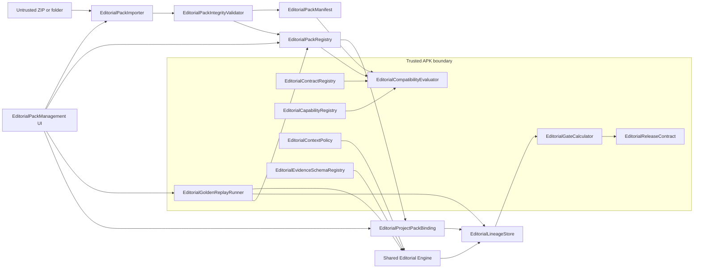
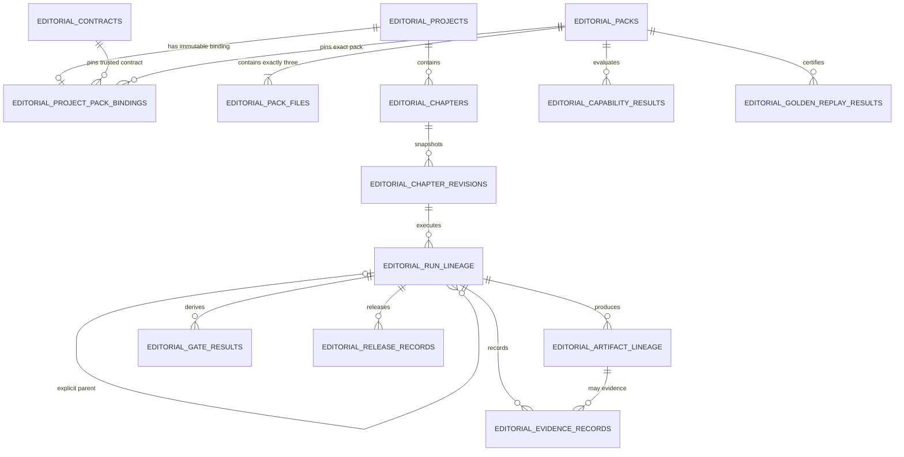

# Editorial Pack Platform Plan

Status: `PHASE_1_RESEARCH_COMPLETE / AWAITING_APPROVAL / NO_IMPLEMENTATION`

Date: `2026-08-03`

This document defines the proposed contract-first, fail-closed architecture for
turning Editorial into an immutable, versioned, runtime-importable Editorial
Pack platform. It does not enable model execution and does not restore any
retired V5 runner, schema, validator, gate or release flow.

## 1. Executive decision

The platform should build one shared Editorial engine and treat SAFE4, SAFE5
and later workflows as immutable data packs plus trusted machine contracts.

A pack may be imported without a new APK only when its effective machine
contract is exactly compatible with capabilities already present in the app.
The pack manifest's compatibility claim is never authoritative: the app must
compute the effective compatibility class from trusted contract, adapter and
capability registries.

Every project must be permanently bound to:

- pack ID and pack version;
- canonical pack hash;
- contract version;
- evidence schema version;
- the binding hash created at project creation.

No project is automatically upgraded or rebound. Multiple certified packs may
coexist. Old SQLite rows, evidence, APKs, artifacts, tags and releases remain
unchanged and readable as history.

## 2. Current workspace findings

The accepted development baseline is `4.16-dev.24`/code86 from commit
`ab8e78abeeb0fa6264ac8a7b0dea2e436cd39d90`. The current branch is
`feature/v4.16`; actual `HEAD` at research time was
`731bc9061b959b582d5ff02ea15b973c52eadb89`. The only pre-existing worktree
change was the user-owned `.idea/gradle.xml`, which was not modified.

The SAFE4 foundation already provides:

- a static immutable three-file identity and build-time hash guard;
- fail-closed capability enumeration;
- project/chapter/reference-profile and immutable input-snapshot concepts;
- RAW/DRAFT/Glossary/Pronoun chapter import and preview;
- deterministic RAW anchors, scene segmentation and text-diff candidates;
- additive v11-v13 Editorial tables;
- legacy project read-only behavior;
- mandatory archive-first APK build and byte-preserving Git attributes.

The following components are reusable after refactoring or audit:

| Current component | Reusable value | Required change |
|---|---|---|
| `EditorialSafe4Pack` | Capability vocabulary and immutable source hashes | Replace one-pack constants with registry lookup and canonical manifest identity |
| `EditorialSafe4Workflow` | Asset roles, pronoun states and phase terminology | Move contract data into trusted descriptors; remove SAFE4 hardcoding from the engine/UI |
| `EditorialRepository` | Project, chapter, reference and input-snapshot persistence | Add immutable binding/revision/lineage stores; remove destructive production deletion |
| `EditorialImportPlanner` | Chapter input mapping | Keep separate from the new Editorial Pack importer |
| `EditorialRawMap` | Deterministic operational anchors | Audit and register as an engine capability before use |
| `EditorialSceneSegmenter` | Deterministic segmentation candidate | Audit, version and test as a capability |
| `EditorialDraftSceneMapper` | Constrained RAW/DRAFT mapping candidate | Audit; never inherit old PASS/CLOSED semantics |
| `EditorialTextDiff` | Diff preview candidate | Replace preview-only counts with exact lineage-aware change coverage |
| `EditorialModelSceneMapper` | Anchor-constrained mapping idea | Not trusted as-is because it contains a hardcoded model prompt/call |
| Build/archive scripts | Immutable APK/source retention | Extend with separate runtime-pack certification archives |

The retired V5 runners, evidence schema/validator, context builders, latest-row
lookup, model-derived gate closure and release flow must not be restored or used
as an implementation shortcut.

### 2.1 Current external-pack mismatch

The external folder currently contains exactly three strict UTF-8, no-BOM,
LF-only text files, but no manifest.

| File | Current external bytes/hash | code86 bundled bytes/hash |
|---|---|---|
| `PROJECT_INSTRUCTION_BIEN_TAP_V5_SAFE_4.txt` | `9063`, `C57100C45F16FC5A27E56AE17ABE919BE89DA55082A66D060DB504746ED8B717` | exact match |
| `PROMPT_DAU_CHAT_3_LUOT_V5_SAFE_4.txt` | `5040`, `DBE214D842D98FD76AFD2E700747FCC2CF3D5B6038134B38EA8F220FED3BF273` | `5008`, `0B4C02573F46A91528A63262D3E52C655A5C7E31F2ABBBFB01759D38E94F8E81` |
| `WORKFLOW_BIEN_TAP_3_LUOT_V5_SAFE_4.txt` | `18337`, `7A434ADE77239DB33AF5A677456D0310AC11DC8391565FC4888236536FF96B5E` | exact match |

The prompt difference is the added L2 line:

```text
PRONOUN_STATUS: LEGACY_REJECTED
```

This may alter phase-specific Pronoun policy, so it cannot be classified as a
wording-only DATA_COMPATIBLE change. Until it receives a new immutable version,
canonical manifest and contract review, its correct status is:

```text
BLOCKED_MANIFEST_REQUIRED
BLOCKED_CONTRACT_REVIEW
```

The code86 bytes must remain a separate historical identity. The external
bytes must not overwrite or reuse the same `(packId, version)` identity.

### 2.2 Source hardcode and coupling inventory

This inventory is based on source at `HEAD`
`731bc9061b959b582d5ff02ea15b973c52eadb89`, not on an APK decompile.

| Current file/area | Coupling found | Platform treatment |
|---|---|---|
| `app/build.gradle` | Static `editorialSafe4Files`, `editorialSafe4Root` and `verifyEditorialSafe4Pack` are attached to every `preBuild` | Retain as a bootstrap-pack byte guard until a manifest-driven bootstrap verifier replaces it; do not use it as runtime certification |
| `EditorialSafe4Pack.java` | One global version/hash/schema/capability set; pack hash is a SAFE4-specific construction | Preserve only as a legacy bootstrap descriptor; registry becomes authoritative |
| `EditorialSafe4Workflow.java` | Asset roles, phase visibility, state transitions, gates and release readiness are Java enums/branches | Split declarations into contract descriptors and executable semantics into trusted engine calculators/adapters |
| `EditorialAssetManifest.java` | Required roles are typed with the SAFE4 enum | Generalize only after the new role/cardinality contract exists |
| `EditorialImportPlanner.java` | Chapter bundle mapping uses SAFE4 roles and filename heuristics | Keep as chapter-data import; never reuse as the pack importer |
| `EditorialRepository.java` | New projects are forced to static SAFE4 constants; state is derived partly by version only; roles are SAFE4 enums | Route identity through Pack Registry and immutable binding; keep legacy reads isolated |
| `EditorialRepository.java` deletion APIs | Project/reference deletion physically removes rows, including evidence chains | Replace platform-facing destructive actions with archive/disable; retain old API only until callers are removed and covered by migration tests |
| `EditorialPageFactory.java` | Project cards, labels, create action and blocked state contain SAFE4 text/constants | Move presentation to pack/contract view models supplied by registry/application services |
| `EditorialImportPreviewDialog.java` | Preview copy states a fixed SAFE4 contract | Render the selected certified pack and its input contract instead |
| `MainActivity.java` | Owns request codes, pending Editorial maps, SAF callbacks, project creation, chapter/reference import and direct repository calls | Extract orchestration behind Pack Management and Editorial application services; MainActivity retains navigation/result delivery only |
| `FileUtil` use in Editorial flows | General text reader may accept BOM, UTF-16, Shift-JIS/windows-31j and replacement fallback | Forbidden for pack integrity; importer stages raw bytes, hashes first and decodes strict UTF-8 only |
| `EditorialMigrationSpec.java` / `TranslationRepository.java` | DB v13; Editorial v11-v13 uses `safeExec`, no explicit `onConfigure` foreign-key enablement | New security-critical migration is transactional, error-propagating and verified; old rows are untouched |
| `EditorialModelSceneMapper.java` | Contains model-call/prompt behavior | Not part of the trusted common engine; reuse requires a separately reviewed provider adapter |
| Existing SAFE4 tests | Assert current static contract and legacy repository behavior | Keep as regression tests while new pack tests are added beside them; do not rewrite history to make the new platform pass |

The UI dependency seam to create is:

```text
MainActivity / EditorialPageFactory
    -> EditorialPackManagementController (UI/application service)
    -> EditorialPackRegistry + EditorialProjectPackBindingService
    -> importer / replay / lineage ports
```

No activity or dialog may read `EditorialSafe4Pack.VERSION`,
`EditorialSafe4Pack.PACK_HASH`, a schema constant or a capability constant after
the final UI extraction.

### 2.3 Reuse and trust boundary

The three boundaries are intentionally asymmetric:

- **Pack data (untrusted):** canonical manifest plus exactly three UTF-8 prompt/
  workflow files. It can declare identifiers but cannot contribute Java, Dex,
  scripts, SQL, reflection targets or calculator expressions.
- **Adapter (trusted APK code):** a named, versioned, lossless mapping from one
  known declarative contract/schema to existing engine types. It may map field
  names or enum values, but may not weaken cardinality, evidence completeness,
  phase visibility, gate equations or release requirements.
- **Common engine (trusted APK code):** phase barriers, context enforcement,
  typed ledger validation, exact lineage, gate calculators, release checks and
  replay execution. Any behavior not representable by installed engine
  capabilities is `ENGINE_UPGRADE_REQUIRED`.

`EditorialRawMap`, `EditorialSceneSegmenter`, `EditorialDraftSceneMapper` and
`EditorialTextDiff` are candidates for the engine only after deterministic
behavior, versioned capability IDs and negative tests are established. Existing
project/import/snapshot/reference persistence concepts and UI layout can be
reused; their SAFE4 decisions cannot.

## 3. Main gaps

1. No canonical manifest or ZIP/folder pack importer exists.
2. No Pack Registry is the single source of truth.
3. No trusted Contract Registry or adapter registry exists.
4. No machine-contract fingerprint or compatibility evaluator exists.
5. Projects do not persist contract/schema identity in an immutable binding.
6. No immutable chapter revision layer exists.
7. Runs lack exact parent run, chapter revision and adapter/engine identity.
8. Existing gate/evidence tables are not a sufficient typed append-only chain.
9. No Golden Replay runner, result store or certification lifecycle exists.
10. UI is hardcoded to SAFE4 and allows project preparation before certification.
11. General text import may decode Shift-JIS/fallback; pack import must hash raw bytes and accept only strict UTF-8.
12. Some stored sizes are Java character counts rather than raw byte lengths.
13. Security-critical migrations cannot use the current error-swallowing `safeExec` pattern.
14. Foreign key enforcement is not explicitly enabled in `onConfigure`.
15. Production repository APIs can physically delete projects, references and history.
16. No pack-specific certification archive exists independently of APK evidence.

## 4. Architecture



Recommended Gradle boundaries:

- `:editorial-engine`: pure JVM manifest, compatibility, context, evidence,
  gate, release and replay contracts;
- `:editorial-safe4-adapter`: trusted SAFE4 mapping and fixtures, tested alone;
- `:editorial-storage-android`: SQLite, SAF staging, registry, binding and
  lineage;
- `:app`: Android UI, provider invocation and orchestration.

### 4.1 Module responsibilities

| Module | Responsibility |
|---|---|
| `EditorialPackManifest` | Strict immutable DTO and canonical JSON model |
| `EditorialPackImporter` | SAF selection, raw-byte staging and atomic import |
| `EditorialPackIntegrityValidator` | Entry count, role, encoding, hash, canonical and schema validation |
| `EditorialPackRegistry` | Sole source for pack identity, state and references |
| `EditorialContractRegistry` | Trusted contract/adapter descriptors installed by the APK |
| `EditorialCompatibilityEvaluator` | Compute effective compatibility; never trust a pack claim |
| `EditorialCapabilityRegistry` | Trusted capability IDs/versions and their evidence fingerprints |
| `EditorialProjectPackBinding` | One-time immutable project binding |
| `EditorialContextPolicy` | Exact per-phase required/allowed/forbidden role enforcement |
| `EditorialEvidenceSchemaRegistry` | Typed evidence validators by schema ID/version |
| `EditorialGateCalculator` | Machine derivation from exact typed evidence sets |
| `EditorialLineageStore` | Append-only run, artifact, evidence and parent chain |
| `EditorialGoldenReplayRunner` | Certification through the same engine/gate/release path |
| `EditorialReleaseContract` | Exact output count, role, hash and receipt checks |
| `EditorialPackManagement UI` | Import, preview, replay, certification, archive/disable and project selection |

## 5. Manifest v1

The archive/folder contains exactly four root entries:

1. `editorial-pack.json`;
2. one `PROJECT_INSTRUCTION` UTF-8 file;
3. one `TURN_PROMPT` UTF-8 file;
4. one `WORKFLOW` UTF-8 file.

Filename is not authority. `fileRoles` binds an exact path to an exact role and
raw-byte hash.

```json
{
  "manifestFormat": "com.ml.tblandroidtxt.editorial-pack",
  "manifestVersion": 1,
  "packId": "com.ml.tblandroidtxt.editorial.v5-safe4",
  "version": "5.0.4+baseline.1",
  "displayName": "Editorial V5-SAFE.4",
  "contractVersion": "editorial-contract.safe4.v1",
  "schemaVersion": "editorial-evidence.safe4.v1",
  "minimumEngineVersion": "1.0.0",
  "compatibilityClass": "DATA_COMPATIBLE",
  "adapterId": "safe4.v1",
  "requiredCapabilities": [
    "pack.integrity.sha256.v1",
    "lineage.exact-parent.v1",
    "ledger.exhaustive.safe4.v1",
    "gate.derived.safe4.v1",
    "context.pronoun-pair.safe4.v1",
    "barrier.l1-raw-first.v1",
    "diff.change-coverage.v1",
    "qa.l3-two-adversarial.v1",
    "release.safe4.v1",
    "replay.safe4.g1-g10.v1"
  ],
  "fileRoles": [
    {
      "role": "PROJECT_INSTRUCTION",
      "path": "PROJECT_INSTRUCTION_BIEN_TAP_V5_SAFE_4.txt",
      "mediaType": "text/plain",
      "charset": "UTF-8",
      "bom": "FORBIDDEN",
      "byteLength": 9063,
      "sha256": "c57100c45f16fc5a27e56ae17abe919be89da55082a66d060db504746ed8b717"
    },
    {
      "role": "TURN_PROMPT",
      "path": "PROMPT_DAU_CHAT_3_LUOT_V5_SAFE_4.txt",
      "mediaType": "text/plain",
      "charset": "UTF-8",
      "bom": "FORBIDDEN",
      "byteLength": 5008,
      "sha256": "0b4c02573f46a91528a63262d3e52c655a5c7e31f2abbbfb01759d38e94f8e81"
    },
    {
      "role": "WORKFLOW",
      "path": "WORKFLOW_BIEN_TAP_3_LUOT_V5_SAFE_4.txt",
      "mediaType": "text/plain",
      "charset": "UTF-8",
      "bom": "FORBIDDEN",
      "byteLength": 18337,
      "sha256": "7a434ade77239db33af5a677456d0310ac11dc8391565fc4888236536ff96b5e"
    }
  ],
  "canonicalPackHash": "<generated-by-editorial-pack-tool>",
  "inputRoles": [
    {"role": "RAW", "cardinality": "ONE", "required": true},
    {"role": "DRAFT", "cardinality": "ONE", "required": true},
    {"role": "GLOSSARY", "cardinality": "ONE", "required": true},
    {"role": "PRONOUN", "cardinality": "ZERO_OR_ONE", "requiredWhen": "pronounStatus == AVAILABLE"},
    {"role": "PAIR_CONTEXT", "cardinality": "ZERO_OR_ONE", "required": false}
  ],
  "pronounPolicy": {
    "allowedStatuses": ["AVAILABLE", "LEGACY_REJECTED", "NONE"],
    "defaultStatus": "NONE",
    "availableRequiresRole": "PRONOUN",
    "noneForbidsRole": "PRONOUN",
    "legacyRejectedForbidsRole": "PRONOUN",
    "fallbackLookupAllowed": false
  },
  "pairContextPolicy": {
    "optional": true,
    "source": "PRIOR_CHAPTER_PAIR_DELTA_QA",
    "qaConfirmedRequired": true,
    "sameProjectRequired": true,
    "samePackHashRequired": true,
    "scopeRequired": true,
    "boundaryRequired": true
  },
  "phaseGraph": {
    "profile": "safe4-linear-barrier-v1",
    "initialPhase": "L1_RAW_DISCOVERY",
    "terminalPhase": "RELEASED",
    "phases": [
      "L1_RAW_DISCOVERY",
      "L1_RECONCILE",
      "L1_CLOSED",
      "L2_RAW_DISCOVERY",
      "L2_EDIT",
      "L2_CLOSED",
      "L3_BLIND",
      "L3_RECONCILE",
      "L3_ADVERSARIAL_COVERAGE",
      "L3_ADVERSARIAL_REGRESSION",
      "RELEASE_READY",
      "RELEASED"
    ],
    "edges": [
      ["L1_RAW_DISCOVERY", "L1_RECONCILE"],
      ["L1_RECONCILE", "L1_CLOSED"],
      ["L1_CLOSED", "L2_RAW_DISCOVERY"],
      ["L2_RAW_DISCOVERY", "L2_EDIT"],
      ["L2_EDIT", "L2_CLOSED"],
      ["L2_CLOSED", "L3_BLIND"],
      ["L3_BLIND", "L3_RECONCILE"],
      ["L3_RECONCILE", "L3_ADVERSARIAL_COVERAGE"],
      ["L3_ADVERSARIAL_COVERAGE", "L3_ADVERSARIAL_REGRESSION"],
      ["L3_ADVERSARIAL_REGRESSION", "RELEASE_READY"],
      ["RELEASE_READY", "RELEASED"]
    ]
  },
  "contextAllowList": {
    "L1_RAW_DISCOVERY": {"required": ["RAW"], "allowed": ["RAW"]},
    "L1_RECONCILE": {
      "required": ["RAW", "DRAFT", "GLOSSARY"],
      "allowed": ["RAW", "DRAFT", "GLOSSARY", "PRONOUN", "PAIR_CONTEXT"]
    },
    "L2_RAW_DISCOVERY": {"required": ["RAW"], "allowed": ["RAW"]},
    "L2_EDIT": {
      "required": ["RAW", "DRAFT", "GLOSSARY", "REPORT_L1"],
      "allowed": ["RAW", "DRAFT", "GLOSSARY", "PRONOUN", "PAIR_CONTEXT", "REPORT_L1"]
    },
    "L3_BLIND": {
      "required": ["RAW", "GLOSSARY", "VI_L2"],
      "allowed": ["RAW", "GLOSSARY", "PRONOUN", "PAIR_CONTEXT", "VI_L2"]
    },
    "L3_RECONCILE": {
      "required": ["RAW", "DRAFT", "GLOSSARY", "REPORT_L1", "VI_L2", "CHANGE_MAP_L2"],
      "allowed": ["RAW", "DRAFT", "GLOSSARY", "PRONOUN", "PAIR_CONTEXT", "REPORT_L1", "VI_L2", "CHANGE_MAP_L2"]
    },
    "L3_ADVERSARIAL_COVERAGE": {"sameAs": "L3_RECONCILE"},
    "L3_ADVERSARIAL_REGRESSION": {"sameAs": "L3_RECONCILE"}
  },
  "evidenceSchemas": [
    {"evidenceType": "CONTEXT_MANIFEST", "schemaId": "safe4.context-manifest.v1"},
    {"evidenceType": "SCENE_LEDGER", "schemaId": "safe4.scene-ledger.v1"},
    {"evidenceType": "RAW_VI_UNIT_STATUS", "schemaId": "safe4.raw-vi-unit.v1"},
    {"evidenceType": "TITLE_GLOSSARY_LEDGER", "schemaId": "safe4.title-glossary.v1"},
    {"evidenceType": "SEMANTIC_RISK_LEDGER", "schemaId": "safe4.semantic-risk.v1"},
    {"evidenceType": "RELATION_CANDIDATE_INVENTORY", "schemaId": "safe4.relation-candidate.v1"},
    {"evidenceType": "PAIR_RECORD", "schemaId": "safe4.pair-record.v1"},
    {"evidenceType": "SPEAKER_PROOF", "schemaId": "safe4.speaker-proof.v1"},
    {"evidenceType": "ERROR_LEDGER", "schemaId": "safe4.error-ledger.v1"},
    {"evidenceType": "CHANGE_MAP", "schemaId": "safe4.change-map.v1"},
    {"evidenceType": "PROTECTED_SPAN_LEDGER", "schemaId": "safe4.protected-span.v1"},
    {"evidenceType": "ADVERSARIAL_PASS", "schemaId": "safe4.adversarial-pass.v1"},
    {"evidenceType": "GATE_RECEIPT", "schemaId": "safe4.gate-receipt.v1"},
    {"evidenceType": "RELEASE_RECEIPT", "schemaId": "safe4.release-receipt.v1"}
  ],
  "gateDefinitions": [
    {"gateId": "ARTIFACT_IDENTITY", "calculatorId": "safe4.identity-exact-chain.v1", "requires": ["CONTEXT_MANIFEST"]},
    {"gateId": "COVERAGE", "calculatorId": "safe4.raw-unit-coverage.v1", "requires": ["SCENE_LEDGER", "RAW_VI_UNIT_STATUS"]},
    {"gateId": "TITLE_GLOSSARY", "calculatorId": "safe4.title-glossary-equation.v1", "requires": ["TITLE_GLOSSARY_LEDGER"]},
    {"gateId": "SEMANTIC_FIDELITY", "calculatorId": "safe4.semantic-equation.v1", "requires": ["SEMANTIC_RISK_LEDGER", "RAW_VI_UNIT_STATUS"]},
    {"gateId": "RELATION_PAIR_PROOF", "calculatorId": "safe4.relation-pair-proof.v1", "requires": ["RELATION_CANDIDATE_INVENTORY", "PAIR_RECORD"]},
    {"gateId": "SPEAKER", "calculatorId": "safe4.changed-dialogue-speaker-proof.v1", "requires": ["CHANGE_MAP", "SPEAKER_PROOF"]},
    {"gateId": "CHANGE_COVERAGE", "calculatorId": "safe4.diff-population-subset.v1", "requires": ["CHANGE_MAP"]},
    {"gateId": "NO_REGRESSION", "calculatorId": "safe4.protected-regression.v1", "requires": ["CHANGE_MAP", "PROTECTED_SPAN_LEDGER"]},
    {"gateId": "CONTINUITY_STRUCTURE_TECHNICAL", "calculatorId": "safe4.structure-technical.v1", "requires": ["SCENE_LEDGER", "PROTECTED_SPAN_LEDGER"]}
  ],
  "releaseArtifacts": {
    "maximumFiles": 3,
    "artifacts": [
      {"role": "FINAL_QA", "required": true, "nameTemplate": "[ID]_FINAL_QA_[SERIES].txt", "contentContract": "TRANSLATION_ONLY"},
      {"role": "QA_RECEIPT", "required": true, "nameTemplate": "[ID]_QA_RECEIPT_[SERIES].txt", "contentContract": "DERIVED_GATE_AND_LINEAGE_RECEIPT"},
      {"role": "PAIR_DELTA_QA", "required": false, "nameTemplate": "[ID]_PAIR_DELTA_QA_[SERIES].txt", "presentWhen": "qaConfirmedPairDeltaCount > 0"}
    ],
    "forbiddenArtifacts": ["CHANGE_MAP_QA", "REPORT_QA"]
  },
  "goldenReplayCases": [
    {"caseId": "G1", "fixtureId": "safe4/g1-role-locked", "expectedCode": "RELATION_CONFLICT"},
    {"caseId": "G2", "fixtureId": "safe4/g2-half-pair", "expectedCode": "PAIR_PROOF_REQUIRED"},
    {"caseId": "G3", "fixtureId": "safe4/g3-reciprocity", "expectedCode": "RELATION_CONFLICT"},
    {"caseId": "G4", "fixtureId": "safe4/g4-title-glossary", "expectedCode": "TITLE_GLOSSARY_CONFLICT"},
    {"caseId": "G5", "fixtureId": "safe4/g5-semantic-relation", "expectedCode": "SEMANTIC_CONFLICT"},
    {"caseId": "G6", "fixtureId": "safe4/g6-pronoun-none", "expectedCode": "PRONOUN_NONE_ACCEPTED"},
    {"caseId": "G7", "fixtureId": "safe4/g7-speaker-proof", "expectedCode": "SPEAKER_PROOF_MISSING"},
    {"caseId": "G8", "fixtureId": "safe4/g8-release-files", "expectedCode": "RELEASE_CONTRACT_MATCH"},
    {"caseId": "G9", "fixtureId": "safe4/g9-neutralization", "expectedCode": "NO_REGRESSION_FAIL"},
    {"caseId": "G10", "fixtureId": "safe4/g10-receipt-evidence", "expectedCode": "RECEIPT_EVIDENCE_FAIL"}
  ],
  "createdAt": "2026-08-03T15:27:32+07:00",
  "migrationPolicy": {
    "automaticProjectUpgrade": false,
    "projectRebindAllowed": false,
    "existingProjectAction": "KEEP_ORIGINAL_BINDING",
    "newProjectPolicy": "CERTIFIED_PACK_ONLY",
    "copyToDifferentPackRequiresNewProject": true
  }
}
```

The sample hash is deliberately a placeholder. A real pack tool must calculate
and insert it; the importer must reject the placeholder.

Canonical rules:

- `editorial-pack.json` is strict UTF-8 with no BOM;
- use deterministic JSON canonicalization equivalent to RFC 8785;
- reject duplicate keys, comments, non-finite numbers and unknown v1 fields;
- validate required ordering for arrays that represent sets;
- calculate `canonicalPackHash` as SHA-256 over a domain separator plus the
  canonical manifest with `canonicalPackHash` omitted;
- because raw file SHA-256 values are in the manifest, any changed file byte
  changes the canonical pack hash;
- `(packId, version)` may identify only one hash.

## 6. Additive SQLite migration

At implementation time, use the next available DB version (currently expected
to be v13 to v14). Create new tables only; do not update, delete or infer
contract/schema values for existing rows.

| Required table | Core contents |
|---|---|
| `editorial_packs` | Immutable pack hash, ID/version, contract/schema, minimum engine, canonical manifest bytes, declared class |
| `editorial_pack_files` | Exact three role bindings, raw BLOB bytes, raw byte length and SHA-256 |
| `editorial_contracts` | Trusted contract/adapter descriptor hash, versions and capability fingerprint installed by APK |
| `editorial_project_pack_bindings` | One immutable row per new project with pack/contract/schema/binding hashes |
| `editorial_run_lineage` | Run UUID, revision, phase, pack/contract/engine/adapter, parent run and manifest hashes |
| `editorial_artifact_lineage` | Artifact UUID, producer run, parent artifact, role, bytes/hash/schema |
| `editorial_capability_results` | Capability result tied to pack/engine/adapter and evidence artifact |
| `editorial_golden_replay_results` | Session/case result tied to pack/engine/adapter/corpus and evidence |

Supporting tables required for a complete chain:

- `editorial_pack_state_events`;
- `editorial_chapter_revisions`;
- `editorial_evidence_records`;
- `editorial_gate_results`;
- `editorial_run_events`;
- `editorial_release_records`.

Database rules:

- enable foreign keys in `onConfigure`;
- use `ON DELETE RESTRICT` for all referenced immutable identities;
- add triggers rejecting update/delete of pack files, bindings, lineage,
  artifacts, evidence, gates and replay results;
- represent pack/run state with append-only events;
- run the migration transactionally and fail on any statement error;
- do not use `safeExec` for these tables;
- run `foreign_key_check` and explicit schema/index/trigger verification;
- compare legacy table row counts and content hashes before/after migration;
- leave pre-platform projects read-only when their contract/schema identity is
  not already provable.

Exact lineage is:

```text
project
  -> immutable pack binding
  -> chapter revision
  -> input artifact manifest
  -> L1 run and REPORT_L1
  -> L2 child run and VI_L2/CHANGE_MAP_L2
  -> L3 child run
  -> typed evidence set
  -> machine-derived gate results
  -> FINAL/QA_RECEIPT/optional PAIR_DELTA_QA
```

Queries such as "latest evidence for chapter" are forbidden. Every consumer
must start from an explicit run, parent or artifact ID and verify hashes.

### 6.1 Proposed data relationships



### 6.2 Required v13-to-v14 schema shape

`14` is the expected next version at this baseline. Implementation must first
re-read the live DB version; if another migration has landed, use the real next
number instead of creating a competing v14.

| Table | Identity and required immutable columns | Key constraints |
|---|---|---|
| `editorial_packs` | `pack_hash`, `pack_id`, `pack_version`, `contract_version`, `schema_version`, `minimum_engine_version`, `declared_compatibility`, exact canonical `manifest_bytes`, `imported_at` | PK `pack_hash`; UNIQUE `(pack_id, pack_version)` so the same visible identity cannot point at different bytes |
| `editorial_pack_files` | `pack_hash`, `file_role`, `relative_path`, `sha256`, `byte_length`, exact `content_bytes` | PK `(pack_hash, file_role)`; UNIQUE `(pack_hash, relative_path)`; FK pack with `ON DELETE RESTRICT` |
| `editorial_contracts` | `contract_descriptor_hash`, `contract_version`, `schema_version`, `adapter_id`, `adapter_version`, `minimum_engine_version`, `capability_fingerprint`, exact trusted descriptor bytes | PK descriptor hash; UNIQUE contract/schema/adapter version tuple |
| `editorial_project_pack_bindings` | `project_id`, redundant pinned `pack_id/version/hash`, `contract_version`, `schema_version`, `contract_descriptor_hash`, `binding_hash`, `created_at` | PK `project_id`; UNIQUE `binding_hash`; all referenced identities use `ON DELETE RESTRICT`; UPDATE/DELETE denied |
| `editorial_chapter_revisions` | `revision_uuid`, `chapter_id`, monotonic `revision_no`, `parent_revision_uuid`, `input_manifest_hash`, exact manifest bytes, `created_at` | PK UUID; UNIQUE `(chapter_id, revision_no)`; explicit self-parent only |
| `editorial_run_lineage` | `run_uuid`, optional legacy `run_id`, `revision_uuid`, `phase_id`, `pack_hash`, contract/engine/adapter fingerprints, `parent_run_uuid`, `input_manifest_hash`, `created_at` | PK UUID; exact FK chain; no mutable state column is authoritative |
| `editorial_artifact_lineage` | `artifact_uuid`, `producer_run_uuid`, optional `parent_artifact_uuid`, `artifact_role`, `schema_id`, `sha256`, `byte_length`, immutable BLOB or content-addressed storage receipt, `created_at` | PK UUID; UNIQUE producer/role/hash as contract permits; RESTRICT delete |
| `editorial_evidence_records` | `evidence_uuid`, `run_uuid`, optional `artifact_uuid`, `evidence_type`, `schema_id`, canonical payload bytes/hash, `created_at` | PK UUID; append-only; schema resolved through pinned contract |
| `editorial_gate_results` | `gate_result_uuid`, `run_uuid`, `gate_id`, `calculator_id/version`, `evidence_set_hash`, derived status/payload hash, `created_at` | PK UUID; UNIQUE `(run_uuid, gate_id, evidence_set_hash)`; no model-authored status input |
| `editorial_capability_results` | `result_uuid`, `pack_hash`, engine/adapter/capability fingerprints, capability ID, status, blocker code, evidence artifact/hash, `evaluated_at` | UNIQUE exact evaluation tuple; only trusted evaluators write |
| `editorial_golden_replay_results` | `replay_session_uuid`, `case_id`, `pack_hash`, engine/adapter/capability/corpus fingerprints, result, output/evidence hashes, `created_at` | PK `(replay_session_uuid, case_id)`; certification requires complete expected set |
| `editorial_pack_state_events` | `event_uuid`, `pack_hash`, from/to state, reason code, evaluator fingerprint, `created_at` | Append-only state history; invalid transitions rejected |
| `editorial_run_events` | `event_uuid`, `run_uuid`, state/reason, `created_at` | Append-only run state; retries use new run UUID |
| `editorial_release_records` | `release_uuid`, `run_uuid`, release contract hash, artifact-set hash, gate-set hash, receipt artifact UUID, `created_at` | Release only from exact derived gates and artifact set |

Migration acceptance is not “tables exist.” It requires a single transaction,
all tables/indexes/triggers present, `PRAGMA foreign_key_check` clean, legacy
row counts and sampled/full content hashes unchanged, and an injected-failure
test proving total rollback. Production code must not catch and ignore any
statement in this migration.

The migration inserts **no** project binding for old rows. A pre-platform
project keeps its original `workflow_version/workflow_hash` and legacy
read-only behavior. A later, separately approved adoption flow may append the
first binding only when the old hash equals an already certified pack, the
contract/schema is proven, the user explicitly confirms, and an audit event is
stored. It can never select a newer or merely similar pack.

## 7. Compatibility model

| Change | Effective class | Runtime use without new APK |
|---|---|---|
| Only three file bytes change; exact machine-contract fingerprint remains identical | `DATA_COMPATIBLE` | Yes, after certification |
| Filename changes but manifest roles/hashes are exact; contract unchanged | `DATA_COMPATIBLE` | Yes, after certification |
| Schema/role declaration maps losslessly through an already installed trusted adapter | `ADAPTER_REQUIRED` | Yes, if adapter already exists |
| Required adapter is absent | `ADAPTER_REQUIRED / BLOCKED` | No; install APK containing adapter |
| Schema or ledger semantics cannot map losslessly | `ENGINE_UPGRADE_REQUIRED` | No |
| New gate derivation/calculator | `ENGINE_UPGRADE_REQUIRED` | No |
| New phase barrier or real visibility semantics | `ENGINE_UPGRADE_REQUIRED` | No |
| New release artifact/receipt semantics | `ENGINE_UPGRADE_REQUIRED` | No |
| Minimum engine exceeds installed engine | `ENGINE_UPGRADE_REQUIRED / BLOCKED` | No |
| Unknown contract/schema and no exact adapter | `BLOCKED` | No fallback |
| Declared compatibility understates computed change | `INVALID` | Never |

The compatibility fingerprint covers at least:

- input roles;
- Pronoun and Pair Context policy;
- phase graph and barriers;
- per-phase context allow-list;
- evidence schema IDs/versions;
- gate definitions/calculator IDs;
- release artifact contract;
- required capabilities;
- mandatory Golden Replay case set.

## 8. Pack lifecycle

```mermaid
stateDiagram-v2
    [*] --> IMPORTED
    IMPORTED --> INVALID: "Structure, manifest, UTF-8, role or hash failure"
    IMPORTED --> VALIDATED: "Integrity and canonical checks pass"
    VALIDATED --> INVALID: "Contradictory or dishonest compatibility declaration"
    VALIDATED --> BLOCKED: "Missing contract, adapter, capability or engine"
    VALIDATED --> COMPATIBLE: "Exact contract or complete trusted adapter"
    COMPATIBLE --> REPLAYING: "User starts certification"
    REPLAYING --> CERTIFIED: "Every mandatory replay passes"
    REPLAYING --> BLOCKED: "Replay, schema, gate or release failure"
    BLOCKED --> COMPATIBLE: "APK/adapter upgrade and re-evaluation pass"
    BLOCKED --> REPLAYING: "Retry after a recoverable cause is resolved"
    CERTIFIED --> ARCHIVED: "Hidden for new projects"
    CERTIFIED --> DISABLED: "New runs blocked; history retained"
```



UI labels:

- `COMPATIBLE`: `READY TO CERTIFY`;
- missing adapter: `ADAPTER REQUIRED`;
- missing engine capability: `ENGINE UPGRADE REQUIRED`;
- intrinsic failure or other blocker: `INVALID/BLOCKED`;
- `CERTIFIED`: available for new projects.

Certification is bound to:

```text
packHash
+ engineVersion
+ adapterVersion
+ capabilityFingerprint
+ goldenCorpusHash
```

Changing any component requires re-evaluation and replay.

## 9. Import flow

1. Select a ZIP or folder through SAF.
2. Copy bytes once to app-private staging to prevent TOCTOU.
3. Require exactly one manifest and exactly three root-level data entries.
4. Reject absolute paths, `..`, backslashes, symlinks, encrypted entries,
   duplicate/case-folded/Unicode-colliding paths, zip bombs and extras.
5. Enforce entry and total-size limits plus a compression-ratio limit.
6. Parse strict UTF-8/no-BOM canonical manifest.
7. Bind roles from `fileRoles`, never from filenames.
8. Hash raw bytes before decoding and compare length/hash declarations.
9. Decode with strict UTF-8 only; no Shift-JIS or replacement fallback.
10. Calculate the canonical pack hash and detect identity/version collisions.
11. Store exact bytes and append the `IMPORTED` event atomically.
12. Run integrity and schema validation to reach `VALIDATED` or `INVALID`.
13. Compute effective compatibility using trusted registries.
14. Display version, contract, schema, hash, declared/effective class and exact
    blocker/capability IDs.
15. Run Golden Replay only on user request.
16. Offer the pack to new-project creation only after `CERTIFIED`.
17. Never make it a silent default and never alter existing bindings.

## 10. Shared L1/L2/L3 execution

Before every phase:

- resolve the project only through its immutable binding;
- require a certification matching the installed engine/adapter fingerprint;
- verify chapter revision and every input artifact hash;
- require explicit Pronoun and Pair Context state;
- construct and store exact input/context manifest hashes;
- reject any missing or forbidden phase role before a provider call;
- create a new run lineage row with an explicit parent.

### L1

- `L1_RAW_DISCOVERY` uses a fresh allow-listed context.
- Raw model output is stored as untrusted data.
- Trusted validators convert it to typed exhaustive ledgers.
- `L1_RECONCILE` opens only after its barrier.
- Machine calculators evaluate counts, equations, anchors and conflicts.
- `REPORT_L1` is produced only from complete evidence; model text such as
  `PASS` or `CLOSED` never closes a gate.

### L2

- Parent must be the exact closed L1 run for the same revision/pack/contract.
- RAW discovery is independent; edit context opens only afterwards.
- Each edit requires Error/Change ID and dialogue Speaker Proof when relevant.
- Machine diff proves actual changed anchors are inside declared populations.
- `VI_L2`, `CHANGE_MAP_L2` and optional delta receive exact artifact lineage.

### L3

- Parent must be the exact closed L2 run.
- Blind QA cannot access any role forbidden by the manifest.
- Reconcile opens only after blind evidence is stored and validated.
- Both adversarial passes are independent evidence checkpoints.
- Release numbers and all gates are machine-derived.
- The release contract accepts only exact FINAL, QA_RECEIPT and optional
  QA-confirmed PAIR_DELTA_QA artifacts.

Retry always creates a child run. Reuse is allowed only through explicit
artifact IDs/hashes under contract rules; no row or evidence is overwritten.

## 11. Golden Replay certification

Every pack must run the union of:

- mandatory trusted cases required by its contract;
- pack-declared additional cases accepted by that contract;
- prompt/context assembly snapshots for the exact three file hashes.

The pack cannot replace mandatory fixtures or invent weaker expected outcomes.
Trusted fixture IDs and fixture hashes live in the Contract Registry.

A pack becomes `CERTIFIED` only when:

- integrity, canonical and schema checks pass;
- compatibility evaluation passes;
- all required capabilities are present and evidenced;
- every mandatory replay case passes through the normal engine/gate/release
  path;
- results are stored with exact pack, engine, adapter, capability and corpus
  fingerprints.

Golden Replay uses deterministic fake/recorded provider responses. A paid or
live provider test may be optional QA but is not certification evidence.

Any changed byte in any of the three files creates a new hash and invalidates
all previous replay results.

## 12. Pack Management UX

Pack list cards show:

- display name, pack ID/version and full hash;
- contract/schema/minimum engine;
- declared and effective compatibility;
- current lifecycle state and blocker codes;
- adapter/capability gaps;
- last replay engine/adapter/corpus fingerprint;
- project/run/evidence reference counts.

Import flow:

1. choose ZIP/folder;
2. inspect manifest and exact files;
3. show compatibility and blockers;
4. display `READY TO CERTIFY`, `ADAPTER REQUIRED`,
   `ENGINE UPGRADE REQUIRED` or `INVALID/BLOCKED`;
5. run Golden Replay;
6. enable new-project selection only when certified.

Project creation requires an explicit certified-pack selection and writes the
project plus immutable binding in one transaction. Project screens show the
locked pack/contract/schema/hash but expose no rebind action.

`ARCHIVED` hides a pack for new projects but preserves existing use/history.
`DISABLED` blocks new runs and retains all history. A certified or referenced
pack is never physically deleted. Only uncommitted/invalid staging bytes may be
purged.

## 13. Build, archive and rollback

The common engine and adapter are tested independently. Pure engine tests do
not produce an APK. Every APK development build still uses only:

```powershell
.\scripts\build-and-save.ps1 -Series 4.16-dev
```

Direct `assembleDebug` remains forbidden.

Every APK build must retain identical immutable payloads in artifact and
backup, including APK, README, `BUILD_INFO.json`, `SHA256SUMS.txt` and exact
tracked-source ZIP. Bundled/bootstrap pack files remain marked binary and each
ZIP entry is rehashed after archive creation.

Runtime data-pack import does not require an APK build, but certification must
create a separate immutable payload in both:

```text
artifacts/editorial-packs/<packHash>/<certification-event>/
backup/editorial-packs/<packHash>/<certification-event>/
```

The payload contains the exact original pack, canonical manifest,
`CERTIFICATION_INFO.json`, replay/evidence/gate receipts and checksums.

An old APK build is never evidence for a new pack. Compiling an APK never
enables execution by itself: the exact pack must be certified on the resulting
engine/adapter fingerprint.

Rollback rules:

- a bad pack is disabled/archived, never overwritten or deleted;
- choosing an older pack is allowed only for a new project;
- a failed run creates a child retry and preserves all evidence;
- an engine/adapter defect is corrected by a higher-versionCode hotfix;
- database downgrade, tag movement and release/artifact overwrite are forbidden.

## 14. Planned commit sequence

After explicit approval, implement in small independently testable commits:

1. `docs(editorial): define pack and compatibility contracts`
2. `feat(editorial-core): add strict pack manifest model`
3. `test(editorial-core): cover canonical manifest hashing`
4. `feat(editorial-storage): add additive pack registry schema`
5. `feat(editorial-storage): add immutable pack registry`
6. `feat(editorial-import): stage and validate zip and folder packs`
7. `test(editorial-import): reject malformed and hostile packs`
8. `feat(editorial-core): add contract and capability registries`
9. `feat(editorial-core): evaluate three compatibility classes`
10. `feat(editorial-storage): add immutable project pack bindings`
11. `feat(editorial-storage): add chapter revision and exact lineage`
12. `feat(editorial-engine): add typed evidence schema registry`
13. `feat(editorial-engine): add context allow-list enforcement`
14. `feat(editorial-engine): derive gates from evidence`
15. `feat(editorial-safe4): implement L1 adapter`
16. `feat(editorial-safe4): implement L2 adapter`
17. `feat(editorial-safe4): implement L3 and release contract`
18. `feat(editorial-replay): certify packs with Golden Replay`
19. `feat(editorial-ui): add pack management and certified picker`
20. `refactor(editorial-ui): remove SAFE4 constants from MainActivity`
21. `test(editorial): add migration and device coexistence coverage`
22. `build(editorial): archive pack certification evidence`
23. `docs(editorial): record QA and workspace handoff`

No commit may restore a retired V5 runner/schema/validator/gate/release class.
The user-owned `.idea/gradle.xml` must remain excluded.

### 14.1 Delivery groups, files, tests and review stops

Names below are proposed ownership boundaries. They are not authorization to
create the files.

| Group | Proposed files added/modified | SQLite | Mandatory proof | Rollback and review stop |
|---|---|---|---|---|
| G2-A: pure pack core | Add `editorial-engine/build.gradle`; `editorial-engine/src/main/java/com/ml/tblandroidtxt/editorial/pack/{EditorialPackManifest,EditorialPackFileRole,EditorialCompatibilityClass,EditorialCanonicalJson,EditorialPackIntegrityValidator,EditorialPackValidationResult,EditorialContractDescriptor,EditorialCapabilityDescriptor,EditorialCompatibilityEvaluator,EditorialCompatibilityResult,EditorialPackRegistry,InMemoryEditorialPackRegistry}.java`; matching JVM tests/fixtures; modify `settings.gradle` only to include the isolated module | None | Focused `:editorial-engine:test`; canonical/hash and compatibility negative matrix | Remove the unreferenced module/files; app behavior is unchanged. **Stop A:** review API, canonical rules and test evidence |
| G2-B: persistent registry/import | Add `editorial-storage-android` module, `EditorialPackImporter`, `SqliteEditorialPackRegistry`, migration/spec tests; modify `settings.gradle` and later `TranslationRepository` migration hook | Add pack/files/contracts/state/capability/replay foundation tables using the approved migration version | v13 fixture migration, hostile ZIP/folder instrumentation, FK/trigger/schema verification, interrupted transaction rollback | New code remains unreachable from UI until approved. Never downgrade DB; fix forward. **Stop B:** inspect real device migration and exact-byte evidence |
| G2-C: immutable project binding | Add `EditorialProjectPackBindingService`, binding DAO and certified-pack selection view model; modify `EditorialRepository` only behind new APIs | Add bindings and chapter revisions if not delivered in G2-B | Same-project pack immutability, multi-pack coexistence, legacy row byte/count preservation, process-death tests | Feature flag/new entry point off; old read-only path remains. **Stop C:** inspect old and new projects side-by-side |
| G2-D: exact lineage core | Add `EditorialLineageStore`, run/artifact/evidence/gate/release DAOs and engine ports | Add lineage/evidence/gate/run-event/release tables if not delivered in G2-B | Wrong parent/revision/pack/evidence negatives; append-only trigger tests; no-latest-query static review | No provider/model connection. Forward-only schema correction if needed. **Stop D:** manually trace one synthetic chain by IDs/hashes |
| G2-E: SAFE4 adapter and replay | Add trusted `editorial-safe4-adapter` module, typed schemas/calculators/context/release contracts and replay fixtures | No destructive migration; append capability/replay results only | Adapter contract tests, G1-G10, prompt/context snapshots, one-byte invalidation | Adapter can be disabled without touching packs/projects/history. **Stop E:** review all derived-gate and replay receipts before execution |
| G2-F: UI and controlled execution | Add Pack Management controller/screens; modify `EditorialPageFactory`, `EditorialImportPreviewDialog`, `MainActivity` routing; connect application services only after prior stops | No identity rewrite | Instrumentation for all UI states, certified-only creation, process death and forbidden-context-before-provider | UI route can be disabled; bindings/data remain. **Stop F:** device QA before any execution or APK release claim |

Build/archive evidence begins only for a group that changes APK production
source and only after its review stop is accepted. No group treats compilation
or a previous APK as pack certification.

## 15. Test matrix

| Type | Required coverage |
|---|---|
| Unit | Canonical JSON/hash, raw-byte hash, role cardinality, collisions, compatibility, context allow-lists, schema validators, gate equations and release contract |
| Instrumentation | SAF ZIP/folder, process death, registry persistence, certified-only project creation, multiple packs, immutable binding and fake-provider L1-L3 |
| Migration | v10/v11/v12/v13 fixtures, unchanged legacy row counts/hashes, FK/index/trigger checks and interrupted migration rollback |
| Negative/security | Missing/extra/duplicate files, bad UTF-8/BOM/hash, noncanonical manifest, zip-slip/bomb/symlink, version collision and unsupported contract/capability |
| Lineage | Wrong parent/revision/pack/evidence, stale run and any latest-evidence lookup attempt are blocked |
| Gate | Model-declared PASS/CLOSED with missing ledgers, equation mismatch, unaccounted change, missing Speaker Proof and protected regression |
| Golden Replay | G1-G10, prompt/context snapshot and invalidation on byte/engine/adapter/corpus changes |
| UI | All compatibility states, replay progress, certified selection, no project rebind and safe archive/disable |
| Release | Exact 2-3 files, names/hashes, optional delta, forbidden QA files and receipt-to-evidence lineage |
| Build/archive | Artifact/backup parity, manifest verification and exact source/pack bytes |

## 16. Acceptance gates by phase

| Phase | Acceptance condition |
|---|---|
| Specification freeze | Canonical rules and compatibility semantics approved; the `DBE214...` prompt receives a distinct version and reviewed Pronoun policy |
| Pack foundation | Valid imports work; malformed/hostile packs fail closed; one-byte change creates a new identity |
| Storage and lineage | Migration changes no legacy row; immutable binding/run/evidence chain is enforced; destructive production deletion is gone |
| Compatibility | Every matrix case passes and no closest-contract fallback exists |
| Engine core | Forbidden context cannot reach a model; typed evidence and machine gates ignore model labels |
| SAFE4 adapter | L1/L2/L3 barriers, parent chain, diff and release contract pass focused tests |
| Certification | G1-G10 and required snapshots pass and are retained with exact fingerprints |
| UI | Only certified packs create projects; packs coexist; bindings cannot change |
| RC/release | Archive-first build, migration/device QA, parity, checklist and release evidence pass |

## 17. Security and data risks

| Risk | Mitigation |
|---|---|
| Same visible version with changed prompt | Unique `(packId, version)` and collision rejection |
| Hash proves integrity but not publisher identity | Treat v1 as explicit local import; consider signed manifests in a future format version |
| ZIP traversal/bomb/symlink | Root-only exact entries, path validation and strict quotas |
| SAF TOCTOU | Copy once to app-private staging and validate stored bytes |
| Capability/compatibility spoofing | Only trusted APK registries are authoritative |
| Prompt injection/model self-certification | Untrusted model output, typed validation and machine-derived gates |
| Cross-run evidence mixing | Explicit UUID/FK/hash chain; no latest lookup |
| Retry overwrites history | Append-only child runs |
| Project/reference deletion | Archive/disable plus database delete restrictions |
| Partial migration | Transaction, no swallowed errors, schema and row verification |
| CRLF/LF drift | Raw-byte hashing, binary Git attributes and archive-entry rehashing |
| Sensitive evidence export | App-private exact evidence; redacted exported receipt with retained hashes/lengths |
| Certificate survives incompatible engine change | Bind certification to engine/adapter/capability/corpus fingerprints |
| APK/database downgrade | Forward-only higher-versionCode hotfix |

## 18. Exact APK boundary

No new APK is required when:

- only the three prompt/workflow files change;
- the complete machine-contract fingerprint is unchanged;
- the current engine already satisfies every capability;
- or an exact required adapter is already installed;
- and the exact new pack hash passes integrity, schema, compatibility and all
  mandatory Golden Replay cases.

A new APK is required when:

- the needed adapter is absent;
- a schema/ledger cannot be mapped losslessly;
- gate derivation or calculator semantics change;
- phase barrier or real visibility semantics change;
- Pronoun/Pair behavior needs new engine logic;
- release artifacts or receipt semantics change;
- the minimum engine version is not met;
- any required capability is absent.

An engine APK update adds only the necessary engine/adapter module. The shared
project/import/snapshot/storage/UI platform remains intact, and all old packs,
projects, lineage and artifacts remain bound to their original identities.

## 19. Approval boundary

No implementation should begin until this plan is approved and the following
SAFE4 identity decision is made:

1. preserve the code86 `0B4C...` prompt as its own historical pack identity;
2. assign the external `DBE214...` prompt a distinct immutable version;
3. resolve whether the added L2 `LEGACY_REJECTED` line intentionally changes
   Pronoun policy and therefore compatibility class.

Until then, Editorial execution and release remain fail-closed.

## 20. Smallest proposed Phase 2

The smallest useful next slice is **G2-A only**. It creates an isolated pure-JVM
`:editorial-engine` module and deliberately leaves it unreferenced by `:app`.

Scope:

1. immutable manifest/domain model for manifest format v1;
2. strict canonical JSON boundary and canonical pack-hash calculation;
3. integrity validator operating on already staged raw bytes;
4. trusted contract/capability descriptors supplied by tests;
5. three-class compatibility evaluator with exact blocker codes;
6. read-only in-memory registry with exact lookup by hash and by
   `(packId, version)` collision detection;
7. JVM fixtures and negative tests.

Explicitly out of scope:

- no changes to `MainActivity`, Editorial UI, `EditorialRepository`,
  `TranslationRepository`, SQLite version or current SAFE4 assets/classes;
- no SAF/ZIP importer, writable/persistent registry or project binding;
- no model/provider call, L1/L2/L3, evidence gate, release output or replay
  execution;
- no APK build, install, tag or release in this slice;
- no claim that SAFE4 or the external `DBE214...` bytes are certified.

Required Phase 2 unit cases:

| Area | Minimum cases |
|---|---|
| Manifest | All required fields; exactly three distinct roles; unknown/duplicate field rejection; explicit Pronoun and Pair state; phase/context/schema/gate/release declarations present |
| Canonical/hash | Same semantic canonical input gives same hash; one byte in each file changes hash; manifest placeholder/wrong hash rejected; LF/CRLF differ; BOM rejected |
| Integrity | Missing/extra/duplicate/case-fold collision, bad length/hash, bad UTF-8, wrong cardinality/path/media type all fail with stable blocker codes |
| Compatibility | Exact fingerprint → `DATA_COMPATIBLE`; installed lossless adapter → `ADAPTER_REQUIRED` and compatible; missing adapter → blocked; unsupported barrier/ledger/gate/release/minimum engine → `ENGINE_UPGRADE_REQUIRED`; no closest match |
| Registry | Exact hash lookup, ID/version lookup, coexistence of versions, rejection of same ID/version with another hash, immutable returned views |

Phase 2 acceptance criteria:

- every public result has a stable machine-readable code and human-readable
  explanation naming the missing adapter/capability;
- the evaluator computes its result and rejects any manifest-declared class
  that does not exactly match;
- no imported value can select a Java/Dex class, method, SQL statement or
  executable expression;
- focused JVM tests pass from a clean checkout and test fixtures retain exact
  bytes;
- a source review proves `:app` has no dependency on the new module and current
  Editorial behavior/data are untouched;
- evidence and a snapshot are saved, then work stops at **Stop A** for user
  approval before storage/import/UI work.

Phase 1 therefore ends with this document only. It does not authorize G2-A or
any later group.
